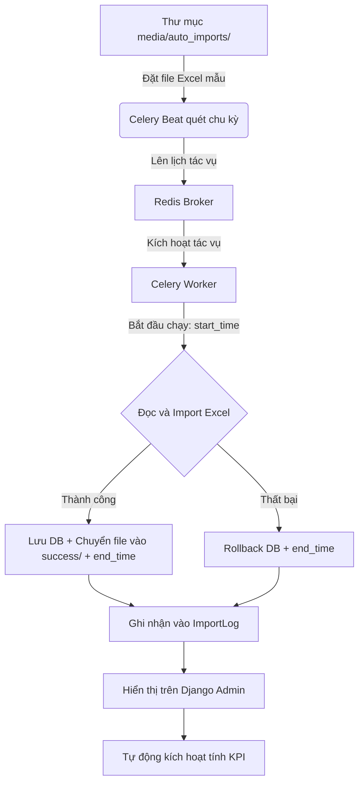

# Tài liệu hướng dẫn tổng quan dự án Report2026 (HP Co.)

Chào mừng bạn tiếp quản dự án! Đừng lo lắng nếu bạn chưa rành về Python. Tài liệu này được thiết kế để giúp bạn nắm bắt toàn bộ bức tranh của dự án từ kiến trúc, nghiệp vụ đến cách vận hành thực tế.

> [!IMPORTANT]
> **Quy trình thực thi chuẩn (SOP) & Checklist bắt buộc**:
> Tất cả các lập trình viên và AI Coding Agent khi tham gia phát triển, bảo trì dự án này bắt buộc phải đọc và tuân thủ quy trình 5 bước được định nghĩa tại file [CheckList.md](file:///d:/Sources/dashboard-report/CheckList.md) trước khi sửa đổi code hoặc thực hiện commit.

---

## 1. Dự án này là gì?
Dự án **Report2026** là một hệ thống **Backend API (Application Programming Interface)** chuyên phục vụ cho việc:
1. **Thu thập dữ liệu tự động**: Đọc các file báo cáo Excel xuất ra từ các hệ thống kế toán khác.
2. **Tính toán chỉ số hiệu suất**: Tính doanh thu, công nợ, dòng tiền, chi phí vận hành, tồn kho theo từng ngày, từng tháng cho từng đơn vị kinh doanh (Business Unit - BU) và cho toàn công ty.
3. **Cung cấp API cho Frontend**: Trả dữ liệu đã tính toán dưới dạng JSON để giao diện Dashboard (React/Vue) vẽ biểu đồ.

---

## 2. Các công nghệ cốt lõi được sử dụng
*   **Ngôn ngữ**: Python 3.14 (chạy trong môi trường ảo ở thư mục `.venv`).
*   **Framework Web**: **Django** & **Django REST Framework (DRF)**. Django giúp quản lý Database và Admin, còn DRF dùng để xây dựng các API.
*   **Hệ quản trị cơ sở dữ liệu**: **PostgreSQL** (chạy ở cổng `5433`, tên database là `reportdb`).
*   **Hệ thống hàng đợi & Tác vụ ngầm**: **Celery** kết hợp với **Redis Broker** để chạy các tác vụ import file Excel tự động.
*   **Thư viện xử lý Excel**: `django-import-export` kết hợp `tablib` để đọc/ghi file Excel cấu trúc lớn.

---

## 3. Cấu trúc thư mục & Kiến trúc Module Backend

Thư mục làm việc bao gồm:
*   `.venv/`: Môi trường ảo Python 3.14.
*   `report2026/` *(Thư mục cấu hình dự án)*:
    *   [settings.py](file:///d:/Sources/dashboard-report/report2026/settings.py): Cấu hình hệ thống (Database PostgreSQL, Redis/Celery, CORS/CSRF, MISA credentials, EXCLUDED rules).
    *   [urls.py](file:///d:/Sources/dashboard-report/report2026/urls.py): Routing gốc điều hướng API.
    *   [celery.py](file:///d:/Sources/dashboard-report/report2026/celery.py): Cấu hình khởi tạo Celery Worker & Beat.
*   `accounting/` *(Ứng dụng xử lý kế toán - Đã tái cấu trúc Modular Package)*:
    *   `models/` *(Gói Model chuyên biệt)*:
        *   [organization.py](file:///d:/Sources/dashboard-report/accounting/models/organization.py): `Branch`, `Warehouse`, `CustomerGroup`, `Customer`, `MaterialGroup`, `Product`, `BusinessUnit`.
        *   [employee.py](file:///d:/Sources/dashboard-report/accounting/models/employee.py): `Department`, `JobTitle`, `Employee`, `EmployeeAssignment` *(Tạo mới 27/07/2026 — Quản lý Nhân sự)*.
        *   [master_data.py](file:///d:/Sources/dashboard-report/accounting/models/master_data.py): `BUTargetPlan`, `ManualAdjustment`, `ImportLog`.
        *   [transactions.py](file:///d:/Sources/dashboard-report/accounting/models/transactions.py): `SalesTransaction`, `AccountDetail`, `BankBalance`.
        *   [debt.py](file:///d:/Sources/dashboard-report/accounting/models/debt.py): `SupplierGroup`, `Supplier`, `SupplierDebt`, `ReceivablesAgeing`, `PurchaseDetail`.
        *   [performance.py](file:///d:/Sources/dashboard-report/accounting/models/performance.py): `BUPerformance`, `BUPerformanceDaily`, `InventorySummary`.
        *   [models.py](file:///d:/Sources/dashboard-report/accounting/models.py): **Wrapper Module**: Re-export 100% models, giữ tương thích ngược 100%.
    *   `views/` *(Gói API Views chuyên biệt)*:
        *   [misa_api.py](file:///d:/Sources/dashboard-report/accounting/views/misa_api.py): Master Data ViewSets & Xác thực Knox/Google (`LoginAPI`, `GoogleLoginAPI`...).
        *   [collection_api.py](file:///d:/Sources/dashboard-report/accounting/views/collection_api.py): Receivables & Supplier Debt ViewSets.
        *   [inventory_api.py](file:///d:/Sources/dashboard-report/accounting/views/inventory_api.py): Warehouse & Inventory ViewSets.
        *   [dashboard_api.py](file:///d:/Sources/dashboard-report/accounting/views/dashboard_api.py): API Hiệu suất & Thu nợ Dashboard (`BUReportAPIView`, `BUPerformanceDailyListView`, `BUPerformanceUpdateAPIView`...).
        *   [views.py](file:///d:/Sources/dashboard-report/accounting/views.py): **Wrapper Module**: Re-export 100% API view classes.
    *   `services/` *(Gói nghiệp vụ lõi & Tính toán KPI)*:
        *   [kpi_calculator.py](file:///d:/Sources/dashboard-report/accounting/services/kpi_calculator.py): Động cơ tính toán KPI cho BusinessUnit & BUPerformance (`update_single_bu_performance`).
        *   [period_parser.py](file:///d:/Sources/dashboard-report/accounting/services/period_parser.py): Nhận diện kỳ báo cáo Excel (`detect_period_from_filename`).
        *   [inventory_sync.py](file:///d:/Sources/dashboard-report/accounting/services/inventory_sync.py): Logic tổng hợp tồn kho kho hàng (`sync_warehouse_inventory_data_logic`).
        *   [tasks.py](file:///d:/Sources/dashboard-report/accounting/tasks.py): **Wrapper Module**: Định nghĩa Celery `@shared_task` gọi tới services.
    *   `misa/` *(Gói tự động hóa Playwright MISA Web)*:
        *   [locators.py](file:///d:/Sources/dashboard-report/accounting/misa/locators.py): Lưu trữ tập trung XPath/CSS Selectors.
        *   [browser.py](file:///d:/Sources/dashboard-report/accounting/misa/browser.py): Đăng nhập, lưu phiên làm việc & Smart Anti-Popup Engine (phân biệt popup rác vs Form chọn tham số báo cáo).
        *   [report_exporter.py](file:///d:/Sources/dashboard-report/accounting/misa/report_exporter.py): Xuất báo cáo Excel từ MISA (tự động điền tham số, bảo vệ modal chọn tham số không bị đóng bởi `Escape` hoặc anti-popup trigger).
        *   [automation.py](file:///d:/Sources/dashboard-report/accounting/misa/automation.py): Controller điều khiển Playwright Chromium async.
        *   [misa_tasks.py](file:///d:/Sources/dashboard-report/accounting/misa_tasks.py): **Wrapper Module**: Celery tasks cho MISA download pipeline.
    *   `resources/` *(Gói mapping import-export Excel)*:
        *   `bulk.py`, `sales.py`, `purchase.py`, `finance.py`, `debt.py`, `inventory.py`: Mapping giữa cột Excel và trường CSDL.
        *   [resources.py](file:///d:/Sources/dashboard-report/accounting/resources.py): Wrapper re-export 100% Resource classes.
    *   `management/commands/`:
        *   [sync_misa.py](file:///d:/Sources/dashboard-report/accounting/management/commands/sync_misa.py): **Django Management Command chuẩn hóa**: Thực thi đồng bộ MISA via `python manage.py sync_misa`.
    *   [download_report.py](file:///d:/Sources/dashboard-report/download_report.py): **Script CLI Tải Riêng Báo Cáo MISA**: Tải từng báo cáo theo keyword (`python download_report.py <KEYWORD>`).
    *   [import_specific_file.py](file:///d:/Sources/dashboard-report/import_specific_file.py): **Engine CLI Nạp File Excel Rời**: Nạp 1 file Excel bất kỳ vào CSDL & tính KPI (`python import_specific_file.py <path>`).
    *   `scripts/`: Thư mục chứa các script bổ trợ (`show_snapshot.py`, `test_download_ban_hang.py`, `test_import_customer_group.py`,...) và `scripts/legacy/` (lưu trữ các script cũ đã thay bằng `sync_misa`).
    *   [serializers.py](file:///d:/Sources/dashboard-report/accounting/serializers.py): Bộ chuyển đổi dữ liệu JSON cho DRF.
    *   [urls.py](file:///d:/Sources/dashboard-report/accounting/urls.py): Định tuyến riêng cho các API của app `accounting`.
*   [HANDOVER_LOG.md](file:///d:/Sources/dashboard-report/HANDOVER_LOG.md): Nhật ký theo dõi mục tiêu, thay đổi và bàn giao hệ thống.
*   [CheckList.md](file:///d:/Sources/dashboard-report/CheckList.md): Quy trình 5 bước thực thi chuẩn (SOP) & Checklist trước khi commit.

---

## 4. Các luồng nghiệp vụ chính của dự án

### Luồng A: Tự động nạp dữ liệu từ file Excel (Auto Import)

1. **Chu kỳ quét**: Lịch chạy Celery Beat được tải động từ cấu hình `.env` (thông qua hàm `get_import_schedule` trong [settings.py](file:///d:/Sources/dashboard-report/report2026/settings.py#L173)), cho phép cấu hình linh hoạt (hàng ngày, hàng tuần, hàng tháng hoặc cron tùy chỉnh).
    * *Mặc định thực tế hiện tại*: Cấu hình Custom Cron chạy nhiều lần trong ngày: `20 7,9,11,14,16 * * 1-6` (tương ứng 07:20, 09:20, 11:20, 14:20, 16:20 từ Thứ Hai đến Thứ Bảy).
2. **Quét file**: Celery Worker nhận việc, quét thư mục `media/auto_imports/` để tìm các file có tên dạng:
    *   `BAN_HANG*.xlsx` (Bán hàng) -> Lưu vào `SalesTransaction`
    *   `MUA_HANG*.xlsx` (Mua hàng) -> Lưu vào `PurchaseDetail`
    *   `TON_KHO*.xlsx` (Tồn kho) -> Lưu vào `InventorySummary`
    *   `CONG_NO_NCC*.xlsx` (Công nợ nhà cung cấp) -> Lưu vào `SupplierDebt`
    *   `TUOI_NO_KH*.xlsx` (Tuổi nợ khách hàng) -> Lưu vào `ReceivablesAgeing`
    *   `TAI_KHOAN_CT*.xlsx` (Sổ chi tiết các tài khoản 111, 112, 341, 641, 642) -> Lưu vào `AccountDetail`
    *   `SO_DU_NH*.xlsx` (Số dư ngân hàng) -> Lưu vào `BankBalance`
3. **An toàn dữ liệu & Phạm vi xóa (Scope of Deletion)**: 
    Dữ liệu import của mỗi file được đặt trong một **database transaction** (`transaction.atomic()`). 
    - **Cơ chế Phân đoạn (Targeted Chunk Deletion)**: Thay vì xóa toàn bộ bảng (`objects.all().delete()`), hệ thống chỉ thực hiện xóa dữ liệu của kỳ kế toán tương ứng với file Excel đang nạp.
        - Đối với các bảng giao dịch (`SalesTransaction`, `PurchaseDetail`, `AccountDetail`): Hệ thống xóa dữ liệu trong khoảng ngày hạch toán `[start_date, end_date]` được nhận diện từ file Excel.
        - Đối với các bảng số dư/lũy kế (`InventorySummary`, `SupplierDebt`, `ReceivablesAgeing`, `BankBalance`): Hệ thống xóa theo kỳ báo cáo cụ thể `reporting_period` (định dạng `YYYY-MM`) nhận diện từ file.

---

### Luồng B: Tự động tính toán chỉ số hiệu suất (KPI Calculation Engine)

Sau khi dữ liệu Excel mới được nạp vào, hệ thống chạy hàm `update_single_bu_performance` để tổng hợp số liệu cho từng đơn vị kinh doanh (BU) và cho Tổng công ty. Dưới đây là logic nghiệp vụ và kỹ thuật chi tiết:

#### 1. Logic xác định phạm vi (Global / Sub-BU)
- **Quy ước Global**: Nếu `bu_id` nhận vào là `None`, hệ thống thiết lập biến `is_global = True`.
- **Hành vi**: Khi `is_global = True`, hệ thống sẽ **bỏ qua bộ lọc theo từng BU con**, trực tiếp tổng hợp toàn bộ dữ liệu của toàn công ty (Tổng công ty). Đồng thời, hệ thống **bắt buộc áp dụng bộ lọc loại trừ `settings.EXCLUDED_BU_CODES`** (`['ĐTCT']`) trên tất cả các truy vấn dữ liệu gốc (`SalesTransaction`, `AccountDetail`, `InventorySummary`, `ReceivablesAgeing`) để loại bỏ 1.23 tỷ VNĐ doanh thu mảng ĐTCT khỏi Tổng công ty.
- **Bộ lọc loại trừ động từ `settings.py`**:
  * Loại trừ BU: Tự động lọc bỏ các BU có mã nằm trong `settings.EXCLUDED_BU_CODES` (hiện tại là `['ĐTCT']` - Đầu tư cho thuê) và các đơn vị con của chúng khỏi mọi phép tính (kể cả cấp Tổng công ty `is_global = True`).
  * Loại trừ Khách hàng: Lọc bỏ các giao dịch của khách hàng thuộc nhóm trong `settings.EXCLUDED_CUSTOMER_GROUP_CODES` (hiện tại là `['Internal']`).
  * Loại trừ Mã Chứng từ: Lọc bỏ chứng từ có tiền tố thuộc `settings.EXCLUDED_DOC_ID_PREFIXES` (hiện tại là `['THANHLY']`).
- **BU cấp dưới (Sub-BU)**: Nếu `bu_id` cụ thể, hệ thống lọc chính xác bản ghi của riêng BU đó và các BU con thuộc nhánh thông qua `get_all_descendant_ids()` (và loại trừ các BU/Khách hàng đặc thù nói trên).

#### 2. Logic xử lý mốc thời gian (`target_date`)
- Nhận tham số ngày kết thúc tính toán `target_date_str`.
- Nếu không truyền:
  - Nếu tính toán cho **tháng hiện tại** (trùng tháng/năm hiện tại): `target_date` tự động lấy ngày hôm nay (`today.date()`).
  - Nếu tính toán cho **tháng cũ** trong quá khứ: `target_date` tự động lấy ngày cuối cùng của tháng đó (`calendar.monthrange(year, month)[1]`).
- Hệ thống sẽ chạy vòng lặp cập nhật phát sinh thực tế từng ngày (`BUPerformanceDaily`) bắt đầu từ ngày 1 đến hết ngày `target_date`.

#### 3. Bộ lọc Khách hàng ghi nhận doanh thu (`Customer.has_revenue`)
- Toàn bộ các truy vấn tính Doanh thu (`SalesTransaction`) và Thực thu (`AccountDetail`) đều được áp dụng bộ lọc bắt buộc:
  `customer__has_revenue=True`

#### 4. Logic chi tiết tính các chỉ số hiệu suất
*   **Doanh thu lũy kế tháng**: Tổng hợp từ bảng `SalesTransaction` (cộng cột `actual_sales`).
    > [!IMPORTANT]
    > **Đồng bộ hóa công thức Doanh thu:**
    > - Cả Doanh thu lũy kế tháng (`mtd_revenue_actual`) và Doanh thu phát sinh hàng ngày (`daily_revenue`) đều được đồng bộ hóa sử dụng chung cột **`actual_sales`** (Doanh số thực tế sau giảm trừ) từ bảng `SalesTransaction` để đảm bảo tính nhất quán tuyệt đối.
*   **Thực thu tiền mặt/ngân hàng (Collection - Quy tắc Kế toán)**: 
    - Lọc từ sổ chi tiết tài khoản `AccountDetail` các bút toán có:
      - Tài khoản bắt đầu bằng `111` (tiền mặt) hoặc `112` (tiền gửi ngân hàng).
      - Tài khoản đối ứng bắt đầu bằng `1311` hoặc `1312` (phải thu khách hàng).
    - **Công thức tính thực thu**: `coll_actual = debit_amount - credit_amount`.
*   **Tuổi nợ & Công nợ (Receivables Ageing)**:
    - Lọc từ bảng `ReceivablesAgeing`.
    - **Dư nợ cần thu** (`receivable_total`): Tổng cột `total_debt`.
    - **Nợ quá hạn** (`receivable_overdue`): Tổng cột `overdue_total`.
*   **Tồn kho KPI**: 
    - `InventorySummary` -> `Warehouse` -> `BusinessUnit` (thông qua `warehouse__business_unit_id=bu_id`).
    - **Giá trị tồn kho thực tế** (`inventory_value_actual`) của BU/Tổng công ty được tính bằng tổng cột `closing_value` của bảng `InventorySummary` theo filter BU.

---

### Luồng C: Đồng bộ tồn kho kho hàng (Warehouse Inventory Sync)
Tác vụ `sync_warehouse_inventory_data` dùng để tổng hợp số liệu tồn kho chi tiết từ bảng `InventorySummary` nhóm theo kho hàng rồi cập nhật ngược trực tiếp vào các trường tương ứng trong bảng `Warehouse`.

---

## 5. Hướng dẫn chạy và thao tác với dự án dành cho bạn

> [!NOTE]
> **Nội dung này đã được tách riêng**. Để xem chi tiết hướng dẫn cấu hình môi trường, cài đặt thư viện và cách dùng các lệnh/script kiểm thử terminal, vui lòng tham khảo file: [Run_Test_Scripts.md](Run_Test_Scripts.md)

---

## 6. API Endpoint phục vụ Frontend Dashboard

### Phân quyền & Bảo mật API (Authentication)
*   Hệ thống yêu cầu xác thực bằng **Knox Token** hoặc **Session**.
*   Giao thức gọi API (ngoại trừ `/api/login/`) bắt buộc phải đính kèm Header:
    `Authorization: Token <key_nhận_được_khi_login>`

### Danh sách các API Endpoint:

#### 1. Đăng nhập hệ thống
*   `POST /api/login/`:
    *   **Body (JSON)**: `{"username": "...", "password": "..."}`
    *   **Response (JSON)**: Trả về Token Knox, ngày hết hạn và thông tin cơ bản của user.

#### 2. Đăng xuất hệ thống (Knox Auth)
*   `POST /api/auth/logout/`: Hủy token hiện tại.
*   `POST /api/auth/logoutall/`: Hủy toàn bộ token đã cấp cho user.

#### 3. Lấy số liệu Hiệu suất BU theo Tháng (Dashboard chính)
*   `GET /api/bu-performance/`: Trả về số liệu kế hoạch và thực tế theo tháng kèm theo các trường KPI được tính toán tự động như `revenue_kpi`, `collection_kpi`, `inventory_vs_plan`.
*   **Query Parameters**:
    *   `?start_date=YYYY-MM-DD&end_date=YYYY-MM-DD`: Lọc theo quãng ngày.
    *   `?month=X`: Tháng (1-12).
    *   `?year=X`: Năm.
    *   `?bu_id=X`: ID BU (`null` cho Global, `all` cho toàn bộ).

#### 4. Lấy số liệu Hiệu suất BU theo Ngày (Vẽ biểu đồ)
*   `GET /api/performance/daily/`: Trả về dữ liệu doanh thu và thực thu phát sinh trong từng ngày của tháng.

#### 5. Lấy số liệu Báo cáo Thu nợ theo BU (Dashboard Thu Nợ)
*   `GET /api/dashboard/collection-by-bu/`: Trả về 5 chỉ số thu nợ chi tiết theo từng đơn vị kinh doanh chính (`is_main=True`) cho một ngày cụ thể (`?date=YYYY-MM-DD`).

#### 6. Kích hoạt tính toán lại dữ liệu (Manual Trigger)
*   `POST /api/update-performance/`: Cho phép trigger tính toán và cập nhật lại chỉ số hiệu suất bất đồng bộ qua Celery ngầm.

#### 7. Gửi báo cáo qua email (Send Email API)
*   `POST /api/reports/send-email/`: Cho phép gửi email đính kèm từ Frontend (Knox Token Auth).

#### 7.1. Đăng nhập qua Google (Single Sign-On Google OAuth2 API)
*   `POST /api/google-login/`: Đăng nhập bằng Google ID token, phát hành Knox Token cho Frontend.

#### 8. Các API danh mục chi tiết (DRF ViewSets)
*   `/api/branches/` (Chi nhánh)
*   `/api/warehouses/` (Kho hàng)
*   `/api/customers/` (Khách hàng)
*   `/api/employees/` (Nhân viên — fields: `employee_code`, `full_name`, `gender`, `date_of_birth`, `identity_number`, `phone_number`, `email`, `is_active`)
*   `/api/products/` (Sản phẩm/Vật tư hàng hóa)
*   `/api/business-units/` (Đơn vị kinh doanh - BU)
*   `/api/transactions/` (Chi tiết bán hàng)
*   `/api/suppliers/` (Nhà cung cấp)
*   `/api/supplier-groups/` (Nhóm nhà cung cấp)
*   `/api/supplier-debts/` (Công nợ NCC)
*   `/api/account-details/` (Sổ chi tiết tài khoản)
*   `/api/receivables-ageing/` (Chi tiết tuổi nợ)
*   `/api/purchase-details/` (Chi tiết mua hàng)
*   `/api/inventory-summaries/` (Tổng hợp tồn kho)
*   `/api/target-plans/` (Quản lý Chỉ tiêu Kế hoạch)
*   `/api/adjustments/` (Quản lý Điều chỉnh Phát sinh Ngoại bảng)

---

## 7. Lưu ý kỹ thuật chuyên sâu & Hướng phát triển tương lai

### 7.1. Logic Doanh thu không khớp (Đã giải quyết)
* **Trạng thái**: **Đã hoàn thành đồng bộ**. Cả doanh thu tháng (`mtd_revenue_actual`) và doanh thu ngày (`daily_revenue`) hiện tại đều sử dụng chung trường `actual_sales` (Doanh số thực tế sau giảm trừ).

### 7.2. Cảnh báo chủ động khi có lỗi (Error Handling & Alerts)
* **Bối cảnh**: Khi có lỗi định dạng file Excel, hệ thống rollback transaction và ghi nhật ký với trạng thái `ERROR` vào `ImportLog`.

### 7.3. Cơ chế Phân đoạn & Tối ưu hiệu năng nạp dữ liệu (Targeted Chunk Deletion & Bulk Load)
* **Trạng thái**: **Đã hoàn thành chuyển đổi sang Targeted Chunk Deletion**.
* **Cơ chế**: Khi nạp file Excel mới, hàm `detect_period_from_filename` trong [accounting/services/period_parser.py](file:///d:/Sources/dashboard-report/accounting/services/period_parser.py) đọc lướt các cột ngày hạch toán/chứng từ để trích xuất dải thời gian `[min_date, max_date]`. Hệ thống chỉ xóa phân đoạn các bản ghi trùng khoảng thời gian này và nạp mới bằng `bulk_create` theo chunk 1,000 dòng.

### 7.4. Cấu trúc cây phân cấp của Business Unit (BU Hierarchy)
* Bảng `BusinessUnit` sử dụng mối quan hệ đệ quy đơn giản thông qua `parent = models.ForeignKey('self')`. Gọi hàm `bu.get_all_descendant_ids()` để thu thập ID toàn bộ BU con/cháu.

### 7.5. Cơ chế phân quyền xem báo cáo (Row-Level Security / Data Isolation)
* Hệ thống hiện chưa có Object-level permission. Cần thiết kế thêm `permissions.BasePermission` khi mở rộng API riêng cho các phòng ban độc lập.

---

## 8. Giải đáp các câu hỏi Onboarding thực tế (FAQ dành cho Nhà phát triển)

### Q1: Trường `Customer.has_revenue` được gán thủ công hay import từ đâu?
* **Trả lời**: Trường này được hỗ trợ **import tự động** thông qua `CustomerResource` (mặc định là `True`) hoặc chỉnh sửa thủ công trên Django Admin.

### Q2: Logic `parent == NULL` xác định Global Company là chủ ý nghiệp vụ hay giải pháp tình thế (workaround)?
* **Trả lời**: Đây là **chủ ý nghiệp vụ** của HP Co. Quy ước chính xác hiện tại là: chỉ khi `bu_id is None` mới đại diện cho **Tổng công ty (Global)**.

### Q3: Các trường `actual_sales` và `sales_amount` khác nhau như thế nào?
* **Trả lời**: `sales_amount` là doanh số thô trên hóa đơn. `actual_sales` là doanh số thực tế sau giảm trừ chiết khấu, dùng thống nhất cho Doanh thu MTD và Doanh thu Ngày.

### Q4: Lệnh xóa dữ liệu ở đầu luồng Import Excel là xóa toàn bộ hay xóa tăng dần (incremental)?
* **Trả lời**: Hệ thống hoạt động theo cơ chế **Targeted Chunk Deletion (Xóa phân đoạn theo dải ngày `[min_date, max_date]`)**, không xóa trắng dữ liệu các tháng khác.

### Q5: Khi import xong, hệ thống có tự động chạy `update_single_bu_performance()` và `sync_warehouse_inventory_data()` không?
* **Trả lời**: Có. Tự động kích hoạt bất đồng bộ qua Celery tasks (`update_single_bu_performance.delay()` và `sync_warehouse_inventory_data.delay()`).

### Q6: Tại sao kết quả Celery Task hiển thị ký tự mã thoát Unicode và cách khắc phục?
* **Trả lời**: Lớp `CustomTaskResultAdmin` trong `admin.py` tự động giải mã JSON để render tiếng Việt chuẩn trên Django Admin.

### Q7: Danh sách các lệnh CLI & Django Custom Management Commands chính?
* **Trả lời**: Xem toàn bộ cú pháp và ví dụ chi tiết tại **[Run_Test_Scripts.md](Run_Test_Scripts.md)** (tài liệu trung tâm dành riêng cho terminal & scripts). Các lệnh chính bao gồm:
  - `python manage.py sync_misa [--action=all|download|import] [--file=<PATH>] [--prefix=<PREFIX>] [--period=<PERIOD>]`
  - `python download_report.py <KEYWORD>`
  - `python import_specific_file.py <FILE_PATH>`
  - `python manage.py calculate_bu_performance`, `calculate_global_performance`, `createdefaultuser`

### Q8: Model `Employee` (Được cấu trúc lại 27/07/2026) có những fields nào?
* **Trả lời**: `Employee` được chuyển từ `organization.py` → `employee.py` và được tái thiết kế toàn diện:
  - `employee_code` (VARCHAR 20, UNIQUE — trước đây là `code`)
  - `full_name` (VARCHAR 100 — trước đây là `name`)
  - `gender` (CHOICES: `MALE`/`FEMALE`, nullable)
  - `date_of_birth` (DATE, nullable)
  - `identity_number` (VARCHAR 20, nullable)
  - `phone_number` (VARCHAR 20, nullable)
  - `email` (VARCHAR 100, nullable)
  - `is_active` (BOOLEAN default True)
* **Bảng DB mới**: `employees` (trước đây là `accounting_employee`).
* **Các Model liên quan mới**: `Department` (bảng `departments`), `JobTitle` (bảng `job_titles`), `EmployeeAssignment` (bảng `employee_assignments`).
* **Backward compat**: `Employee.code` property trả về `employee_code`; `Employee.name` property trả về `full_name`.

---

### Cập nhật bổ sung 24/07/2026 (Tái Cấu Trúc Architecture Modular Packages & Django Command `sync_misa`)

1. **Gói Dịch vụ Nghiệp vụ Lõi (`accounting/services/`)**: `kpi_calculator.py`, `period_parser.py`, `inventory_sync.py`. Wrapper: `tasks.py`.
2. **Gói Tự động hóa MISA Playwright (`accounting/misa/`)**: `locators.py`, `browser.py`, `report_exporter.py`, `automation.py`. Wrapper: `misa_tasks.py`.
3. **Gói Django REST Framework Views (`accounting/views/`)**: `misa_api.py`, `collection_api.py`, `inventory_api.py`, `dashboard_api.py`. Wrapper: `views.py`.
4. **Gói Django Database Models (`accounting/models/`)**: `organization.py`, `employee.py`, `master_data.py`, `transactions.py`, `debt.py`, `performance.py`. Wrapper: `models.py`.
5. **Gói Import-Export Excel Resources (`accounting/resources/`)**: `bulk.py`, `sales.py`, `purchase.py`, `finance.py`, `debt.py`, `inventory.py`, `employee.py`. Wrapper: `resources.py`.
6. **Django Custom Management Command (`sync_misa.py`)**: `python manage.py sync_misa --action=all|download|import --prefix=... --period=... --file=...`.

---

### Cập nhật bổ sung 27/07/2026 (Hệ thống Quản lý Nhân sự — Employee Management System)

1. **Model `Employee` tái cấu trúc**: Chuyển từ `organization.py` → `employee.py`. Bảng DB đổi từ `accounting_employee` → `employees`. Fields cũ (`code`, `name`, `age`) được migrate data sang fields mới (`employee_code`, `full_name`) thông qua `RunPython` trong Migration 0041.
2. **Model mới `Department`** (bảng `departments`): Phân cấp tự tham chiếu (self-FK `parent_department`), import từ `Danh_sach_nhan_vien.xlsx`.
3. **Model mới `JobTitle`** (bảng `job_titles`): Danh mục chức danh, auto get_or_create khi import Excel.
4. **Model mới `EmployeeAssignment`** (bảng `employee_assignments`): Lịch sử quá trình công tác (FK → Employee, Department, JobTitle; `start_date`, `end_date`).
5. **Resource mới `EmployeeResource`** (`accounting/resources/employee.py`): Import `Danh_sach_nhan_vien.xlsx` với logic `before_import_row` (chuẩn hóa gender/date/is_active, get_or_create Department/JobTitle) và `after_save_instance` (tạo EmployeeAssignment). `skip_delete=True` — import không xóa data cũ.
6. **Fix `sales.py`**: Cập nhật `ForeignKeyWidget(Employee, 'employee_code')` và `Employee.objects.get_or_create(employee_code=...)` khắc phục lỗi import BAN_HANG sau khi migrate.
7. **Migration 0041**: Thủ công viết lại với đúng thứ tự: (1) Thêm fields mới, (2) RunPython copy data, (3) Xóa fields cũ, (4) Enforce unique index.

---

### Cập nhật bổ sung 29/07/2026 (Global Smart Anti-Popup Engine cho MISA Automation)

1. **Smart Anti-Popup Engine (`accounting/misa/browser.py`)**: Thuật toán thông minh tự động phân biệt giữa Modal Tham số Báo cáo (giữ lại) và các Pop-up rác/thông báo/quảng cáo/cảnh báo ngẫu nhiên. Tự động click nút đóng thông minh hoặc xóa hẳn khỏi DOM (`element.remove()`), đồng thời giải phóng pointer-events & backdrop overlays.
2. **Global Context Script Injection (`accounting/misa/automation.py`)**: Tự động inject JS Anti-Popup Vệ sĩ thông qua `context.add_init_script()` chạy liên tục ở background trên 100% trang và sub-frames với MutationObserver.
3. **Report Exporter Integration (`accounting/misa/report_exporter.py`)**: Tự động kích hoạt dọn dẹp popup trước và sau khi bật Modal Tham số Báo cáo và chọn Kỳ báo cáo.

---

### Cập nhật bổ sung 29/07/2026 (Phase 1 — Thiết lập Mối liên kết Dữ liệu Công nợ Nhân viên & Quản lý Nhóm)

1. **Thêm trường `manager` trong `EmployeeAssignment` (`accounting/models/employee.py`)**: `ForeignKey(Employee, null=True, blank=True, related_name='managed_assignments')` đại diện cho Người quản lý trực tiếp trong từng giai đoạn công tác (`start_date` $\rightarrow$ `end_date`), bảo toàn lịch sử SCD Type 2.
2. **Thêm trường `assigned_employee` trong `Customer` (`accounting/models/organization.py`)**: `ForeignKey(Employee, null=True, blank=True, related_name='assigned_customers')` chỉ định Nhân viên Sales phụ trách chính của Khách hàng.
3. **Migration 0042 (`accounting/migrations/0042_employeeassignment_manager_customer_assigned_employee.py`)**: Đã khởi tạo và apply thành công vào SQLite DB.
4. **Cập nhật `EmployeeResource` (`accounting/resources/employee.py`)**: Đọc tự động cột `Mã người quản lý` / `Mã quản lý` từ file Excel `Danh_sach_nhan_vien.xlsx` để gán Sếp cho `EmployeeAssignment.manager`.
5. **Cập nhật `CustomerResource` (`accounting/resources/sales.py`)**: Đọc cột `Mã nhân viên phụ trách` từ Excel để gán `assigned_employee` cho Customer.
