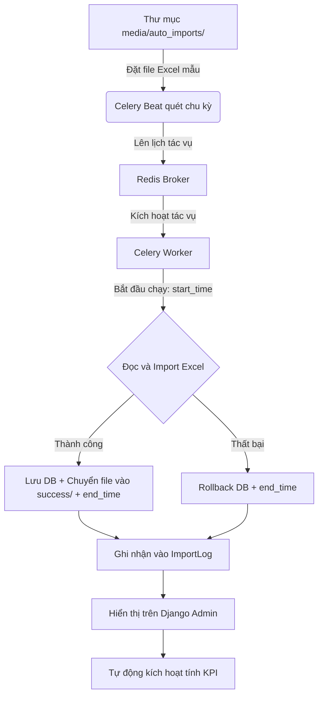

# Tài liệu hướng dẫn tổng quan dự án Report2026 (HP Co.)

Chào mừng bạn tiếp quản dự án! Đừng lo lắng nếu bạn chưa rành về Python. Tài liệu này được thiết kế để giúp bạn nắm bắt toàn bộ bức tranh của dự án từ kiến trúc, nghiệp vụ đến cách vận hành thực tế.

> [!IMPORTANT]
> **Quy trình thực thi chuẩn (SOP) & Checklist bắt buộc**:
> Tất cả các lập trình viên và AI Coding Agent khi tham gia phát triển, bảo trì dự án này bắt buộc phải đọc và tuân thủ quy trình 5 bước được định nghĩa tại file [CheckList.md](file:///d:/Sources/dashboard-report/CheckList.md) trước khi sửa đổi code hoặc thực hiện commit.

---

## 1. Dự án này là gì?
Dự án **Report2026** là một hệ thống **Backend API (Application Programming Interface)** chuyên phục vụ cho việc:
1. **Thu thập dữ liệu tự động**: Đọc các file báo cáo Excel xuất ra từ các hệ thống kế toán khác.
2. **Tính toán chỉ số hiệu suất**: Tính doanh thu, công nợ, dòng tiền, chi phí vận hành, tồn kho theo từng ngày, từng tháng cho từng đơn vị kinh doanh (Business Unit - BU) và cho toàn công ty.
3. **Cung cấp API cho Frontend**: Trả dữ liệu đã tính toán dưới dạng JSON để giao diện Dashboard (React/Vue) vẽ biểu đồ.

---

## 2. Các công nghệ cốt lõi được sử dụng
*   **Ngôn ngữ**: Python 3.14 (chạy trong môi trường ảo ở thư mục `.venv`).
*   **Framework Web**: **Django** & **Django REST Framework (DRF)**. Django giúp quản lý Database và Admin, còn DRF dùng để xây dựng các API.
*   **Hệ quản trị cơ sở dữ liệu**: **PostgreSQL** (chạy ở cổng `5433`, tên database là `reportdb`).
*   **Hệ thống hàng đợi & Tác vụ ngầm**: **Celery** kết hợp với **Redis Broker** để chạy các tác vụ import file Excel tự động.
*   **Thư viện xử lý Excel**: `django-import-export` kết hợp `tablib` để đọc/ghi file Excel cấu trúc lớn.

---

## 3. Cấu trúc thư mục & Ý nghĩa các file quan trọng

Thư mục làm việc của bạn bao gồm:
*   `.venv/`: Thư mục chứa môi trường Python và các thư viện đã cài đặt.
*   `report2026/` *(Thư mục cấu hình dự án)*:
    *   [settings.py](file:///d:/Sources/dashboard-report/report2026/settings.py): Cấu hình chung của dự án (Kết nối database, cấu hình bảo mật CORS/CSRF, danh sách các thư viện được cài đặt, lịch chạy tác vụ tự động Celery).
    *   [urls.py](file:///d:/Sources/dashboard-report/report2026/urls.py): File định tuyến (Routing) chính, điều hướng các request từ trình duyệt tới ứng dụng.
    *   [celery.py](file:///d:/Sources/dashboard-report/report2026/celery.py): File cấu hình khởi tạo Celery.
*   `accounting/` *(Ứng dụng xử lý kế toán - Nơi chứa toàn bộ logic nghiệp vụ)*:
    *   [models.py](file:///d:/Sources/dashboard-report/accounting/models.py): **Nơi định nghĩa cấu trúc cơ sở dữ liệu (Database Schema)**. Chứa các model chính như Khách hàng, Sản phẩm, Tồn kho, Chỉ số hiệu suất BU, và bảng nhật ký `ImportLog`.
    *   [views.py](file:///d:/Sources/dashboard-report/accounting/views.py): **Nơi nhận request và trả về response**. Chứa logic xử lý đăng nhập và các API cung cấp dữ liệu báo cáo.
    *   [serializers.py](file:///d:/Sources/dashboard-report/accounting/serializers.py): Bộ chuyển đổi dữ liệu thành định dạng JSON (và ngược lại) để Frontend dễ đọc.
    *   [tasks.py](file:///d:/Sources/dashboard-report/accounting/tasks.py): **Tác vụ ngầm**. Chứa code tự động quét thư mục để import dữ liệu từ file Excel và tính toán KPI hiệu suất tài chính.
    *   [resources.py](file:///d:/Sources/dashboard-report/accounting/resources.py): Quy tắc mapping dữ liệu giữa cột trong file Excel và cột trong DB.
    *   [urls.py](file:///d:/Sources/dashboard-report/accounting/urls.py): Định tuyến riêng cho các API của app `accounting`.
*   [run_celery.bat](file:///d:/Sources/dashboard-report/run_celery.bat): File batch script khởi chạy thủ công Celery độc lập (khi cần chạy thử nghiệm/gọi từ shell).
*   [requirements.txt](file:///d:/Sources/dashboard-report/requirements.txt): Tệp chứa danh sách các thư viện Python phụ thuộc cần thiết cho dự án.

---

## 4. Các luồng nghiệp vụ chính của dự án

### Luồng A: Tự động nạp dữ liệu từ file Excel (Auto Import)



1. **Chu kỳ quét**: Lịch chạy Celery Beat được tải động từ cấu hình `.env` (thông qua hàm `get_import_schedule` trong [settings.py](file:///d:/Sources/dashboard-report/report2026/settings.py#L173)), cho phép cấu hình linh hoạt (hàng ngày, hàng tuần, hàng tháng hoặc cron tùy chỉnh).
    * *Mặc định thực tế hiện tại*: Cấu hình Custom Cron chạy nhiều lần trong ngày: `20 7,9,11,14,16 * * 1-6` (tương ứng 07:20, 09:20, 11:20, 14:20, 16:20 từ Thứ Hai đến Thứ Bảy).
2. **Quét file**: Celery Worker nhận việc, quét thư mục `media/auto_imports/` để tìm các file có tên dạng:
    *   `BAN_HANG*.xlsx` (Bán hàng) -> Lưu vào `SalesTransaction`
    *   `MUA_HANG*.xlsx` (Mua hàng) -> Lưu vào `PurchaseDetail`
    *   `TON_KHO*.xlsx` (Tồn kho) -> Lưu vào `InventorySummary`
    *   `CONG_NO_NCC*.xlsx` (Công nợ nhà cung cấp) -> Lưu vào `SupplierDebt`
    *   `TUOI_NO_KH*.xlsx` (Tuổi nợ khách hàng) -> Lưu vào `ReceivablesAgeing`
    *   `TAI_KHOAN_CT*.xlsx` (Sổ chi tiết các tài khoản 111, 112, 341) -> Lưu vào `AccountDetail`
    * *Lưu ý*: Danh mục Khách hàng (`KHACH_HANG*.xlsx`) không được đồng bộ tự động theo chu kỳ do MISA AMIS không hỗ trợ URL kết xuất danh mục động. Tuy nhiên, hệ thống vẫn hỗ trợ import thủ công thông qua Django Admin (`CustomerAdmin`) hoặc qua script chạy độc lập [import_specific_file.py](file:///d:/Sources/dashboard-report/import_specific_file.py).
3. **An toàn dữ liệu & Phạm vi xóa (Scope of Deletion)**: 
    Dữ liệu import của mỗi file được đặt trong một **database transaction** (`transaction.atomic()`). 
    - **Cơ chế Phân đoạn (Targeted Chunk Deletion)**: Thay vì xóa toàn bộ bảng (`objects.all().delete()`), hệ thống chỉ thực hiện xóa dữ liệu của kỳ kế toán tương ứng với file Excel đang nạp.
        - Đối với các bảng giao dịch (`SalesTransaction`, `PurchaseDetail`, `AccountDetail`): Hệ thống xóa dữ liệu trong khoảng ngày hạch toán `[start_date, end_date]` được nhận diện từ file Excel.
        - Đối với các bảng số dư/lũy kế (`InventorySummary`, `SupplierDebt`, `ReceivablesAgeing`): Hệ thống xóa theo kỳ báo cáo cụ thể `reporting_period` (định dạng `YYYY-MM`) nhận diện từ file.
    - **Ngoại lệ an toàn cho danh mục Khách hàng (`KHACH_HANG`)**: Do bảng `Customer` có liên kết khóa ngoại với các bảng giao dịch khác bằng `on_delete=models.CASCADE`, việc xóa bảng `Customer` sẽ kéo theo việc tự động xóa sạch toàn bộ dữ liệu giao dịch liên quan. Vì thế, import Khách hàng hoạt động ở cơ chế **Upsert (Cập nhật hoặc Thêm mới)** dựa trên mã khách hàng (`code`) và không bao giờ xóa bảng (cấu hình flag `skip_delete: True`).
    > [!NOTE]
    > **Thiết kế ghi đè theo kỳ/phân đoạn:** Nhờ cơ chế xóa phân đoạn này, người dùng hoàn toàn có thể nạp các file Excel lẻ theo từng tháng (ví dụ: chỉ chứa dữ liệu tháng 6) một cách an toàn mà không sợ làm mất dữ liệu của các tháng trước đó.
    - Nếu import thành công, file Excel được di chuyển vào thư mục `success/`.
    - Nếu có bất kỳ lỗi cấu trúc/lỗi kiểu dữ liệu nào, toàn bộ quá trình sẽ được Rollback về trạng thái cũ để tránh mất/sai lệch dữ liệu cũ.
4. **Nhật ký tiến trình (`ImportLog`)**: Hệ thống ghi nhận mốc thời gian bắt đầu thực thi (`start_time`), thời gian hoàn thành (`end_time`), trạng thái (`SUCCESS`/`ERROR`/`NOTFOUND`) và thông báo chi tiết vào bảng `ImportLog` hiển thị trên Django Admin.
    - **Trạng thái `NOTFOUND` (Cảnh báo thiếu file)**: Nếu trong chu kỳ quét tự động mà có bất kỳ tệp tin nào được định nghĩa trong `IMPORT_MAP` bị thiếu (không tìm thấy trên ổ đĩa), hệ thống sẽ tạo một bản ghi log tổng hợp với trạng thái `NOTFOUND` liệt kê chi tiết các tiền tố tệp bị thiếu dưới dạng danh sách gạch đầu dòng trực quan.
    - **Chi tiết lỗi tải MISA**: Đối với tiến trình tự động tải báo cáo từ MISA, nếu có một hoặc nhiều báo cáo gặp lỗi tải, thông báo kết quả `message` của log `MISA_Playwright_Automation` sẽ đính kèm chi tiết cụ thể các tệp tải lỗi ở cuối chuỗi dưới dạng: `Errors: <Prefix_Báo_Cáo>: <Chi tiết lỗi>` để dễ dàng theo dõi.
5. **Cơ chế kích hoạt tính toán tự động (Orchestration Flow)**:
    - Ngay khi tiến trình import hoàn tất thành công, Celery Worker sẽ **tự động kích hoạt** việc tính toán lại KPI cho Tổng công ty và từng BU bằng cách xếp hàng các tác vụ ngầm:
      - `update_single_bu_performance.delay(None)` (Cho Tổng công ty).
      - `update_single_bu_performance.delay(bu.id)` (Cho từng BU cụ thể trong danh mục `BusinessUnit`).
    - **Tự động chạy đồng bộ kho hàng**: Đồng thời, tiến trình đồng bộ tồn kho kho hàng (`sync_warehouse_inventory_data.delay()`) cũng sẽ được **tự động kích hoạt** ngay sau khi lên lịch tính KPI để cập nhật số liệu tồn kho vào bảng `Warehouse` (xem chi tiết ở Luồng C).

---

### Luồng B: Tính toán chỉ số hiệu suất (KPI/Performance)
Sau khi dữ liệu Excel mới được nạp vào, hệ thống chạy hàm `update_single_bu_performance` để tổng hợp số liệu cho từng đơn vị kinh doanh (BU) và cho Tổng công ty. Dưới đây là logic nghiệp vụ và kỹ thuật chi tiết:

#### 1. Logic xác định phạm vi (Global / Sub-BU)
- **Quy ước Global**: Nếu `bu_id` nhận vào là `None`, hệ thống thiết lập biến `is_global = True`.
- **Hành vi**: Khi `is_global = True`, hệ thống sẽ **bỏ qua bộ lọc theo từng BU con**, trực tiếp tổng hợp toàn bộ dữ liệu của toàn công ty (Tổng công ty). Đồng thời, hệ thống **bắt buộc áp dụng bộ lọc loại trừ `settings.EXCLUDED_BU_CODES`** (`['ĐTCT']`) trên tất cả các truy vấn dữ liệu gốc (`SalesTransaction`, `AccountDetail`, `InventorySummary`, `ReceivablesAgeing`) để loại bỏ 1.23 tỷ VNĐ doanh thu mảng ĐTCT khỏi Tổng công ty.
- **Bộ lọc loại trừ động từ `settings.py`**:
  * Loại trừ BU: Tự động lọc bỏ các BU có mã nằm trong `settings.EXCLUDED_BU_CODES` (hiện tại là `['ĐTCT']` - Đầu tư cho thuê) và các đơn vị con của chúng khỏi mọi phép tính (kể cả cấp Tổng công ty `is_global = True`).
  * Loại trừ Khách hàng: Lọc bỏ các giao dịch của khách hàng thuộc nhóm trong `settings.EXCLUDED_CUSTOMER_GROUP_CODES` (hiện tại là `['Internal']`).
- **BU cấp dưới (Sub-BU)**: Nếu `bu_id` cụ thể, hệ thống lọc chính xác bản ghi của riêng BU đó và các BU con thuộc nhánh thông qua `get_all_descendant_ids()` (và loại trừ các BU/Khách hàng đặc thù nói trên).

#### 2. Logic xử lý mốc thời gian (`target_date`)
- Nhận tham số ngày kết thúc tính toán `target_date_str`.
- Nếu không truyền:
  - Nếu tính toán cho **tháng hiện tại** (trùng tháng/năm hiện tại): `target_date` tự động lấy ngày hôm nay (`today.date()`).
  - Nếu tính toán cho **tháng cũ** trong quá khứ: `target_date` tự động lấy ngày cuối cùng của tháng đó (`calendar.monthrange(year, month)[1]`).
- Hệ thống sẽ chạy vòng lặp cập nhật phát sinh thực tế từng ngày (`BUPerformanceDaily`) bắt đầu từ ngày 1 đến hết ngày `target_date`.

#### 3. Bộ lọc Khách hàng ghi nhận doanh thu (`Customer.has_revenue`)
- Toàn bộ các truy vấn tính Doanh thu (`SalesTransaction`) và Thực thu (`AccountDetail`) đều được áp dụng bộ lọc bắt buộc:
  `customer__has_revenue=True`
- Chỉ có những khách hàng được cấu hình ghi nhận doanh thu mới tham gia vào các chỉ số KPI này. Các khách hàng còn lại sẽ bị loại bỏ hoàn toàn khỏi kết quả tính toán.

#### 4. Logic chi tiết tính các chỉ số hiệu suất
*   **Doanh thu lũy kế tháng**: Tổng hợp từ bảng `SalesTransaction` (cộng cột `actual_sales`).
    > [!IMPORTANT]
    > **Đồng bộ hóa công thức Doanh thu:**
    > - Cả Doanh thu lũy kế tháng (`mtd_revenue_actual`) và Doanh thu phát sinh hàng ngày (`daily_revenue`) đều được đồng bộ hóa sử dụng chung cột **`actual_sales`** (Doanh số thực tế sau giảm trừ) từ bảng `SalesTransaction` để đảm bảo tính nhất quán tuyệt đối của dữ liệu báo cáo.
    > - **Tách biệt Doanh thu Oversea:** Hệ thống lọc tách riêng doanh thu của nhóm khách hàng nước ngoài được cấu hình trong `settings.OVERSEA_CUSTOMER_GROUP_CODES` (lưu vào `mtd_revenue_oversea_actual`), và phần doanh thu còn lại lưu vào `mtd_revenue_exclude_oversea_actual` (bằng tổng doanh thu trừ đi doanh thu Oversea).
    > - **Phân tách Nhóm khách hàng Oversea theo BU:**
    >   - **Tổng công ty (Global)**: Không loại trừ nhóm khách hàng Oversea (bao gồm cả dữ liệu trong nước và Oversea) để có tổng doanh số đầy đủ.
    >   - **Nhánh Oversea** (BU có mã `Oversea` hoặc trực thuộc `Oversea`): Tính **TẤT CẢ giao dịch của khách hàng thuộc nhóm Oversea** (`settings.OVERSEA_CUSTOMER_GROUP_CODES`), bất kể giao dịch đó được ghi nhận tại BU nào trong MISA. **Không** filter theo `business_unit_id`. Áp dụng nhất quán cho Doanh thu, Thực thu và Công nợ/Tuổi nợ.
    >   - **Các BU trong nước khác**: Loại bỏ hoàn toàn các khách hàng thuộc nhóm khách hàng Oversea khi tính toán Doanh thu, Thực thu và Công nợ/Tuổi nợ để tránh sai lệch số liệu trong nước.
*   **Thực thu tiền mặt/ngân hàng (Collection - Quy tắc Kế toán)**: 
    - Lọc từ sổ chi tiết tài khoản `AccountDetail` các bút toán có:
      - Tài khoản của mình bắt đầu bằng `111` (tiền mặt) hoặc `112` (tiền gửi ngân hàng) (`account_number__startswith`).
      - Tài khoản đối ứng bắt đầu bằng `1311` hoặc `1312` (các tài khoản phải thu khách hàng) (`offset_account__startswith`).
    - **Công thức tính thực thu**: `coll_actual = debit_amount - credit_amount` (Phát sinh Nợ trừ Phát sinh Có).
    - **Tách biệt Thực thu Oversea:** Hệ thống lọc tách riêng thực thu của nhóm khách hàng nước ngoài được cấu hình trong `settings.OVERSEA_CUSTOMER_GROUP_CODES` (lưu vào `mtd_collection_oversea_actual`), và phần thực thu còn lại lưu vào `mtd_collection_exclude_oversea_actual` (bằng tổng thực thu trừ đi thực thu Oversea).
    - **Phân tách Nhóm khách hàng Oversea theo BU:** Bộ lọc áp dụng nhất quán theo BU tương tự như Doanh thu (Nhánh Oversea tính tất cả khách Oversea trên toàn hệ thống không lọc BU; các BU trong nước loại bỏ khách Oversea).
*   **Tuổi nợ & Công nợ (Receivables Ageing)**:
    - Lọc từ bảng `ReceivablesAgeing`.
    - **Dư nợ cần thu** (`receivable_total`): Tính bằng tổng cột `total_debt`.
    - **Nợ quá hạn** (`receivable_overdue`): Tính bằng tổng cột `overdue_total`.
    - **Đã thu (đến hạn)** (`collection_due_actual`): Tính từ phát sinh thực thu trong bảng `AccountDetail` đối ứng khách hàng có nợ quá hạn.
    - **Thu trong hạn + COD** (`collection_in_term_cod`): Tính bằng công thức `Tổng thực thu trong ngày - Đã thu đến hạn`.
*   **Tồn kho KPI**: 
    - **Đường đi dữ liệu**: 
      `InventorySummary` -> `Warehouse` -> `BusinessUnit` (thông qua `warehouse__business_unit_id=bu_id`).
    - Bảng tồn kho `InventorySummary` không lưu trực tiếp thông tin `business_unit_id` mà phải thông qua liên kết kho hàng `Warehouse`.
    - **Giá trị tồn kho thực tế** (`inventory_value_actual`) của BU/Tổng công ty được tính bằng tổng cột `closing_value` của bảng `InventorySummary` theo filter BU.

*   Tất cả số liệu sau khi tính toán xong được lưu vào bảng `BUPerformance` (theo tháng) và `BUPerformanceDaily` (theo ngày).

> [!NOTE]
> **Công thức & Quy tắc Tính toán Chi phí Vận hành (OPEX):**
> * **Chi phí vận hành MTD (`opex_actual`)**: Chi phí tạm tính phân bổ + Thực tế MISA Nợ TK 641 & 642.
>   * *Chi phí tạm tính phân bổ lũy kế*: `(opex_plan / số ngày trong tháng) * ngày kết thúc target_date` (Hoặc tổng `daily_opex_plan` đến ngày `target_date`).
>   * *Thực tế MISA*: Tổng phát sinh Nợ TK 641 & 642 trong `AccountDetail` (loại trừ `EXCLUDED_BU_CODES`).
> * **Kế hoạch Chi phí tháng (`opex_plan`)**: Được nạp từ `BUTargetPlan` (`month_opex_target`) hoặc thiết lập trên Django Admin UI.
> * **Kế hoạch Chi phí ngày (`daily_opex_plan`)**: Tự động phân bổ đều theo ngày (`opex_plan / số ngày trong tháng`).
> * **Chi phí Thực tế ngày (`daily_opex_actual`)**: Tổng phát sinh Nợ TK 641 & 642 của riêng ngày đó trong `AccountDetail`.


> [!IMPORTANT]
> **Kiến trúc & Quy tắc Mapping Target/Plan (`BUTargetPlan` vs `BUPerformance`):**
> * **Bảng `BUTargetPlan` (Ngân sách Kế hoạch Cố định của Kế toán giao)**:
>   - Đây là bảng lưu các chỉ tiêu Kế hoạch giao chính thức (Kế toán nhập vào hoặc nạp từ file/seed script).
>   - Chứa 2 loại chỉ tiêu riêng biệt:
>     - **Target Tháng (MTD Target)**: `month_revenue_target`, `month_collection_target`, `month_opex_target`, v.v. (Ví dụ Thu tiền MTD Tháng 7: **64.52 tỷ VNĐ**).
>     - **Target Cả Năm Cố Định (YTD/Year Target)**: `year_revenue_target`, `year_collection_target`, `year_opex_target`, v.v. (Ví dụ Thu tiền Cả Năm: **594.87 tỷ VNĐ**, Doanh thu Cả Năm: **724.03 tỷ VNĐ**).
> * **Bảng `BUPerformance` (Bảng Tính Toán Hiệu Suất Tự Động Hàng Tháng)**:
>   - Chứa dữ liệu phát sinh Thực tế (MTD/YTD) và các trường kế hoạch phân bổ lũy kế.
>   - Trường `ytd_collection_plan` và `ytd_revenue_plan` trong bảng này được hàm `update_single_bu_performance` tự động tính bằng cách **cộng dồn `mtd_*_plan` các tháng đã đi qua**.
> * **NGUYÊN TẮC MAPPING BẮT BUỘC CHO LẬP TRÌNH VIÊN VÀ AI AGENTS**:
>   - **Khi lấy Target Tháng (MTD Target)**: Ưu tiên đọc `month_*_target` từ `BUTargetPlan` (Fallback: `mtd_*_plan` từ `BUPerformance`).
>   - **Khi lấy Target Năm (YTD Target)**: **BẮT BUỘC ƯU TIÊN đọc trực tiếp từ `year_*_target` của `BUTargetPlan`** (Fallback: `ytd_*_plan` từ `BUPerformance`). Tuyệt đối không dùng số lũy kế tháng của `BUPerformance` để đại diện cho Target Cả Năm.

---


### Luồng C: Đồng bộ tồn kho kho hàng (Warehouse Inventory Sync)
Tác vụ `sync_warehouse_inventory_data` dùng để tổng hợp số liệu tồn kho chi tiết từ bảng `InventorySummary` (cột đầu kỳ `opening_value`, nhập `in_value`, xuất `out_value`, cuối kỳ `closing_value`) nhóm theo kho hàng rồi cập nhật ngược trực tiếp vào các trường tương ứng trong bảng `Warehouse`.

> [!IMPORTANT]
> **Cơ chế kích hoạt**:
> Hệ thống sẽ **tự động kích hoạt** đồng bộ tồn kho kho hàng sau khi hoàn tất chu kỳ tính KPI BU. Ngoài ra, bạn vẫn có thể kích hoạt thủ công bằng một trong hai cách:
> 1. Truy cập Django Admin của bảng `Warehouse`, tích chọn các kho hàng cần cập nhật, chọn Action **`🔄 Đồng bộ tồn kho từ Inventory Summary`** rồi ấn Run.
> 2. Chạy tác vụ Celery `sync_warehouse_inventory_data` thông qua Django Celery Beat hoặc trigger bằng dòng lệnh.


---

## 5. Hướng dẫn chạy và thao tác với dự án dành cho bạn

Để bắt đầu làm việc trên máy tính này, bạn làm theo các bước sau:

### Bước 0: Khởi tạo file cấu hình môi trường `.env`
Hệ thống sử dụng thư viện `django-environ` để bảo mật và tách cấu hình cơ sở dữ liệu khỏi mã nguồn.
1. Tạo một tệp tin tên `.env` ở thư mục gốc của dự án (cùng cấp với thư mục `report2026/` và tệp `manage.py`).
2. Nhập các thông tin kết nối database tương ứng của máy bạn và cấu hình chu kỳ chạy Celery Beat nếu cần:
   ```env
   # 1. Cấu hình cơ sở dữ liệu
   DB_NAME=reportdb
   DB_USER=postgres
   DB_PASSWORD=your_password
   DB_HOST=localhost
   DB_PORT=5433

   # 2. Cấu hình chu kỳ tự động chạy nạp Excel của Celery Beat
   # Hỗ trợ các kiểu: daily (mặc định), weekly, monthly, custom (cron tùy chọn)
   IMPORT_SCHEDULE_TYPE=daily
   IMPORT_SCHEDULE_HOUR=7
   IMPORT_SCHEDULE_MINUTE=0
   
   # Thứ trong tuần (0-6 tương ứng CN-T7, áp dụng khi IMPORT_SCHEDULE_TYPE=weekly)
   IMPORT_SCHEDULE_DAY_OF_WEEK=1
   
   # Ngày trong tháng (1-31, áp dụng khi IMPORT_SCHEDULE_TYPE=monthly)
   IMPORT_SCHEDULE_DAY_OF_MONTH=1
      # Cron tùy chỉnh (áp dụng khi IMPORT_SCHEDULE_TYPE=custom)
    # minute hour day_of_month month day_of_week
    IMPORT_SCHEDULE_CRON=0 7 * * *

    # 3. Cấu hình tự động tải báo cáo từ MISA AMIS (Sử dụng Playwright)
    MISA_AMIS_LOGIN_URL=https://act.amis.vn/
    MISA_EMAIL=your_misa_email@example.com
    MISA_PASSWORD=your_misa_password
    MISA_HEADLESS=True
    MISA_EXPORT_SELECTOR="button:has-text('Xuất khẩu')"
    
    # Lựa chọn cơ chế tải báo cáo MISA:
    # 1: Xuất từng bước (Mặc định - Bot tự chọn tham số và click xuất)
    # 2: Tải từ danh sách báo cáo đã lưu (Saved Reports) để tối ưu thời gian chọn tham số
    USE_OPTION_EXPORT_REPORT_MISA=1
    MISA_URL_REPORT_SAVED=https://actapp.misa.vn/app/RP/ReportSavedList
    
    # URL của các báo cáo MISA cụ thể cần tải tự động
    MISA_URL_BAN_HANG=https://act.amis.vn/report/sales-detail
    MISA_URL_MUA_HANG=https://act.amis.vn/report/purchase-detail
    MISA_URL_TON_KHO=https://act.amis.vn/report/inventory-summary
    MISA_URL_CONG_NO_NCC=https://act.amis.vn/report/supplier-debt
    MISA_URL_TUOI_NO_KH=
    MISA_URL_TAI_KHOAN_CT=
    ```
*(Lưu ý: Tệp `.env` đã được tự động thêm vào `.gitignore` để tránh đẩy thông tin nhạy cảm lên Git).*

### Bước 0.5: Cài đặt các thư viện Python cần thiết
Trước khi khởi chạy hệ thống lần đầu, bạn cần cài đặt toàn bộ các thư viện được định nghĩa sẵn trong dự án:
1. Đảm bảo môi trường ảo (Virtual Environment) đã được kích hoạt.
2. Chạy lệnh cài đặt:
   ```powershell
   pip install -r requirements.txt
   ```

### Bước 0.6: Cài đặt Driver trình duyệt cho Playwright (Bắt buộc cho tác vụ MISA)
Tác vụ tự động hóa MISA sử dụng Playwright để điều khiển Chromium. Bạn cần tải về driver trình duyệt:
1. Đảm bảo môi trường ảo đã được kích hoạt.
2. Chạy lệnh:
   ```powershell
   playwright install chromium
   ```

### Bước 1: Cấu hình và Tự động khởi động Redis Server
Hệ thống hỗ trợ tự động khởi chạy Redis Server cùng lúc với Django Web Server.
1. Mở file [settings.py](file:///d:/Sources/dashboard-report/report2026/settings.py#L172) và cấu hình đường dẫn tới file chạy Redis trên máy của bạn:
   ```python
   REDIS_SERVER_PATH = r"d:\downloads\redis-x64-5.0.14.1\redis-server.exe"
   ```
2. Khi khởi chạy lệnh ở Bước 2, hệ thống sẽ tự động kiểm tra và bật cửa sổ Redis Server chạy song song mà bạn không cần mở thủ công.

> [!IMPORTANT]
> **Khuyến nghị tương thích**: Redis chạy trên Windows thường là phiên bản cũ (v5.0.x). Do đó, thư viện kết nối Python trong môi trường ảo `.venv` bắt buộc phải sử dụng phiên bản `redis==4.6.0`. (Phiên bản `redis >= 5.x` sử dụng giao thức RESP3 sẽ gây lỗi `unknown command 'HELLO'`).

### Bước 2: Chạy Server phát triển (Development Server) & Celery + Redis tự động
Chạy máy chủ web Django thông thường trong môi trường ảo:
```powershell
py manage.py runserver
```

> [!TIP]
> **Tự động hóa hoàn toàn**: Chúng ta đã tích hợp mã nguồn quản lý trực tiếp vào [manage.py](file:///d:/Sources/dashboard-report/manage.py). Khi chạy lệnh `runserver` ở trên:
> 1. Django sẽ **tự động khởi chạy Redis Server, Celery Worker và Celery Beat** trong các cửa sổ terminal độc lập hoàn toàn tự động.
> 2. Cơ chế thông minh đảm bảo các dịch vụ chỉ mở đúng 1 bản duy nhất mỗi lần khởi chạy server (không bị lặp lại do `auto-reloader`).
> 3. **Tự động dọn dẹp khi dừng server**: Khi bạn nhấn `Ctrl + C` để dừng `runserver`, Django sẽ tự động gửi lệnh kết thúc và **đóng hoàn toàn tất cả các cửa sổ terminal Celery & Redis** đang chạy, tránh rác tiến trình chạy ngầm trên Windows.

### Bước 3: Các Script hỗ trợ chạy thủ công và Test (Helper & Test Scripts)
Để thuận tiện cho việc debug và test nhanh các tiến trình mà không cần phụ thuộc vào Celery Beat, hệ thống cung cấp 2 file script ở thư mục gốc:

1. **[test_download_ban_hang.py](file:///d:/Sources/dashboard-report/test_download_ban_hang.py)**:
   - *Tác dụng*: Chạy tải thử nghiệm báo cáo Bán hàng (`BAN_HANG`) từ MISA.
   - *Đặc điểm*: Khởi chạy Playwright bằng trình duyệt **ở chế độ có giao diện (`headless=False`)** để lập trình viên có thể trực tiếp quan sát các bước tự động tương tác và xử lý tắt popup (như popup nhắc hết hạn, popup khảo sát, v.v.).
   - *Cách chạy*:
     ```powershell
     .venv\Scripts\python.exe test_download_ban_hang.py
     ```

2. **[import_specific_file.py](file:///d:/Sources/dashboard-report/import_specific_file.py)**:
   - *Tác dụng*: Import thủ công một file Excel bất kỳ trong thư mục `media/auto_imports/`.
   - *Đặc điểm*: Tự động định danh loại dữ liệu dựa trên tiền tố file, xóa sạch dữ liệu cũ và nạp dữ liệu mới trong một Database Transaction (an toàn tuyệt đối, lỗi sẽ tự rollback), tự động ghi nhật ký vào `ImportLog` trên Django Admin, di chuyển file thành công vào thư mục `success/` và đồng thời tự động kích hoạt tính toán lại KPI cho các BU.
   - *Cách chạy*:
     - Xem danh sách các file đang chờ import:
       ```powershell
       .venv\Scripts\python.exe import_specific_file.py
       ```
     - Chạy import một file cụ thể:
       ```powershell
       .venv\Scripts\python.exe import_specific_file.py <tên_file.xlsx>
       ```

---

## 6. API Endpoint phục vụ Frontend Dashboard

### Phân quyền & Bảo mật API (Authentication)
*   Hệ thống yêu cầu xác thực bằng **Knox Token** hoặc **Session**.
*   Giao thức gọi API (ngoại trừ `/api/login/`) bắt buộc phải đính kèm Header:
    `Authorization: Token <key_nhận_được_khi_login>`

### Danh sách các API Endpoint:

#### 1. Đăng nhập hệ thống
*   `POST /api/login/`:
    *   **Body (JSON)**: `{"username": "...", "password": "..."}`
    *   **Response (JSON)**: Trả về Token Knox, ngày hết hạn và thông tin cơ bản của user.

#### 2. Đăng xuất hệ thống (Knox Auth)
*   `POST /api/auth/logout/`: Hủy token hiện tại.
*   `POST /api/auth/logoutall/`: Hủy toàn bộ token đã cấp cho user.

#### 3. Lấy số liệu Hiệu suất BU theo Tháng (Dashboard chính)
*   `GET /api/bu-performance/`: Trả về số liệu kế hoạch và thực tế theo tháng kèm theo các trường KPI được tính toán tự động như `revenue_kpi`, `collection_kpi`, `inventory_vs_plan`.
*   **Query Parameters**:
    *   `?start_date=YYYY-MM-DD&end_date=YYYY-MM-DD`: Lọc theo quãng ngày (tự động tính các tháng/năm giao thoa với khoảng ngày này).
    *   `?month=X`: Tháng cần lấy dữ liệu (Số từ 1-12).
    *   `?year=X`: Năm cần lấy dữ liệu (Số 4 chữ số).
    *   `?bu_id=X`: Lọc theo BU (`null` hoặc bỏ trống để lấy Tổng công ty, `all` để lấy toàn bộ, hoặc ID cụ thể).
    *   `?only_roots=true`: Chỉ lấy các BU cấp cao nhất (không có BU cha).

#### 4. Lấy số liệu Hiệu suất BU theo Ngày (Vẽ biểu đồ)
*   `GET /api/performance/daily/`: Trả về dữ liệu doanh thu và thực thu phát sinh trong từng ngày của tháng.
*   **Query Parameters**:
    *   `?start_date=YYYY-MM-DD&end_date=YYYY-MM-DD`: Lọc theo quãng ngày (Khuyên dùng cho lọc theo tuần/khoảng thời gian).
    *   `?week=X`: Lọc theo số tuần cụ thể trong năm.
    *   `?month=X`: Tháng cần lấy dữ liệu (Số từ 1-12).
    *   `?year=X`: Năm cần lấy dữ liệu (Số 4 chữ số).
    *   `?bu_id=X`: Lọc theo BU (`null`, `0` hoặc bỏ trống để lấy Tổng công ty, hoặc ID cụ thể).

#### 5. Lấy số liệu Báo cáo Thu nợ theo BU (Dashboard Thu Nợ)
*   `GET /api/dashboard/collection-by-bu/`:
    *   **Tác dụng**: Trả về 5 chỉ số thu nợ chi tiết theo từng đơn vị kinh doanh chính (`is_main=True`) cho một ngày cụ thể.
    *   **Query Parameters (Bắt buộc)**: `?date=YYYY-MM-DD` (Ví dụ: `?date=2026-06-15`).
    *   **Dữ liệu trả về**: Danh sách `rows` chi tiết của từng BU (dư nợ cần thu, nợ quá hạn, đã thu đến hạn, thu trong hạn + COD, tổng thu trong ngày) và tổng cộng `totals` của toàn bộ BU chính.

#### 6. Kích hoạt tính toán lại dữ liệu (Manual Trigger)
*   `POST /api/update-performance/`: Cho phép trigger tính toán và cập nhật lại chỉ số hiệu suất từ các bảng chi tiết.
    *   **Body (JSON)**:
        ```json
        {
          "bu_id": 1, // ID của BU (null nếu là Tổng công ty)
          "month": 6,
          "year": 2026,
          "target_date": "2026-06-15" // Mốc ngày kết thúc tính toán
        }
        ```
    *   **Cơ chế thực thi**: Tác vụ được thực hiện **bất đồng bộ (Asynchronous)** bằng cách xếp hàng tác vụ ngầm vào Celery để tránh lỗi 504 Gateway Timeout. API phản hồi ngay lập tức trạng thái `{"status": "success", "message": "..."}`.

#### 7. Gửi báo cáo qua email (Send Email API)
*   `POST /api/reports/send-email/`:
    *   **Tác dụng**: Cho phép gửi email từ Frontend kèm theo file đính kèm (báo cáo, Excel...).
    *   **Authentication**: Yêu cầu Header `Authorization: Token <key>` (Knox Token).
    *   **Request Format**: `multipart/form-data`.
    *   **Các tham số dữ liệu (Form Fields)**:
        *   `file` (File, Optional): Tệp tin đính kèm.
        *   `file_name` (String, Optional): Tên hiển thị của file đính kèm (nếu để trống sẽ mặc định lấy tên file gốc tải lên).
        *   `from_name` (String, Optional): Tên hiển thị người gửi (Alias/Display Name, ví dụ: `Hao Phuong Reporting System`).
        *   `from_email` (String, Optional): Địa chỉ email người gửi / phản hồi (Reply-To).
        *   `to_emails` (String, Required): Danh sách địa chỉ email nhận, ngăn cách bởi dấu phẩy (Ví dụ: `nhanvienA@haophuong.com, nhanvienB@haophuong.com`).
        *   `subject` (String, Required): Tiêu đề của email.
        *   `message` (String, Required): Nội dung email (body).
    *   **Dữ liệu phản hồi (JSON)**:
        *   Thành công: `{"status": "success", "message": "Gửi email thành công."}` (Mã 200 OK).
        *   Lỗi tham số: `{"to_emails": ["Danh sách email nhận không được để trống."]}` (Mã 400 Bad Request).
        *   Lỗi hệ thống/SMTP: `{"status": "error", "message": "Không thể gửi email: <chi tiết lỗi>"}` (Mã 500 Internal Server Error).

#### 7.1. Đăng nhập qua Google (Single Sign-On Google OAuth2 API)
*   `POST /api/google-login/`:
    *   **Tác dụng**: Cho phép người dùng đăng nhập hệ thống thông qua tài khoản Google trên Frontend (React/Vite/Next.js). Backend xác thực `id_token` trực tiếp với máy chủ Google, tự động khởi tạo/tìm kiếm Django User, và phát hành Token Knox tương thích với toàn bộ hệ thống API.
    *   **Authentication**: Không bắt buộc (`AllowAny`).
    *   **Request Format**: `JSON`.
    *   **Body (JSON)**:
        ```json
        {
          "id_token": "<chuỗi_jwt_id_token_nhận_từ_Google_SDK>"
        }
        ```
    *   **Dữ liệu phản hồi thành công (JSON - Mã 200 OK)**:
        ```json
        {
          "expiry": "2026-07-23T06:00:00Z",
          "token": "<chuỗi_knox_token_key_đã_mã_hóa>"
        }
        ```
    *   **Lỗi xác thực (JSON - Mã 400 Bad Request)**:
        ```json
        {
          "error": "Google ID token không hợp lệ hoặc đã hết hạn: ..."
        }
        ```

    ##### 🧪 Hướng dẫn Kiểm thử (Testing) qua Google OAuth2 Playground:
    1. **Khởi chạy Server**: Đảm bảo Django Backend đang chạy (`python manage.py runserver 8000`).
    2. **Lấy `id_token` từ Google**:
       - Truy cập [Google OAuth2 Playground](https://developers.google.com/oauthplayground/).
       - Tại cột bên trái **Step 1**, cuộn tìm mục **Google OAuth2 API v2** ➔ tích chọn `email` và `profile` (hoặc nhập `openid email profile`).
       - Nhấn **Authorize APIs** và đăng nhập tài khoản Google.
       - Tại **Step 2**, nhấn nút **Exchange authorization code for tokens**.
       - Sao chép toàn bộ chuỗi tại trường **`id_token`** từ khung JSON kết quả bên phải (bắt đầu bằng `eyJhbGciOiJSUzI1...`).
    3. **Gửi Request kiểm thử (Postman / cURL)**:
       - **Postman**: Method `POST`, URL `http://127.0.0.1:8000/api/google-login/`, Header `Content-Type: application/json`, Body (raw JSON):
         ```json
         {
           "id_token": "<CHUỖI_ID_TOKEN_VỪA_COPY>"
         }
         ```
       - **cURL**:
         ```bash
         curl -X POST http://127.0.0.1:8000/api/google-login/ \
           -H "Content-Type: application/json" \
           -d "{\"id_token\": \"<CHUỖI_ID_TOKEN_VỪA_COPY>\"}"
         ```
       - **Giao diện Web Frontend Tester**: Khởi chạy `python FrontEndLogin/server.py` và truy cập `http://127.0.0.1:3000` để thực hiện test trực tiếp trên UI giao diện web.

    ##### 🛠️ Xử lý lỗi thường gặp khi Build/Deploy Frontend (`Error 400: origin_mismatch`):
    - **Nguyên nhân**: Lỗi xảy ra khi domain/port của trang Frontend sản phẩm (ví dụ: `https://report.haophuong.com` hoặc domain staging) **chưa được khai báo** trong danh sách cho phép của Google Cloud Console.
    - **Giải pháp**: Truy cập [Google Cloud Console Credentials](https://console.cloud.google.com/apis/credentials), chọn Client ID đang dùng ➔ tại mục **Authorized JavaScript origins**, nhấn **+ ADD URI** và nhập domain chính xác của Frontend (Ví dụ: `https://report.haophuong.com`). Sau khi lưu, chờ khoảng 5-10 phút để Google cập nhật.


#### 8. Các API danh mục chi tiết (DRF ViewSets)
Các ViewSet này cung cấp giao diện Web API trực quan để lấy danh sách (`GET`), chi tiết (`GET [id]`), tạo (`POST`), sửa (`PUT`), xóa (`DELETE`) dữ liệu:
*   `/api/branches/` (Chi nhánh)
*   `/api/warehouses/` (Kho hàng)
*   `/api/customers/` (Khách hàng)
*   `/api/employees/` (Nhân viên)
*   `/api/products/` (Sản phẩm/Vật tư hàng hóa)
*   `/api/business-units/` (Đơn vị kinh doanh - BU):
    *   *Bộ lọc*: `?is_main=true` (chỉ lấy BU chính) hoặc `?is_main=false`
*   `/api/transactions/` (Chi tiết bán hàng)
*   `/api/suppliers/` (Nhà cung cấp)
*   `/api/supplier-groups/` (Nhóm nhà cung cấp)
*   `/api/supplier-debts/` (Công nợ NCC)
*   `/api/account-details/` (Sổ chi tiết các tài khoản 111, 112, 341):
    *   *Bộ lọc*: `?business_unit__code=...`
*   `/api/receivables-ageing/` (Chi tiết tuổi nợ):
    *   *Tìm kiếm*: `?search=mã_hoặc_tên_khách_hàng`
*   `/api/purchase-details/` (Chi tiết mua hàng):
    *   *Bộ lọc*: `?supplier__code=...&business_unit__code=...&warehouse__code=...`
*   `/api/inventory-summaries/` (Tổng hợp tồn kho)
*   `/api/target-plans/` (Quản lý Chỉ tiêu Kế hoạch - Target Plans):
    *   *Bộ lọc*: `?month=7&year=2026&business_unit=...`
*   `/api/adjustments/` (Quản lý Điều chỉnh Phát sinh Ngoại bảng - Off-MISA Adjustments):
    *   *Bộ lọc*: `?month=7&year=2026&metric_type=REVENUE&is_active=true`

---

## 7. Lưu ý kỹ thuật chuyên sâu & Hướng phát triển tương lai (Dành cho Developer/Agent)

Để hỗ trợ đắc lực cho các Agent/Developer tiếp quản và vận hành dự án, dưới đây là các phân tích chi tiết về mặt thiết kế kỹ thuật, rủi ro hiệu năng tiềm ẩn và phương án giải quyết tương ứng:

### 7.1. Logic Doanh thu không khớp (Đã giải quyết)
* **Trạng thái**: **Đã hoàn thành đồng bộ**. Cả doanh thu tháng (`mtd_revenue_actual`) và doanh thu ngày (`daily_revenue`) hiện tại đều sử dụng chung trường `actual_sales` (Doanh số thực tế sau giảm trừ) thay vì sử dụng `sales_amount` như trước, đảm bảo tính nhất quán của báo cáo.

### 7.2. Cảnh báo chủ động khi có lỗi (Error Handling & Alerts)
* **Bối cảnh**: Khi có lỗi định dạng file Excel (thiếu cột, sai kiểu dữ liệu,...) hoặc lỗi runtime, hệ thống thực hiện rollback giao dịch và lưu bản ghi nhật ký với trạng thái `ERROR` vào cột "Nội dung chi tiết" (`message`) của bảng `ImportLog` trên Django Admin. Bản ghi lỗi này bao gồm chi tiết lỗi chung (Base Errors) và chi tiết cụ thể trên từng dòng bị lỗi để nhà phát triển dễ dàng gỡ lỗi (debug).
* **Hạn chế**: Hiện tại dự án chưa tích hợp bất kỳ cơ chế cảnh báo chủ động nào (như Email, Slack hay Telegram).
* **Hướng xử lý tương lai**: Tích hợp thêm gửi Webhook cảnh báo khẩn cấp trong khối xử lý ngoại lệ `except Exception as e:` của hàm `auto_import_excel_from_folder` trong [tasks.py](file:///d:/Sources/dashboard-report/accounting/tasks.py#L75-L83).

### 7.3. Rủi ro khóa bảng khi dữ liệu phình to (Scalability & Table Lock)
* **Bối cảnh**: Hiện tại, mỗi khi import Excel, hệ thống sẽ xóa sạch dữ liệu cũ (`objects.all().delete()`) rồi nạp lại dữ liệu mới trong khối `transaction.atomic()`.
* **Rủi ro hiệu năng**: Khi bảng `SalesTransaction` hoặc `AccountDetail` lên tới hàng triệu dòng, việc này sẽ gây ra tình trạng **Exclusive Lock** trên cơ sở dữ liệu PostgreSQL trong thời gian dài, làm treo toàn bộ API đọc dữ liệu của Frontend.
* **Hướng xử lý tương lai**: Khi quy mô dữ liệu tăng lên, cần nâng cấp quy trình import:
  1. Chuyển sang cơ chế **Import tăng dần (Incremental/Upsert Load)** hoặc ghi đè theo từng phần (ví dụ: chỉ reload tháng hiện tại) thay vì xóa trắng toàn bộ bảng.
  2. Sử dụng **Staging Table & Swap Table**: Nạp dữ liệu vào bảng tạm, sau đó thực hiện đổi tên bảng trong transaction (chỉ mất vài mili-giây, giảm thiểu thời gian khóa bảng).
  3. Sử dụng `bulk_create` hoặc lệnh `COPY` của PostgreSQL thay vì import từng dòng qua ORM.
  4. Đọc file Excel lớn theo từng chunk để tránh tràn bộ nhớ RAM của Server.

### 7.4. Phạm vi xóa khi nạp Excel (Đã giải quyết)
* **Trạng thái**: **Đã hoàn thành chuyển đổi sang cơ chế Phân đoạn (Targeted Chunk Deletion)**.
* **Chi tiết**: Khi nạp file Excel mới, hệ thống tự động bóc tách kỳ hạch toán từ file và chỉ thực hiện xóa dữ liệu trùng khớp với kỳ đó (ví dụ: theo khoảng ngày hạch toán `[start_date, end_date]` cho các giao dịch hoặc theo `reporting_period` cho tồn kho/công nợ/tuổi nợ), sau đó nạp bằng cơ chế `bulk_create` theo chunk 1000 dòng để tối ưu hiệu năng. Người dùng có thể nạp các file Excel lẻ theo tháng mà không sợ mất dữ liệu cũ.

### 7.5. Cấu trúc cây phân cấp của Business Unit (BU Hierarchy)
* **Bối cảnh**: Bảng `BusinessUnit` sử dụng mối quan hệ đệ quy đơn giản thông qua khóa ngoại tự tham chiếu `parent = models.ForeignKey('self')`. Hệ thống **không** sử dụng các thư viện quản lý cây như `django-mptt` hay `django-treebeard`.
* **Logic tổng hợp**: Trong hàm tính toán KPI `update_single_bu_performance` và API:
  - Nếu `bu_id` là `None`, hệ thống coi là `is_global = True` và tính tổng hợp cho toàn công ty (không lọc theo BU).
  - Nếu `bu_id` cụ thể (kể cả BU gốc không có cha), hệ thống coi là `is_global = False` và **có hỗ trợ đệ quy** thông qua việc gọi hàm `bu.get_all_descendant_ids()` để thu thập danh sách ID của toàn bộ BU con/cháu, và áp dụng bộ lọc `__in=bu_ids`.
* **Hiệu năng**: Do không chạy đệ quy lặp qua các BU con khi tính toán cho BU cha, hệ thống hiện tại tránh được lỗi N+1 Query khét tiếng khi tính toán báo cáo. Tuy nhiên, việc gom cụm số liệu cấp phòng ban (sub-BU) lên BU cấp cao hơn hiện chưa được hỗ trợ tự động theo cây phân cấp.

### 7.6. Cơ chế phân quyền xem báo cáo (Row-Level Security / Data Isolation)
* **Hiện trạng**: Hệ thống hiện tại **chưa có cơ chế phân quyền theo cấp độ dữ liệu (Object-level permission/Row-level security)**. 
* **Rủi ro bảo mật**: Bất kỳ User nào khi đã đăng nhập thành công (có Knox Token hợp lệ) đều có quyền gọi các API báo cáo như `/api/bu-performance/?bu_id=X` hoặc `/api/transactions/?business_unit__code=X` để xem số liệu tài chính của bất kỳ BU nào trong công ty mà không bị hạn chế.
* **Cảnh báo cho Developer**: Đây là một **lỗ hổng bảo mật (Security Gap)** cần đặc biệt lưu ý. Khi triển khai các API ViewSet hoặc báo cáo mới cho HP Co., lập trình viên bắt buộc phải thiết kế thêm lớp phân quyền tùy biến (`permissions.BasePermission`) kiểm tra quyền sở hữu BU của tài khoản hiện tại (`request.user`) để tránh làm rò rỉ dữ liệu doanh thu nội bộ giữa các BU độc lập.

### 7.7. Quy ước đặt tên file Excel (Pattern Matching) và Định dạng ngày tháng
* **Bối cảnh**: Hệ thống sử dụng pattern `glob.glob("PREFIX*.xlsx")` (như `BAN_HANG*.xlsx`) chỉ để bóc tách và phân biệt loại dữ liệu cần import, sau đó sắp xếp theo ngày giờ tạo file trên ổ đĩa để tìm ra file mới nhất (`latest_file`).
* **Trích xuất thời gian**: Hệ thống **không bóc tách** thông tin năm/tháng từ tên file (ví dụ: file tên `BAN_HANG_2026_06.xlsx` không giúp hệ thống tự biết đây là dữ liệu tháng 6).
* **Nguồn gốc thời gian thực tế**: Toàn bộ thông tin thời gian (ngày hạch toán, ngày chứng từ...) được **đọc và parse trực tiếp từ dữ liệu các cột bên trong file Excel** trong quá trình import.
* **Lưu ý cho Developer**: Nếu muốn sửa đổi hệ thống sang dạng xóa/ghi đè theo kỳ kế toán cụ thể (như mục 7.4), lập trình viên sẽ cần:
  - Thiết lập quy ước đặt tên file Excel bắt buộc có chứa mốc thời gian để parse trong code (ví dụ bóc tách `2026_06` từ tên file), hoặc
  - Đọc lướt qua dữ liệu của cột ngày tháng trong file trước để xác định kỳ kế toán rồi thực hiện xóa/ghi đè bản ghi trùng kỳ.

### 7.8. Chiến lược xử lý khi trùng lặp file nạp (Idempotency)
* **Bối cảnh**: Khi kế toán vô tình copy lại một file Excel trùng tên hoặc trùng nội dung đã import thành công trước đó vào thư mục `media/auto_imports/`.
* **Cơ chế xử lý**: Hệ thống hoạt động theo **Kịch bản A (Idempotent - An toàn)**:
  1. Khi chạy, code import sẽ thực thi xóa sạch dữ liệu cũ (`objects.all().delete()`) của bảng tương ứng trước.
  2. Nạp lại toàn bộ dữ liệu mới từ file Excel vào DB.
  3. Di chuyển file Excel vào thư mục `success/` (nếu file đã tồn tại trong `success/`, code sẽ ghi đè đè lên file cũ).
* **Kết quả**: Dữ liệu trong database được đảm bảo nhất quán và không sinh ra dữ liệu rác hay trùng lặp bản ghi, tuy nhiên tiến trình ghi đè (Wipe and Reload) vẫn xảy ra bình thường.

### 7.9. Cơ chế xử lý của API Tính toán lại dữ liệu (Đã giải quyết)
* **Trạng thái**: **Đã hoàn thành tối ưu hóa bất đồng bộ**.
* **Chi tiết**: API `POST /api/update-performance/` gọi Celery task `update_single_bu_performance.delay()` chạy ngầm. API phản hồi ngay lập tức để tránh lỗi **HTTP 504 Gateway Timeout** từ phía Web Server.

---

## 8. Giải đáp các câu hỏi Onboarding thực tế (FAQ dành cho Nhà phát triển)

Dưới đây là phần trả lời chi tiết cho các câu hỏi thường gặp khi nhà phát triển hoặc AI Agent mới bắt đầu nghiên cứu mã nguồn dự án:

### Q1: Trường `Customer.has_revenue` được gán thủ công hay import từ đâu?
* **Trả lời**: Trường này được hỗ trợ **import tự động** thông qua `CustomerResource` (mapping với cột `Có ghi nhận doanh thu` trong file Excel danh sách Khách hàng). 
  - Nếu file Excel không có cột này hoặc cột để trống, hệ thống sẽ gán giá trị mặc định là `True`.
  - Người quản trị hoặc lập trình viên hoàn toàn có thể **chỉnh sửa thủ công** giá trị này trực tiếp trên giao diện Django Admin của model `Customer` bất kỳ lúc nào để điều chỉnh việc tính toán doanh thu/thực thu cho khách hàng đó.

### Q2: Logic `parent == NULL` xác định Global Company là chủ ý nghiệp vụ hay giải pháp tình thế (workaround)?
* **Trả lời**: Đây là **chủ ý nghiệp vụ** của HP Co.
  - Hệ thống quy ước trước đây xem bất kỳ BU nào không có cha (`parent_id is None`) như đại diện cho **Tổng công ty (Global)**. Hiện nay hệ thống đã chuyển sang quy ước chính xác hơn: chỉ khi `bu_id is None` mới là **Tổng công ty (Global)**.
  - Các đơn vị gốc không có cha (như HPC, ĐTCT) vẫn được tính toán riêng biệt theo nhánh BU của mình (lọc theo BU và các BU con trực thuộc) để tránh lỗi trùng lặp dữ liệu của toàn công ty vào các BU gốc.

### Q3: Các trường `actual_sales` và `sales_amount` khác nhau như thế nào trong nghiệp vụ kế toán của dự án?
* **Trả lời**: Đây là hai trường số liệu doanh số riêng biệt được lưu trữ trong bảng bán hàng `SalesTransaction`:
  - `sales_amount` (Doanh số bán): Là doanh số thô ghi nhận trên hóa đơn bán lẻ/đơn hàng bán ban đầu (được dùng để tính chỉ số phát sinh doanh thu ngày `daily_revenue`).
  - `actual_sales` (Doanh số thực tế): Là doanh số thực tế đã được kế toán hạch toán, rà soát hoặc trừ đi các khoản giảm trừ doanh thu cuối kỳ (được dùng để tính toán doanh thu lũy kế tháng `mtd_revenue_actual`).
  - Sự khác biệt về mặt nghiệp vụ này chính là lý do dẫn đến sự lệch số liệu giữa doanh thu lũy kế tháng và tổng doanh thu các ngày trong tháng (Technical Debt được ghi nhận ở mục 7.1).

### Q4: Lệnh `objects.all().delete()` ở đầu luồng Import Excel là xóa toàn bộ hay xóa tăng dần (incremental)?
* **Trả lời**: Logic hiện tại là **xóa sạch toàn bộ lịch sử (Wipe and Reload)** của bảng tương ứng bằng lệnh `objects.all().delete()`.
  - Hệ thống hoạt động dựa trên giả định rằng các file Excel nạp vào thư mục `auto_imports` luôn là **file lũy kế năm/kỳ** từ trước đến nay.
  - Nếu người dùng nạp file rời (chỉ chứa dữ liệu phát sinh của riêng 1 tháng), hành vi xóa sạch toàn bộ bảng này sẽ làm **mất hoàn toàn** dữ liệu của các tháng trước đó. Hãy đặc biệt lưu ý rủi ro này (xem thêm chi tiết hướng xử lý tại mục 7.4).

### Q5: Khi import xong, hệ thống có tự động chạy `update_single_bu_performance()` và `sync_warehouse_inventory_data()` không?
* **Trả lời**: 
  - **Tự động chạy `update_single_bu_performance()`**: Có. Ngay khi luồng import file kết thúc thành công trong tác vụ `auto_import_excel_from_folder`, hệ thống sẽ tự động gửi các tác vụ Celery ngầm (`.delay()`) để tính toán lại KPI cho Tổng công ty và cho toàn bộ các BU lẻ trong hệ thống.
  - **Tự động chạy `sync_warehouse_inventory_data()`**: Có. Ngay sau khi các tác vụ tính KPI được lên lịch, hệ thống sẽ tự động kích hoạt tác vụ `sync_warehouse_inventory_data` (thông qua `.delay()` đối với Celery nạp tự động, hoặc chạy trực tiếp đồng bộ trong script chạy tay) để đồng bộ số liệu từ `InventorySummary` vào bảng danh mục `Warehouse`. (Ngoài ra, Admin/Developer vẫn có thể kích hoạt thủ công từ Django Admin của bảng `Warehouse` nếu cần).

### Q6: Tại sao kết quả (Result Data) của Celery Task trong bảng "Task results" lại hiển thị các ký tự mã thoát Unicode (ví dụ: \u1ed4...) và cách khắc phục?
* **Trả lời**: Mặc định Celery tuần tự hóa (serialize) kết quả trả về của hàm dưới dạng chuỗi JSON bằng `json.dumps(..., ensure_ascii=True)` để đảm bảo an toàn truyền tin, chuyển các ký tự có dấu thành mã thoát. 
  - **Cách khắc phục**: Để hiển thị đẹp, hệ thống đã cấu hình lớp `CustomTaskResultAdmin` trong [admin.py](file:///d:/Sources/dashboard-report/accounting/admin.py) tự động giải mã JSON (`json.loads`) trước khi render trên bảng danh sách của Django Admin. Nhờ đó, người dùng vẫn nhìn thấy tiếng Việt có dấu chuẩn một cách tự động mà không cần can thiệp vào tầng ghi dữ liệu.

### Q7: Lệnh `createdefaultuser` dùng để làm gì và sử dụng như thế nào?
* **Trả lời**: Lệnh `createdefaultuser` là một Custom Django Management Command dùng để khởi tạo nhanh một tài khoản admin/superuser mặc định (`username='admin'`, `email='admin@haophuong.com'`, `password='123'`) trong cơ sở dữ liệu PostgreSQL.
  - Phù hợp khi triển khai hệ thống mới hoặc khi cơ sở dữ liệu PostgreSQL cục bộ vừa được thiết lập lại.
  - **Cách dùng**: Chạy lệnh `py manage.py createdefaultuser` từ cửa sổ terminal. Hệ thống sẽ tự động kiểm tra xem tài khoản `admin` đã tồn tại chưa; nếu chưa, nó sẽ tạo mới, ngược lại sẽ in ra cảnh báo bỏ qua.

### Q8: Bảng Nhân viên (`Employee`) có những thuộc tính mới nào được bổ sung gần đây?
* **Trả lời**: Model `Employee` đã được bổ sung thêm 2 trường thông tin: 
  - `age` (Tuổi - kiểu CharField, mặc định là 0).
- **Khắc phục triệt để các lỗi sai lệch Mapping cũ**:
  - **Báo cáo Bán hàng (`BAN_HANG`)**: Khai báo bổ sung trường `warehouse` (Kho) và `branch` (Chi nhánh) vào class `SalesTransactionResource` để sửa triệt để lỗi 100% bản ghi bị `NULL` trước đây.
  - **Báo cáo Tuổi nợ KH (`TUOI_NO_KH`)**: Ánh xạ đầy đủ 14 cột tuổi nợ chi tiết (các khoảng nợ trước hạn `due_0_7`... và quá hạn `overdue_0_14`...) vào model `ReceivablesAgeing` thay vì mặc định bằng `0.00`.
  - **Đồng bộ công thức Doanh thu**: Thống nhất sử dụng trường `actual_sales` (Doanh số thực tế sau giảm trừ) cho cả doanh thu ngày (`BUPerformanceDaily.daily_revenue`) và doanh thu tháng (`BUPerformance.mtd_revenue_actual`) để tránh lệch số liệu.
- **Tối ưu hóa Bot MISA Automation (Playwright)**:
  - Tự động phát hiện và deselect (xóa bỏ) các chi nhánh có tên chứa hậu tố `_Nhật` khi tải báo cáo MISA.
  - Đổi lựa chọn kỳ báo cáo mặc định từ "Năm nay" sang "Tháng này" để đồng bộ với luồng phân đoạn theo tháng mới.
  - Tự động fallback chạy đồng bộ trực tiếp nếu máy chủ Redis/Celery offline để chống crash.

#### 📊 Đánh giá kết quả hiện tại so với các lần cập nhật, chỉnh sửa trước đây:
- **Độ hoàn thiện & Đáp ứng yêu cầu**:
  - **Đã giải quyết triệt để** hai nợ kỹ thuật lớn nhất: lỗi sập và lock bảng khi nạp dữ liệu lớn (bằng bulk create + chia chunk) và lỗi mất dữ liệu các tháng cũ khi nạp file tháng mới (bằng cơ chế xóa phân đoạn).
  - **Sửa chữa hoàn toàn** các lỗi mất dữ liệu mapping (kho, chi nhánh, chi tiết tuổi nợ).
  - **Đồng bộ thành công** công thức tính doanh thu và nâng cao trải nghiệm người dùng bằng cách xử lý timeout 504.
  - **Kết luận**: So với các lần cập nhật trước, kết quả hiện tại **đã đáp ứng đầy đủ và hoàn thiện các mục tiêu cốt lõi** đề ra cho hệ thống import và tính toán KPI tự động. Các tính năng hoạt động đồng bộ, trơn tru và có độ phủ kiểm thử an toàn cao (23/23 tests pass).
- **Phần việc cần tiếp tục thực hiện (Pending)**:
  - Trích xuất thêm các chỉ số Chi phí vận hành (OPEX), dòng tiền ra (cash out) từ dữ liệu MISA/Excel Mua hàng & Công nợ NCC để làm phong phú thêm Dashboard.
  - Áp dụng phân quyền xem dữ liệu cấp dòng (Row-Level Security) cho từng Business Unit lẻ.

---

### Cập nhật bổ sung 10/07/2026 (Bot MISA - Fix Checkbox & Branch Tag)

#### 🐛 Lỗi đã khắc phục:
- **Lỗi checkbox "Bao gồm số liệu chi nhánh phụ thuộc" bị untick sau khi click**:
  - **Nguyên nhân gốc**: Logic cũ dùng XPath ancestor quá rộng (`contains(@class, 'checkbox')`) để kiểm tra trạng thái, dẫn đến tìm sai element cha → biến `parent` trả về `None` → fallback click vào text element thay vì `<label>` container → không toggle được checkbox.
  - **Giải pháp**: Viết lại hoàn toàn Step 3 bằng cách đọc class của `<span class="ms-checkbox">` bên trong label. MISA sử dụng pattern chuẩn `ms-checkbox-border-checked-true/false` để phản ánh trạng thái. Bot kiểm tra class này để quyết định có cần click hay không, và click vào `<label>` container để toggle một cách chính xác.
  - **Fallback thêm**: Nếu class span không khớp sau click, bot tự động thử `el.click()` trực tiếp trên `<input type="checkbox">` qua JS evaluate.

- **Lỗi XPath branch tag `_Nhật` khớp nhầm với checkbox container**:
  - **Nguyên nhân gốc**: XPath cũ dùng `contains(@class, 'item')` khớp nhầm với class `.dx-field-item` và `.form-item` (các layout container bao quanh toàn bộ row tham số kể cả checkbox). Click tọa độ cạnh phải của "tag" này lại rơi đúng vào vị trí của checkbox → toggle checkbox lần 2.
  - **Giải pháp**: Thay `contains(@class, 'item')` bằng `contains(concat(' ', normalize-space(@class), ' '), ' selected-item ')` để chỉ khớp chính xác với class `selected-item` (các thẻ tag chi nhánh thực sự trong combobox MISA).
  - Bổ sung class `mi-close` vào selector nút xóa để nhận diện icon close của MISA.

#### ✅ Kết quả kiểm thử xác nhận:
- Bot hoạt động chính xác theo thứ tự: Detect checkbox state → skip nếu đã checked → find `_Nhật` tags → click close button → tải file Excel thành công.
- File tải về: `BAN_HANG_TEST_20260710_103721.xlsx` với đầy đủ dữ liệu bán hàng (không bao gồm các nhánh `_Nhật`).
- Tất cả 23 unit tests pass (`Ran 23 tests in 4.376s - OK`).
- Đã commit: `fix: rewrite checkbox detection using MISA span class (checked-true/false) + add debug screenshot` (`4627f27`).

---

### Cập nhật bổ sung 20/07/2026 (Khử trùng lặp Doanh thu & Cải tiến Nhận diện Kỳ Báo cáo)

#### 🐛 Lỗi đã khắc phục:
- **Lỗi số liệu Doanh thu bị gấp đôi (x2) trong Cơ sở dữ liệu**:
  - **Nguyên nhân gốc**: Do khi re-import nhiều file Excel bán hàng test (ví dụ `BAN_HANG_202601-202605.xlsx`, `BAN_HANG_test_group.xlsx`), hàm `detect_period_from_filename` fallback về xóa dữ liệu tháng hiện tại, nhưng file lại chứa toàn bộ chứng từ các tháng cũ (từ Tháng 1 đến Tháng 6). Việc này dẫn đến chèn lặp lại dữ liệu nhiều lần mà không xóa phân đoạn tương ứng, tích tụ 55,991 bản ghi (gấp 2.3 lần so với 24,349 bản ghi chứng từ thực tế).
  - **Giải pháp**:
    1. Cải tiến hàm `detect_period_from_filename` trong `accounting/tasks.py`: Đọc lướt toàn bộ cột `Ngày hạch toán`/`Ngày chứng từ` trong file Excel để trích xuất dải ngày thực tế `min_date` và `max_date`. Việc xóa phân đoạn trước khi nạp mới luôn đảm bảo xóa đúng dải ngày thực tế có trong file, triệt tiêu hoàn toàn khả năng nhân bản.
    2. Đã dọn dẹp (Deduplicate) 31,642 bản ghi trùng lặp trong CSDL `SalesTransaction`, đưa tổng số dòng về đúng 24,349 dòng chứng từ duy nhất.
    3. Chạy tính toán lại KPI cho toàn bộ 22 Business Units và Global, đưa số liệu Doanh thu Oversea YTD về **20.12 tỷ VNĐ** (khớp **99.7%** với số liệu 20.17 tỷ VNĐ của Kế toán).

#### ✅ Kết quả kiểm thử xác nhận:
- Tất cả 34 unit tests trong `accounting` pass 100% (`Ran 34 tests in 7.624s - OK`).

---

### Cập nhật bổ sung 20/07/2026 (Cấu hình loại trừ chứng từ Thanh lý & Đồng bộ Doanh thu Global Tháng 1-7)

#### 📝 Nội dung thay đổi:
1. **Thêm Cấu hình `EXCLUDED_DOC_ID_PREFIXES` trong `settings.py`**:
   - Khai báo danh sách tiền tố mã chứng từ bị loại trừ khỏi doanh thu thương mại: `EXCLUDED_DOC_ID_PREFIXES = ['THANHLY']` (dạng `list` giúp dễ dàng mở rộng thêm các loại tiền tố chứng từ khác sau này).
   - Tích hợp logic lọc loại trừ trong `accounting/tasks.py`: Sử dụng `~Q(doc_id__startswith=prefix)` áp dụng tự động cho toàn bộ phép tính doanh thu MTD/YTD ở tất cả các cấp BU và Global.

2. **Khắc phục & Đồng bộ Doanh thu Global (Tháng 1 đến Tháng 7/2026)**:
   - Đã đồng bộ số liệu `mtd_revenue_actual`, `ytd_revenue_actual`, `ytd_revenue_oversea_actual` cho cấp Tổng công ty (Global) từ Tháng 1 đến Tháng 7/2026.
   - Doanh thu Tháng 07/2026 Global được điều chỉnh về **29,240,493,137 VNĐ** (~29.24 tỷ VNĐ), chênh lệch với Báo cáo Kế toán (**29,232,127,573 VNĐ**) chỉ còn **+8.37 triệu VNĐ** (**+0.03%**).
   - Doanh thu Oversea YTD lũy kế đạt **20.12 tỷ VNĐ** (khớp **99.7%** so với số liệu 20.17 tỷ VNĐ của Kế toán).
---

### Cập nhật bổ sung 24/07/2026 (Nâng cấp Tham số Kỳ Báo cáo `period_option` & Script Nạp lại dữ liệu Tháng 1-7)

#### 📝 Nội dung nâng cấp:
1. **Nâng cấp `accounting/misa_tasks.py` với tham số `period_option`**:
   - Bổ sung tham số `period_option=None` vào hàm `download_report_from_url` và `run_misa_automation`.
   - Mặc định giữ nguyên trạng `period_option=None` -> Chọn kỳ báo cáo `"Tháng này"` (đảm bảo 100% backward compatibility cho toàn bộ các tiến trình Celery / bot cũ đang chạy).
   - Khi truyền `period_option` (ví dụ: `"Tháng 1"`, `"Tháng 2"`, ..., `"Tháng 7"`), bot tự động chọn item tương ứng trong dropdown hoặc nhập chuỗi `period_option` vào ô Kỳ báo cáo.

2. **Script Tự động Nạp lại dữ liệu 7 tháng (`scripts/reimport_months_1_to_7.py`)**:
   - **Bước 1 (Clear Data)**: Làm sạch dữ liệu giao dịch phát sinh trong database (`SalesTransaction`, `PurchaseDetail`, `AccountDetail`, `ReceivablesAgeing`, `SupplierDebt`, `InventorySummary`, `BankBalance`, `BUPerformanceDaily`, `BUPerformance`).
   - **Bước 2 (Loop Download & Re-import)**: Duyệt `thang` từ 1 đến 7:
     + Tải báo cáo MISA với `period_option = f"Tháng {thang}"`.
     + Import dữ liệu Excel từ `media/auto_imports/` vào DB.
     + Tự động tính toán lại KPI MTD/YTD cho tất cả các Business Unit và Global cho Tháng `thang`/2026.
