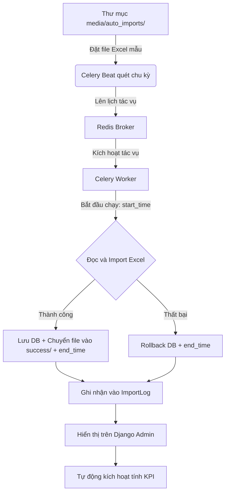
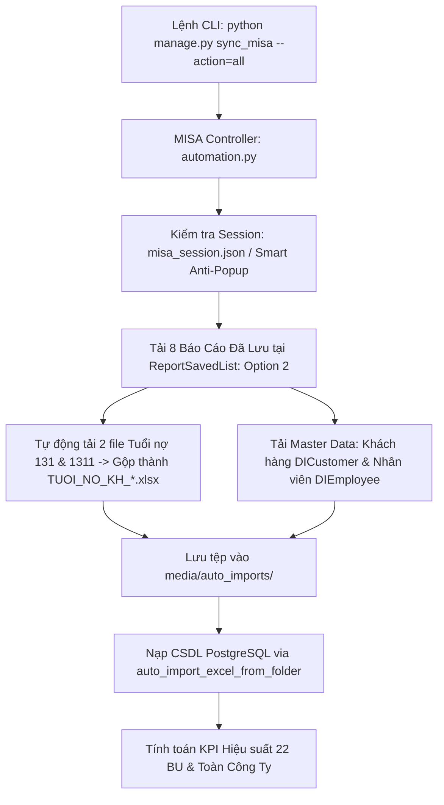
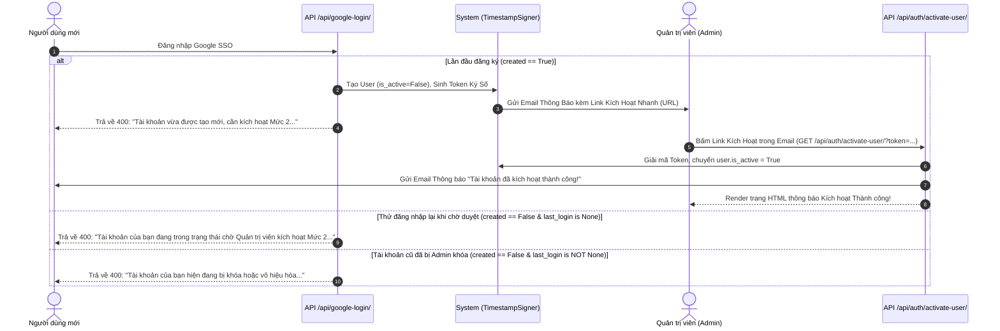

# Tài liệu hướng dẫn tổng quan dự án Report2026 (HP Co.)

Chào mừng bạn tiếp quản dự án! Đừng lo lắng nếu bạn chưa rành về Python. Tài liệu này được thiết kế để giúp bạn nắm bắt toàn bộ bức tranh của dự án từ kiến trúc, nghiệp vụ đến cách vận hành thực tế.

> [!IMPORTANT]
> **Quy trình thực thi chuẩn (SOP) & Checklist bắt buộc**:
> Tất cả các lập trình viên và AI Coding Agent khi tham gia phát triển, bảo trì dự án này bắt buộc phải đọc và tuân thủ quy trình 5 bước được định nghĩa tại file [CheckList.md](file:///d:/Sources/dashboard-report/CheckList.md) trước khi sửa đổi code hoặc thực hiện commit.

---

## 1. Dự án này là gì?
Dự án **Report2026** là một hệ thống **Backend API (Application Programming Interface)** chuyên phục vụ cho việc:
1. **Thu thập dữ liệu tự động**: Đọc các file báo cáo Excel xuất ra từ các hệ thống kế toán khác.
2. **Tính toán chỉ số hiệu suất**: Tính doanh thu, công nợ, dòng tiền, chi phí vận hành, tồn kho theo từng ngày, từng tháng cho từng đơn vị kinh doanh (Business Unit - BU) và cho toàn công ty.
3. **Cung cấp API cho Frontend**: Trả dữ liệu đã tính toán dưới dạng JSON để giao diện Dashboard (React/Vue) vẽ biểu đồ.

---

## 2. Các công nghệ cốt lõi được sử dụng
*   **Ngôn ngữ**: Python 3.14 (chạy trong môi trường ảo ở thư mục `.venv`).
*   **Framework Web**: **Django** & **Django REST Framework (DRF)**. Django giúp quản lý Database và Admin, còn DRF dùng để xây dựng các API.
*   **Hệ quản trị cơ sở dữ liệu**: **PostgreSQL** (chạy ở cổng `5433`, tên database là `reportdb`).
*   **Hệ thống hàng đợi & Tác vụ ngầm**: **Celery** kết hợp với **Redis Broker** để chạy các tác vụ import file Excel tự động.
*   **Thư viện xử lý Excel**: `django-import-export` kết hợp `tablib` để đọc/ghi file Excel cấu trúc lớn.

---

## 3. Cấu trúc thư mục & Kiến trúc Module Backend

Thư mục làm việc bao gồm:
*   `.venv/`: Môi trường ảo Python 3.14.
*   `report2026/` *(Thư mục cấu hình dự án)*:
    *   [settings.py](file:///d:/Sources/dashboard-report/report2026/settings.py): Cấu hình hệ thống (Database PostgreSQL, Redis/Celery, CORS/CSRF, MISA credentials, EXCLUDED rules).
    *   [urls.py](file:///d:/Sources/dashboard-report/report2026/urls.py): Routing gốc điều hướng API.
    *   [celery.py](file:///d:/Sources/dashboard-report/report2026/celery.py): Cấu hình khởi tạo Celery Worker & Beat.
*   `accounting/` *(Ứng dụng xử lý kế toán - Đã tái cấu trúc Modular Package)*:
    *   `models/` *(Gói Model chuyên biệt)*:
        *   [organization.py](file:///d:/Sources/dashboard-report/accounting/models/organization.py): `Branch`, `Warehouse`, `CustomerGroup`, `Customer`, `MaterialGroup`, `Product`, `BusinessUnit`.
        *   [employee.py](file:///d:/Sources/dashboard-report/accounting/models/employee.py): `Department`, `JobTitle`, `Employee`, `EmployeeAssignment` *(Tạo mới 27/07/2026 — Quản lý Nhân sự)*.
        *   [master_data.py](file:///d:/Sources/dashboard-report/accounting/models/master_data.py): `BUTargetPlan`, `ManualAdjustment`, `ImportLog`.
        *   [transactions.py](file:///d:/Sources/dashboard-report/accounting/models/transactions.py): `SalesTransaction`, `AccountDetail`, `BankBalance`.
        *   [debt.py](file:///d:/Sources/dashboard-report/accounting/models/debt.py): `SupplierGroup`, `Supplier`, `SupplierDebt`, `ReceivablesAgeing`, `PurchaseDetail`.
        *   [performance.py](file:///d:/Sources/dashboard-report/accounting/models/performance.py): `BUPerformance`, `BUPerformanceDaily`, `InventorySummary`.
        *   [models.py](file:///d:/Sources/dashboard-report/accounting/models.py): **Wrapper Module**: Re-export 100% models, giữ tương thích ngược 100%.
    *   `views/` *(Gói API Views chuyên biệt)*:
        *   [misa_api.py](file:///d:/Sources/dashboard-report/accounting/views/misa_api.py): Master Data ViewSets & Xác thực Knox/Google (`LoginAPI`, `GoogleLoginAPI`...).
        *   [collection_api.py](file:///d:/Sources/dashboard-report/accounting/views/collection_api.py): Receivables & Supplier Debt ViewSets.
        *   [inventory_api.py](file:///d:/Sources/dashboard-report/accounting/views/inventory_api.py): Warehouse & Inventory ViewSets.
        *   [dashboard_api.py](file:///d:/Sources/dashboard-report/accounting/views/dashboard_api.py): API Hiệu suất & Thu nợ Dashboard (`BUReportAPIView`, `BUPerformanceDailyListView`, `BUPerformanceUpdateAPIView`...).
        *   [views.py](file:///d:/Sources/dashboard-report/accounting/views.py): **Wrapper Module**: Re-export 100% API view classes.
    *   `services/` *(Gói nghiệp vụ lõi & Tính toán KPI)*:
        *   [kpi_calculator.py](file:///d:/Sources/dashboard-report/accounting/services/kpi_calculator.py): Động cơ tính toán KPI cho BusinessUnit & BUPerformance (`update_single_bu_performance`).
        *   [period_parser.py](file:///d:/Sources/dashboard-report/accounting/services/period_parser.py): Nhận diện kỳ báo cáo Excel (`detect_period_from_filename`).
        *   [inventory_sync.py](file:///d:/Sources/dashboard-report/accounting/services/inventory_sync.py): Logic tổng hợp tồn kho kho hàng (`sync_warehouse_inventory_data_logic`).
        *   [tasks.py](file:///d:/Sources/dashboard-report/accounting/tasks.py): **Wrapper Module**: Định nghĩa Celery `@shared_task` gọi tới services.
    *   `misa/` *(Gói tự động hóa Playwright MISA Web)*:
        *   [locators.py](file:///d:/Sources/dashboard-report/accounting/misa/locators.py): Lưu trữ tập trung XPath/CSS Selectors.
        *   [browser.py](file:///d:/Sources/dashboard-report/accounting/misa/browser.py): Đăng nhập, lưu phiên làm việc & Smart Anti-Popup Engine (phân biệt popup rác vs Form chọn tham số báo cáo).
        *   [report_exporter.py](file:///d:/Sources/dashboard-report/accounting/misa/report_exporter.py): Xuất báo cáo Excel từ MISA (tự động điền tham số, bảo vệ modal chọn tham số không bị đóng bởi `Escape` hoặc anti-popup trigger).
        *   [automation.py](file:///d:/Sources/dashboard-report/accounting/misa/automation.py): Controller điều khiển Playwright Chromium async.
        *   [misa_tasks.py](file:///d:/Sources/dashboard-report/accounting/misa_tasks.py): **Wrapper Module**: Celery tasks cho MISA download pipeline.
    *   `resources/` *(Gói mapping import-export Excel)*:
        *   `bulk.py`, `sales.py`, `purchase.py`, `finance.py`, `debt.py`, `inventory.py`: Mapping giữa cột Excel và trường CSDL.
        *   [resources.py](file:///d:/Sources/dashboard-report/accounting/resources.py): Wrapper re-export 100% Resource classes.
    *   `management/commands/`:
        *   [sync_misa.py](file:///d:/Sources/dashboard-report/accounting/management/commands/sync_misa.py): **Django Management Command chuẩn hóa**: Thực thi đồng bộ MISA via `python manage.py sync_misa`.
    *   [download_report.py](file:///d:/Sources/dashboard-report/download_report.py): **Script CLI Tải Riêng Báo Cáo MISA**: Tải từng báo cáo theo keyword (`python download_report.py <KEYWORD>`).
    *   [import_specific_file.py](file:///d:/Sources/dashboard-report/import_specific_file.py): **Engine CLI Nạp File Excel Rời**: Nạp 1 file Excel bất kỳ vào CSDL & tính KPI (`python import_specific_file.py <path>`).
    *   `scripts/`: Thư mục chứa các script bổ trợ (`show_snapshot.py`, `test_download_ban_hang.py`, `test_import_customer_group.py`,...) và `scripts/legacy/` (lưu trữ các script cũ đã thay bằng `sync_misa`).
    *   [serializers.py](file:///d:/Sources/dashboard-report/accounting/serializers.py): Bộ chuyển đổi dữ liệu JSON cho DRF.
    *   [urls.py](file:///d:/Sources/dashboard-report/accounting/urls.py): Định tuyến riêng cho các API của app `accounting`.
*   [HANDOVER_LOG.md](file:///d:/Sources/dashboard-report/HANDOVER_LOG.md): Nhật ký theo dõi mục tiêu, thay đổi và bàn giao hệ thống.
*   [CheckList.md](file:///d:/Sources/dashboard-report/CheckList.md): Quy trình 5 bước thực thi chuẩn (SOP) & Checklist trước khi commit.

---

## 4. Các luồng nghiệp vụ chính của dự án

### Luồng A: Tự động nạp dữ liệu từ file Excel (Auto Import)



1. **Chu kỳ quét**: Lịch chạy Celery Beat được tải động từ cấu hình `.env` (thông qua hàm `get_import_schedule` trong [settings.py](file:///d:/Sources/dashboard-report/report2026/settings.py#L173)), cho phép cấu hình linh hoạt (hàng ngày, hàng tuần, hàng tháng hoặc cron tùy chỉnh).
    * *Mặc định thực tế hiện tại*: Cấu hình Custom Cron chạy nhiều lần trong ngày: `20 7,9,11,14,16 * * 1-6` (tương ứng 07:20, 09:20, 11:20, 14:20, 16:20 từ Thứ Hai đến Thứ Bảy).
2. **Quét file**: Celery Worker nhận việc, quét thư mục `media/auto_imports/` để tìm các file có tên dạng:
    *   `BAN_HANG*.xlsx` (Bán hàng) -> Lưu vào `SalesTransaction`
    *   `MUA_HANG*.xlsx` (Mua hàng) -> Lưu vào `PurchaseDetail`
    *   `TON_KHO*.xlsx` (Tồn kho) -> Lưu vào `InventorySummary`
    *   `CONG_NO_NCC*.xlsx` (Công nợ nhà cung cấp) -> Lưu vào `SupplierDebt`
    *   `TUOI_NO_KH*.xlsx` (Tuổi nợ khách hàng) -> Lưu vào `ReceivablesAgeing`
    *   `TAI_KHOAN_CT*.xlsx` (Sổ chi tiết các tài khoản 111, 112, 341, 641, 642) -> Lưu vào `AccountDetail`
    *   `SO_DU_NH*.xlsx` (Số dư ngân hàng) -> Lưu vào `BankBalance`
3. **An toàn dữ liệu & Phạm vi xóa (Scope of Deletion)**: 
    Dữ liệu import của mỗi file được đặt trong một **database transaction** (`transaction.atomic()`). 
    - **Cơ chế Phân đoạn (Targeted Chunk Deletion)**: Thay vì xóa toàn bộ bảng (`objects.all().delete()`), hệ thống chỉ thực hiện xóa dữ liệu của kỳ kế toán tương ứng với file Excel đang nạp.
        - Đối với các bảng giao dịch (`SalesTransaction`, `PurchaseDetail`, `AccountDetail`): Hệ thống xóa dữ liệu trong khoảng ngày hạch toán `[start_date, end_date]` được nhận diện từ file Excel.
        - Đối với các bảng số dư/lũy kế (`InventorySummary`, `SupplierDebt`, `ReceivablesAgeing`, `BankBalance`): Hệ thống xóa theo kỳ báo cáo cụ thể `reporting_period` (định dạng `YYYY-MM`) nhận diện từ file.

### Luồng B: Tự động hóa tải báo cáo MISA (Playwright MISA Automation — Option 2)

Hệ thống hỗ trợ cơ chế tự động hóa bằng Playwright Chromium để đăng nhập MISA Web và trích xuất báo cáo:



1. **Option 2 (Báo cáo đã lưu — `USE_OPTION_EXPORT_REPORT_MISA=2`)**:
   - Truy cập thẳng vào danh mục Báo cáo đã lưu `https://actapp.misa.vn/app/RP/ReportSavedList`.
   - Lần lượt click mở các mẫu báo cáo đã lưu cấu hình sẵn (`01 - Sổ chi tiết bán hàng` đến `07 - Bảng kê số dư ngân hàng`), chọn `Xuất Excel (dạng dữ liệu)` và nhận tệp từ Trung tâm tải tệp (Report Viewer Download Manager).
2. **Cơ chế gộp tự động Tuổi nợ KH (`merge_tuoi_no_kh_excel_files`)**:
   - Hệ thống tự động tải độc lập 2 file báo cáo đã lưu: `06 - Tuổi nợ 131` và `06 - Tuổi nợ 1311`.
   - Kích hoạt hàm `merge_tuoi_no_kh_excel_files` gộp 2 file theo mã khách hàng thành 1 file `TUOI_NO_KH_*.xlsx` chuẩn trước khi đưa vào hàng đợi import.
3. **Master Data Khách hàng & Nhân viên**:
   - Truy cập danh mục Khách hàng (`DICustomer`) và Nhân viên (`DIEmployee`).
   - Kích hoạt nút xuất khẩu qua DOM `.click()` trên icon `.mi-s1-file-export`, bắt sự kiện download đa kênh và lưu trực tiếp vào `media/auto_imports/`.
4. **Cơ chế phân nhóm 9 loại báo cáo chuẩn (`REQUIRED_REPORT_GROUPS`)**:
   - `IMPORT_MAP` hỗ trợ nhiều alias cho cùng 1 loại báo cáo (`DANH_SACH_NHAN_VIEN` & `NHAN_VIEN`, `BAN_HANG` & `SO_CHI_TIET_BAN_HANG`, v.v.).
   - Bộ quét tự động phân nhóm theo 9 nhóm báo cáo chuẩn (`NHAN_VIEN`, `KHACH_HANG`, `BAN_HANG`, `MUA_HANG`, `TON_KHO`, `CONG_NO_NCC`, `TUOI_NO_KH`, `TAI_KHOAN_CT`, `SO_DU_NH`). Chỉ khi 1 trong 9 nhóm này hoàn toàn không có file nào mới ghi nhận log `NOTFOUND`, loại bỏ hoàn toàn hiện tượng cảnh báo giả.
5. **Tối ưu hóa phạm vi tính KPI**:
   - Hệ thống nhận diện chính xác `reporting_period` của từng file nạp (ví dụ `2026-08`), chỉ kích hoạt tính toán KPI và công nợ nhân viên cho đúng kỳ báo cáo hiện tại, giảm thời gian tính toán từ 5 phút xuống dưới 20 giây.

---

### Luồng C: Tự động tính toán chỉ số hiệu suất (KPI Calculation Engine)

Sau khi dữ liệu Excel mới được nạp vào, hệ thống chạy hàm `update_single_bu_performance` để tổng hợp số liệu cho từng đơn vị kinh doanh (BU) và cho Tổng công ty. Dưới đây là logic nghiệp vụ và kỹ thuật chi tiết:

#### 1. Logic xác định phạm vi (Global / Sub-BU)
- **Quy ước Global**: Nếu `bu_id` nhận vào là `None`, hệ thống thiết lập biến `is_global = True`.
- **Hành vi**: Khi `is_global = True`, hệ thống sẽ **bỏ qua bộ lọc theo từng BU con**, trực tiếp tổng hợp toàn bộ dữ liệu của toàn công ty (Tổng công ty). Đồng thời, hệ thống **bắt buộc áp dụng bộ lọc loại trừ `settings.EXCLUDED_BU_CODES`** (`['ĐTCT']`) trên tất cả các truy vấn dữ liệu gốc (`SalesTransaction`, `AccountDetail`, `InventorySummary`, `ReceivablesAgeing`) để loại bỏ 1.23 tỷ VNĐ doanh thu mảng ĐTCT khỏi Tổng công ty.
- **Bộ lọc loại trừ động từ `settings.py`**:
  * Loại trừ BU: Tự động lọc bỏ các BU có mã nằm trong `settings.EXCLUDED_BU_CODES` (hiện tại là `['ĐTCT']` - Đầu tư cho thuê) và các đơn vị con của chúng khỏi mọi phép tính (kể cả cấp Tổng công ty `is_global = True`).
  * Loại trừ Khách hàng: Lọc bỏ các giao dịch của khách hàng thuộc nhóm trong `settings.EXCLUDED_CUSTOMER_GROUP_CODES` (hiện tại là `['Internal']`).
  * Loại trừ Mã Chứng từ: Lọc bỏ chứng từ có tiền tố thuộc `settings.EXCLUDED_DOC_ID_PREFIXES` (hiện tại là `['THANHLY']`).
- **BU cấp dưới (Sub-BU)**: Nếu `bu_id` cụ thể, hệ thống lọc chính xác bản ghi của riêng BU đó và các BU con thuộc nhánh thông qua `get_all_descendant_ids()` (và loại trừ các BU/Khách hàng đặc thù nói trên).

#### 2. Logic xử lý mốc thời gian (`target_date`)
- Nhận tham số ngày kết thúc tính toán `target_date_str`.
- Nếu không truyền:
  - Nếu tính toán cho **tháng hiện tại** (trùng tháng/năm hiện tại): `target_date` tự động lấy ngày hôm nay (`today.date()`).
  - Nếu tính toán cho **tháng cũ** trong quá khứ: `target_date` tự động lấy ngày cuối cùng của tháng đó (`calendar.monthrange(year, month)[1]`).
- Hệ thống sẽ chạy vòng lặp cập nhật phát sinh thực tế từng ngày (`BUPerformanceDaily`) bắt đầu từ ngày 1 đến hết ngày `target_date`.

#### 3. Bộ lọc Khách hàng ghi nhận doanh thu (`Customer.has_revenue`)
- Toàn bộ các truy vấn tính Doanh thu (`SalesTransaction`) và Thực thu (`AccountDetail`) đều được áp dụng bộ lọc bắt buộc:
  `customer__has_revenue=True`

#### 4. Logic chi tiết tính các chỉ số hiệu suất
*   **Doanh thu lũy kế tháng**: Tổng hợp từ bảng `SalesTransaction` (cộng cột `actual_sales`).
    > [!IMPORTANT]
    > **Đồng bộ hóa công thức Doanh thu:**
    > - Cả Doanh thu lũy kế tháng (`mtd_revenue_actual`) và Doanh thu phát sinh hàng ngày (`daily_revenue`) đều được đồng bộ hóa sử dụng chung cột **`actual_sales`** (Doanh số thực tế sau giảm trừ) từ bảng `SalesTransaction` để đảm bảo tính nhất quán tuyệt đối.
*   **Thực thu tiền mặt/ngân hàng (Collection - Quy tắc Kế toán)**: 
    - Lọc từ sổ chi tiết tài khoản `AccountDetail` các bút toán có:
      - Tài khoản bắt đầu bằng `111` (tiền mặt) hoặc `112` (tiền gửi ngân hàng).
      - Tài khoản đối ứng bắt đầu bằng `1311` hoặc `1312` (phải thu khách hàng).
    - **Công thức tính thực thu**: `coll_actual = debit_amount - credit_amount`.
*   **Tuổi nợ & Công nợ (Receivables Ageing)**:
    - Lọc từ bảng `ReceivablesAgeing`.
    - **Dư nợ cần thu** (`receivable_total`): Tổng cột `total_debt`.
    - **Nợ quá hạn** (`receivable_overdue`): Tổng cột `overdue_total`.
*   **Tồn kho KPI**: 
    - `InventorySummary` -> `Warehouse` -> `BusinessUnit` (thông qua `warehouse__business_unit_id=bu_id`).
    - **Giá trị tồn kho thực tế** (`inventory_value_actual`) của BU/Tổng công ty được tính bằng tổng cột `closing_value` của bảng `InventorySummary` theo filter BU.

---

### Luồng C: Đồng bộ tồn kho kho hàng (Warehouse Inventory Sync)
Tác vụ `sync_warehouse_inventory_data` dùng để tổng hợp số liệu tồn kho chi tiết từ bảng `InventorySummary` nhóm theo kho hàng rồi cập nhật ngược trực tiếp vào các trường tương ứng trong bảng `Warehouse`.

---

## 5. Hướng dẫn chạy và thao tác với dự án dành cho bạn

> [!NOTE]
> **Nội dung này đã được tách riêng**. Để xem chi tiết hướng dẫn cấu hình môi trường, cài đặt thư viện và cách dùng các lệnh/script kiểm thử terminal, vui lòng tham khảo file: [Run_Test_Scripts.md](Run_Test_Scripts.md)

---

## 6. API Endpoint phục vụ Frontend Dashboard

### Phân quyền & Bảo mật API (Authentication)
*   Hệ thống yêu cầu xác thực bằng **Knox Token** hoặc **Session**.
*   Giao thức gọi API (ngoại trừ `/api/login/`) bắt buộc phải đính kèm Header:
    `Authorization: Token <key_nhận_được_khi_login>`

### Danh sách các API Endpoint:

#### 1. Đăng nhập hệ thống
*   `POST /api/login/`:
    *   **Body (JSON)**: `{"username": "...", "password": "..."}`
    *   **Response (JSON)**: Trả về Token Knox, ngày hết hạn và thông tin cơ bản của user.

#### 2. Đăng xuất hệ thống (Knox Auth)
*   `POST /api/auth/logout/`: Hủy token hiện tại.
*   `POST /api/auth/logoutall/`: Hủy toàn bộ token đã cấp cho user.

#### 3. Lấy số liệu Hiệu suất BU theo Tháng (Dashboard chính)
*   `GET /api/bu-performance/`: Trả về số liệu kế hoạch và thực tế theo tháng kèm theo các trường KPI được tính toán tự động như `revenue_kpi`, `collection_kpi`, `inventory_vs_plan`.
*   **Query Parameters**:
    *   `?start_date=YYYY-MM-DD&end_date=YYYY-MM-DD`: Lọc theo quãng ngày.
    *   `?month=X`: Tháng (1-12).
    *   `?year=X`: Năm.
    *   `?bu_id=X`: ID BU (`null` cho Global, `all` cho toàn bộ).

#### 4. Lấy số liệu Hiệu suất BU theo Ngày (Vẽ biểu đồ)
*   `GET /api/performance/daily/`: Trả về dữ liệu doanh thu và thực thu phát sinh trong từng ngày của tháng.

#### 5. Lấy số liệu Báo cáo Thu nợ theo BU (Dashboard Thu Nợ)
*   `GET /api/dashboard/collection-by-bu/`: Trả về 5 chỉ số thu nợ chi tiết theo từng đơn vị kinh doanh chính (`is_main=True`) cho một ngày cụ thể (`?date=YYYY-MM-DD`). Chuẩn hóa lọc tài khoản công nợ 1311 và khớp 100% với Báo cáo Tuổi Nợ `GET /api/debt/bus/`.

#### 5.1. Lấy danh sách Khách hàng Nợ quá hạn Chi tiết (Modal Cam kết Thu / Quá hạn)
*   `GET /api/debt/overdue-customers/` (hoặc `/api/reports/debt/overdue-customers/`):
    *   **Mô tả**: Trả về danh sách chi tiết các khách hàng có nợ quá hạn thật từ `ReceivablesAgeing` (`overdue_total > 0`, TK `1311`), phân loại 4 nhóm tuổi nợ (1-14 ngày, 15-30 ngày, 31-60 ngày, > 60 ngày), nhân sự phụ trách và tổng tiền khớp chính xác với Card KPI Cam kết thu (nợ quá hạn) bên ngoài (11.88 tỷ VND). Hỗ trợ đa định dạng ngày (`YYYY-MM-DD`, `DD/MM/YYYY`) và tự động gom nhóm theo từng khách hàng.
    *   **Query Parameters**:
        *   `?date=YYYY-MM-DD`: Ngày báo cáo (Mặc định: ngày hiện tại hoặc kỳ mới nhất).
        *   `?bu_code=BU_...`: Mã BU cần lọc (Tùy chọn).
    *   **Response (JSON)**: `{"date": "...", "reporting_period": "...", "total_overdue": 13621986874, "count": 76, "customers": [...]}`

#### 5.2. Cấu hình & Quản lý Email Báo cáo & Nhắc nợ Phân cấp
*   **Cấu hình biến môi trường (`.env` / `settings.py`)**:
    *   `DEBT_REMINDER_EXCLUDE_BU_CODES`: Danh sách mã BU bị loại trừ không gửi email nhắc nợ (Mặc định: `['ĐTCT', 'BU_DTCT']`).
    *   `DEBT_REMINDER_RECIPIENT_TYPE`: Đối tượng nhận email (`'MANAGERS'` - Chỉ Trưởng BU, `'SALES'`, `'ALL'`).
    *   `DEBT_REMINDER_CC_EMAILS`: Danh sách email CC (BOD, KTT).
    *   `DEBT_REMINDER_EXCLUDE_EMAILS`: Blacklist email cá nhân không gửi.
*   **Các Management Commands hỗ trợ điều hành & kiểm thử**:
    *   `python manage.py list_bu_managers`: Liệt kê bảng danh sách 8 Trưởng BU, mã NV, email và trạng thái gửi.
    *   `python manage.py send_debt_reminders`: Gửi email nhắc nợ phân cấp tự động.
        *   `--recipients=MANAGERS`: Chỉ gửi Trưởng BU (hoặc `SALES`, `ALL`).
        *   `--override-email <email>`: Chuyển hướng toàn bộ email về email test an toàn, tự động thêm tiền tố `[TEST - <BU_NAME>]`.
        *   `--bu <BU_CODE>`: Giới hạn gửi cho riêng 1 BU chỉ định (ví dụ `--bu BU_ELEVATOR`).
        *   `--period <YYYY-MM>`: Chỉ định kỳ báo cáo.
        *   `--live --yes`: Bật chế độ gửi thực tế ra email công ty của Trưởng BU/Sales.
    *   `python manage.py send_executive_dashboard`: Gửi Email Báo Cáo Điều Hành Tổng Quan (Executive Dashboard) đồng bộ 100% với Web Dashboard (`~/dashboard`):
        *   **Khối 1**: 4 Top KPI Cards (DT theo kỳ, Thu tiền theo kỳ, Tồn kho, Nợ ngân hàng).
        *   **Khối 2**: 4 Cards Tỷ trọng Doanh thu Oversea & Nội địa (MTD, YTD).
        *   **Khối 3**: Bảng Tổng hợp Hiệu suất 8 BU Thương mại (Doanh thu Thực tế/KH, Thu tiền Thực tế/KH, Dư nợ 1311, Nợ quá hạn).
        *   `--to-email <email>` (Bắt buộc): Địa chỉ người nhận.
        *   `--cc <email1,email2>`: Danh sách CC.
        *   `--date <YYYY-MM-DD>`: Ngày chốt số liệu (mặc định: hôm qua T-1).
        *   `--period <YYYY-MM>`: Kỳ báo cáo (ví dụ: `2026-08`).
        *   `--dry-run`: Chạy thử nghiệm thống kê số liệu và render không gửi mail.
    *   **Celery Beat Tự Động Định Kỳ (Executive Dashboard Schedule)**:
        *   Task: `accounting.tasks.send_executive_dashboard_task`
        *   Cấu hình `.env`:
            - `AUTO_SEND_EXECUTIVE_DASHBOARD_ENABLED=True` (Bật/Tắt)
            - `EXECUTIVE_DASHBOARD_TO_EMAIL='bod@haophuong.com'` (Email nhận chính)
            - `EXECUTIVE_DASHBOARD_CC_EMAILS='sep1@haophuong.com,sep2@haophuong.com'` (Danh sách CC)
            - `EXECUTIVE_DASHBOARD_SCHEDULE_TYPE='daily'` (`daily`, `weekly`, `monthly`, `custom`)
            - `EXECUTIVE_DASHBOARD_SCHEDULE_HOUR=08`, `EXECUTIVE_DASHBOARD_SCHEDULE_MINUTE=30`
            - `EXECUTIVE_DASHBOARD_SCHEDULE_DAY_OF_WEEK='1-6'` (Thứ 2 đến Thứ 7)

#### 6. Kích hoạt tính toán lại dữ liệu (Manual Trigger)
*   `POST /api/update-performance/`: Cho phép trigger tính toán và cập nhật lại chỉ số hiệu suất bất đồng bộ qua Celery ngầm.

#### 7. Gửi báo cáo qua email (Send Email API)
*   `POST /api/reports/send-email/`: Cho phép gửi email đính kèm từ Frontend (Knox Token Auth).

#### 7.1. Đăng nhập qua Google (Single Sign-On Google OAuth2 API)
*   `POST /api/google-login/`: Đăng nhập bằng Google ID token, phát hành Knox Token cho Frontend.
*   **Request Body (JSON)**: `{"id_token": "<google_credential_id_token>"}`
*   **Response (JSON)**: Trả về Token Knox, thời hạn expiry và object `user` bao gồm đầy đủ `id`, `email`, `full_name`, `role`, `allowed_tabs`, `employee_code`, `bu_code`, `bu_name`, `avatar` (URL ảnh đại diện Google Profile), `avatar_url`.

#### 8. Các API danh mục chi tiết (DRF ViewSets)
*   `/api/branches/` (Chi nhánh)
*   `/api/warehouses/` (Kho hàng)
*   `/api/customers/` (Khách hàng)
*   `/api/employees/` (Nhân viên — fields: `employee_code`, `full_name`, `gender`, `date_of_birth`, `identity_number`, `phone_number`, `email`, `is_active`)
*   `/api/products/` (Sản phẩm/Vật tư hàng hóa)
*   `/api/business-units/` (Đơn vị kinh doanh - BU)
*   `/api/transactions/` (Chi tiết bán hàng)
*   `/api/suppliers/` (Nhà cung cấp)
*   `/api/supplier-groups/` (Nhóm nhà cung cấp)
*   `/api/supplier-debts/` (Công nợ NCC)
*   `/api/account-details/` (Sổ chi tiết tài khoản)
*   `/api/receivables-ageing/` (Chi tiết tuổi nợ)
*   `/api/purchase-details/` (Chi tiết mua hàng)
*   `/api/inventory-summaries/` (Tổng hợp tồn kho)
*   `/api/target-plans/` (Quản lý Chỉ tiêu Kế hoạch)
*   `/api/adjustments/` (Quản lý Điều chỉnh Phát sinh Ngoại bảng)

---

## 7. Lưu ý kỹ thuật chuyên sâu & Hướng phát triển tương lai

### 7.1. Logic Doanh thu không khớp (Đã giải quyết)
* **Trạng thái**: **Đã hoàn thành đồng bộ**. Cả doanh thu tháng (`mtd_revenue_actual`) và doanh thu ngày (`daily_revenue`) hiện tại đều sử dụng chung trường `actual_sales` (Doanh số thực tế sau giảm trừ).

### 7.2. Cảnh báo chủ động khi có lỗi (Error Handling & Alerts)
* **Bối cảnh**: Khi có lỗi định dạng file Excel, hệ thống rollback transaction và ghi nhật ký với trạng thái `ERROR` vào `ImportLog`.

### 7.3. Cơ chế Phân đoạn & Tối ưu hiệu năng nạp dữ liệu (Targeted Chunk Deletion & Bulk Load)
* **Trạng thái**: **Đã hoàn thành chuyển đổi sang Targeted Chunk Deletion**.
* **Cơ chế**: Khi nạp file Excel mới, hàm `detect_period_from_filename` trong [accounting/services/period_parser.py](file:///d:/Sources/dashboard-report/accounting/services/period_parser.py) đọc lướt các cột ngày hạch toán/chứng từ để trích xuất dải thời gian `[min_date, max_date]`. Hệ thống chỉ xóa phân đoạn các bản ghi trùng khoảng thời gian này và nạp mới bằng `bulk_create` theo chunk 1,000 dòng.

### 7.4. Cấu trúc cây phân cấp của Business Unit (BU Hierarchy)
* Bảng `BusinessUnit` sử dụng mối quan hệ đệ quy đơn giản thông qua `parent = models.ForeignKey('self')`. Gọi hàm `bu.get_all_descendant_ids()` để thu thập ID toàn bộ BU con/cháu.

### 7.5. Cơ chế phân quyền xem báo cáo (Row-Level Security / Data Isolation)
* Hệ thống hiện chưa có Object-level permission. Cần thiết kế thêm `permissions.BasePermission` khi mở rộng API riêng cho các phòng ban độc lập.

---

## 8. Giải đáp các câu hỏi Onboarding thực tế (FAQ dành cho Nhà phát triển)

### Q1: Trường `Customer.has_revenue` được gán thủ công hay import từ đâu?
* **Trả lời**: Trường này được hỗ trợ **import tự động** thông qua `CustomerResource` (mặc định là `True`) hoặc chỉnh sửa thủ công trên Django Admin.

### Q2: Logic `parent == NULL` xác định Global Company là chủ ý nghiệp vụ hay giải pháp tình thế (workaround)?
* **Trả lời**: Đây là **chủ ý nghiệp vụ** của HP Co. Quy ước chính xác hiện tại là: chỉ khi `bu_id is None` mới đại diện cho **Tổng công ty (Global)**.

### Q3: Các trường `actual_sales` và `sales_amount` khác nhau như thế nào?
* **Trả lời**: `sales_amount` là doanh số thô trên hóa đơn. `actual_sales` là doanh số thực tế sau giảm trừ chiết khấu, dùng thống nhất cho Doanh thu MTD và Doanh thu Ngày.

### Q4: Lệnh xóa dữ liệu ở đầu luồng Import Excel là xóa toàn bộ hay xóa tăng dần (incremental)?
* **Trả lời**: Hệ thống hoạt động theo cơ chế **Targeted Chunk Deletion (Xóa phân đoạn theo dải ngày `[min_date, max_date]`)**, không xóa trắng dữ liệu các tháng khác.

### Q5: Khi import xong, hệ thống có tự động chạy `update_single_bu_performance()` và `sync_warehouse_inventory_data()` không?
* **Trả lời**: Có. Tự động kích hoạt bất đồng bộ qua Celery tasks (`update_single_bu_performance.delay()` và `sync_warehouse_inventory_data.delay()`).

### Q6: Tại sao kết quả Celery Task hiển thị ký tự mã thoát Unicode và cách khắc phục?
* **Trả lời**: Lớp `CustomTaskResultAdmin` trong `admin.py` tự động giải mã JSON để render tiếng Việt chuẩn trên Django Admin.

### Q7: Danh sách các lệnh CLI & Django Custom Management Commands chính?
* **Trả lời**: Xem toàn bộ cú pháp và ví dụ chi tiết tại **[Run_Test_Scripts.md](Run_Test_Scripts.md)** (tài liệu trung tâm dành riêng cho terminal & scripts). Các lệnh chính bao gồm:
  - `python manage.py sync_misa [--action=all|download|import] [--file=<PATH>] [--prefix=<PREFIX>] [--period=<PERIOD>]`
  - `python download_report.py <KEYWORD>`
  - `python import_specific_file.py <FILE_PATH>`
  - `python manage.py calculate_bu_performance`, `calculate_global_performance`, `createdefaultuser`

### Q8: Model `Employee` (Được cấu trúc lại 27/07/2026) có những fields nào?
* **Trả lời**: `Employee` được chuyển từ `organization.py` → `employee.py` và được tái thiết kế toàn diện:
  - `employee_code` (VARCHAR 20, UNIQUE — trước đây là `code`)
  - `full_name` (VARCHAR 100 — trước đây là `name`)
  - `gender` (CHOICES: `MALE`/`FEMALE`, nullable)
  - `date_of_birth` (DATE, nullable)
  - `identity_number` (VARCHAR 20, nullable)
  - `phone_number` (VARCHAR 20, nullable)
  - `email` (VARCHAR 100, nullable)
  - `is_active` (BOOLEAN default True)
* **Bảng DB mới**: `employees` (trước đây là `accounting_employee`).
* **Các Model liên quan mới**: `Department` (bảng `departments`), `JobTitle` (bảng `job_titles`), `EmployeeAssignment` (bảng `employee_assignments`).
* **Backward compat**: `Employee.code` property trả về `employee_code`; `Employee.name` property trả về `full_name`.

---

### Cập nhật bổ sung 24/07/2026 (Tái Cấu Trúc Architecture Modular Packages & Django Command `sync_misa`)

1. **Gói Dịch vụ Nghiệp vụ Lõi (`accounting/services/`)**: `kpi_calculator.py`, `period_parser.py`, `inventory_sync.py`. Wrapper: `tasks.py`.
2. **Gói Tự động hóa MISA Playwright (`accounting/misa/`)**: `locators.py`, `browser.py`, `report_exporter.py`, `automation.py`. Wrapper: `misa_tasks.py`.
3. **Gói Django REST Framework Views (`accounting/views/`)**: `misa_api.py`, `collection_api.py`, `inventory_api.py`, `dashboard_api.py`. Wrapper: `views.py`.
4. **Gói Django Database Models (`accounting/models/`)**: `organization.py`, `employee.py`, `master_data.py`, `transactions.py`, `debt.py`, `performance.py`. Wrapper: `models.py`.
5. **Gói Import-Export Excel Resources (`accounting/resources/`)**: `bulk.py`, `sales.py`, `purchase.py`, `finance.py`, `debt.py`, `inventory.py`, `employee.py`. Wrapper: `resources.py`.
6. **Django Custom Management Command (`sync_misa.py`)**: `python manage.py sync_misa --action=all|download|import --prefix=... --period=... --file=...`.

---

### Cập nhật bổ sung 27/07/2026 (Hệ thống Quản lý Nhân sự — Employee Management System)

1. **Model `Employee` tái cấu trúc**: Chuyển từ `organization.py` → `employee.py`. Bảng DB đổi từ `accounting_employee` → `employees`. Fields cũ (`code`, `name`, `age`) được migrate data sang fields mới (`employee_code`, `full_name`) thông qua `RunPython` trong Migration 0041.
2. **Model mới `Department`** (bảng `departments`): Phân cấp tự tham chiếu (self-FK `parent_department`), import từ `Danh_sach_nhan_vien.xlsx`.
3. **Model mới `JobTitle`** (bảng `job_titles`): Danh mục chức danh, auto get_or_create khi import Excel.
4. **Model mới `EmployeeAssignment`** (bảng `employee_assignments`): Lịch sử quá trình công tác (FK → Employee, Department, JobTitle; `start_date`, `end_date`).
5. **Resource mới `EmployeeResource`** (`accounting/resources/employee.py`): Import `Danh_sach_nhan_vien.xlsx` với logic `before_import_row` (chuẩn hóa gender/date/is_active, get_or_create Department/JobTitle) và `after_save_instance` (tạo EmployeeAssignment). `skip_delete=True` — import không xóa data cũ.
6. **Fix `sales.py`**: Cập nhật `ForeignKeyWidget(Employee, 'employee_code')` và `Employee.objects.get_or_create(employee_code=...)` khắc phục lỗi import BAN_HANG sau khi migrate.
7. **Migration 0041**: Thủ công viết lại với đúng thứ tự: (1) Thêm fields mới, (2) RunPython copy data, (3) Xóa fields cũ, (4) Enforce unique index.

---

### Cập nhật bổ sung 29/07/2026 (Global Smart Anti-Popup Engine cho MISA Automation)

1. **Smart Anti-Popup Engine (`accounting/misa/browser.py`)**: Thuật toán thông minh tự động phân biệt giữa Modal Tham số Báo cáo (giữ lại) và các Pop-up rác/thông báo/quảng cáo/cảnh báo ngẫu nhiên. Tự động click nút đóng thông minh hoặc xóa hẳn khỏi DOM (`element.remove()`), đồng thời giải phóng pointer-events & backdrop overlays.
2. **Global Context Script Injection (`accounting/misa/automation.py`)**: Tự động inject JS Anti-Popup Vệ sĩ thông qua `context.add_init_script()` chạy liên tục ở background trên 100% trang và sub-frames với MutationObserver.
3. **Report Exporter Integration (`accounting/misa/report_exporter.py`)**: Tự động kích hoạt dọn dẹp popup trước và sau khi bật Modal Tham số Báo cáo và chọn Kỳ báo cáo.

---

- Nếu tính toán cho **tháng hiện tại** (trùng tháng/năm hiện tại): `target_date` tự động lấy ngày hôm nay (`today.date()`).
  - Nếu tính toán cho **tháng cũ** trong quá khứ: `target_date` tự động lấy ngày cuối cùng của tháng đó (`calendar.monthrange(year, month)[1]`).
- Hệ thống sẽ chạy vòng lặp cập nhật phát sinh thực tế từng ngày (`BUPerformanceDaily`) bắt đầu từ ngày 1 đến hết ngày `target_date`.

#### 3. Bộ lọc Khách hàng ghi nhận doanh thu (`Customer.has_revenue`)
- Toàn bộ các truy vấn tính Doanh thu (`SalesTransaction`) và Thực thu (`AccountDetail`) đều được áp dụng bộ lọc bắt buộc:
  `customer__has_revenue=True`

#### 4. Logic chi tiết tính các chỉ số hiệu suất
*   **Doanh thu lũy kế tháng**: Tổng hợp từ bảng `SalesTransaction` (cộng cột `actual_sales`).
    > [!IMPORTANT]
    > **Đồng bộ hóa công thức Doanh thu:**
    > - Cả Doanh thu lũy kế tháng (`mtd_revenue_actual`) và Doanh thu phát sinh hàng ngày (`daily_revenue`) đều được đồng bộ hóa sử dụng chung cột **`actual_sales`** (Doanh số thực tế sau giảm trừ) từ bảng `SalesTransaction` để đảm bảo tính nhất quán tuyệt đối.
*   **Thực thu tiền mặt/ngân hàng (Collection - Quy tắc Kế toán)**: 
    - Lọc từ sổ chi tiết tài khoản `AccountDetail` các bút toán có:
      - Tài khoản bắt đầu bằng `111` (tiền mặt) hoặc `112` (tiền gửi ngân hàng).
      - Tài khoản đối ứng bắt đầu bằng `1311` hoặc `1312` (phải thu khách hàng).
    - **Công thức tính thực thu**: `coll_actual = debit_amount - credit_amount`.
*   **Tuổi nợ & Công nợ (Receivables Ageing)**:
    - Lọc từ bảng `ReceivablesAgeing`.
    - **Dư nợ cần thu** (`receivable_total`): Tổng cột `total_debt`.
    - **Nợ quá hạn** (`receivable_overdue`): Tổng cột `overdue_total`.
*   **Tồn kho KPI**: 
    - `InventorySummary` -> `Warehouse` -> `BusinessUnit` (thông qua `warehouse__business_unit_id=bu_id`).
#### 5. Cờ cấu hình tính toán các khoản điều chỉnh Off-MISA (`ENABLE_MANUAL_ADJUSTMENTS`)
- **Cấu hình tại `report2026/settings.py` & `.env`**:
  `ENABLE_MANUAL_ADJUSTMENTS = env.bool('ENABLE_MANUAL_ADJUSTMENTS', default=False)`
- **Mục đích**:
  - Khi `ENABLE_MANUAL_ADJUSTMENTS = False` (mặc định): Bỏ qua toàn bộ các khoản điều chỉnh thủ công (`ManualAdjustment`), tính toán dữ liệu thuần túy từ CSDL MISA + Oversea. Doanh thu YTD Global sẽ là **372.83 Tỷ VNĐ** (khớp **99.69%** với con số Kế toán 371.67 Tỷ).
  - Khi `ENABLE_MANUAL_ADJUSTMENTS = True`: Áp dụng cộng/trừ/đè các khoản điều chỉnh ngoại bảng Off-MISA (Hisa-FJT, 5EX lũy kế 6 tháng...). Doanh thu YTD Global bao gồm toàn bộ Off-MISA là **621.63 Tỷ VNĐ**.

---

### Luồng C: Đồng bộ tồn kho kho hàng (Warehouse Inventory Sync)
Tác vụ `sync_warehouse_inventory_data` dùng để tổng hợp số liệu tồn kho chi tiết từ bảng `InventorySummary` nhóm theo kho hàng rồi cập nhật ngược trực tiếp vào các trường tương ứng trong bảng `Warehouse`.

---

## 5. Hướng dẫn chạy và thao tác với dự án dành cho bạn

> [!NOTE]
> **Nội dung này đã được tách riêng**. Để xem chi tiết hướng dẫn cấu hình môi trường, cài đặt thư viện và cách dùng các lệnh/script kiểm thử terminal, vui lòng tham khảo file: [Run_Test_Scripts.md](Run_Test_Scripts.md)

---

## 6. API Endpoint phục vụ Frontend Dashboard

### Phân quyền & Bảo mật API (Authentication)
*   Hệ thống yêu cầu xác thực bằng **Knox Token** hoặc **Session**.
*   Giao thức gọi API (ngoại trừ `/api/login/`) bắt buộc phải đính kèm Header:
    `Authorization: Token <key_nhận_được_khi_login>`

### Danh sách các API Endpoint:

#### 1. Đăng nhập hệ thống
*   `POST /api/login/`:
    *   **Body (JSON)**: `{"username": "...", "password": "..."}`
    *   **Response (JSON)**: Trả về Token Knox, ngày hết hạn và thông tin cơ bản của user.

#### 2. Đăng xuất hệ thống (Knox Auth)
*   `POST /api/auth/logout/`: Hủy token hiện tại.
*   `POST /api/auth/logoutall/`: Hủy toàn bộ token đã cấp cho user.

#### 3. Lấy số liệu Hiệu suất BU theo Tháng (Dashboard chính)
*   `GET /api/bu-performance/`: Trả về số liệu kế hoạch và thực tế theo tháng kèm theo các trường KPI được tính toán tự động như `revenue_kpi`, `collection_kpi`, `inventory_vs_plan`.
*   **Query Parameters**:
    *   `?start_date=YYYY-MM-DD&end_date=YYYY-MM-DD`: Lọc theo quãng ngày.
    *   `?month=X`: Tháng (1-12).
    *   `?year=X`: Năm.
    *   `?bu_id=X`: ID BU (`null` cho Global, `all` cho toàn bộ).

#### 4. Lấy số liệu Hiệu suất BU theo Ngày (Vẽ biểu đồ)
*   `GET /api/performance/daily/`: Trả về dữ liệu doanh thu và thực thu phát sinh trong từng ngày của tháng.

#### 5. Lấy số liệu Báo cáo Thu nợ theo BU (Dashboard Thu Nợ)
*   `GET /api/dashboard/collection-by-bu/`: Trả về 5 chỉ số thu nợ chi tiết theo từng đơn vị kinh doanh chính (`is_main=True`) cho một ngày cụ thể (`?date=YYYY-MM-DD`).

#### 6. Kích hoạt tính toán lại dữ liệu (Manual Trigger)
*   `POST /api/update-performance/`: Cho phép trigger tính toán và cập nhật lại chỉ số hiệu suất bất đồng bộ qua Celery ngầm.

#### 7. Gửi báo cáo qua email (Send Email API)
*   `POST /api/reports/send-email/`: Cho phép gửi email đính kèm từ Frontend (Knox Token Auth).

#### 7.1. Đăng nhập qua Google (Single Sign-On Google OAuth2 API)
*   `POST /api/google-login/`: Đăng nhập bằng Google ID token, phát hành Knox Token cho Frontend.

#### 7.2. Tổng hợp Công nợ Tất cả Business Units (All BUs Debt Summary API)
*   `GET /api/debt/bus/`: Trả về danh sách các Business Unit kèm `receivable_total`, `due_total`, `overdue_total`, `overdue_rate` và chỉ số `global_summary` toàn công ty.
*   **Query Parameters**:
    *   `?period=YYYY-MM`: Kỳ báo cáo (ví dụ: `2026-08`, mặc định: kỳ mới nhất trong CSDL).
    *   `?include_all=true` *(hoặc `?all=true`)*: 
        *   **Mặc định (`false`)**: Tự động lọc ẩn các BU có `overdue_rate = 0.0` hoặc không có phát sinh nợ quá hạn (loại bỏ các BU nội bộ/vận hành như VHC_KT, VHC_BOD, VHC_TECHCENTER... để tránh loãng Dashboard).
        *   **Khi bật (`true`)**: Trả về đầy đủ toàn bộ 22 Business Units vận hành độc lập.
*   **Chỉ số Global**: Luôn tính toán trên toàn bộ 22 BU chuẩn xác 100% (Tổng nợ TK 1311: **57,082,185,049 VNĐ (57.08 Tỷ)**, Quá hạn: **11,858,946,783 VNĐ (20.78%)**).

#### 7.3. Báo Cáo Phân Cấp 3 Tầng Drilldown Công Nợ BU (BU 3-Tier Debt Drilldown API)
*   `GET /api/debt/bus/<str:bu_code>/drilldown/`: Trả về cấu trúc cây phân cấp 3 tầng chi tiết cho một BU cụ thể:
    *   **Cấp 1 (BU)**: Mã BU, Tên BU, Trưởng BU, Tổng nợ BU, Trong hạn, Quá hạn.
    *   **Cấp 2 (Sales & Quản lý)**: 
        *   `key_accounts_summary`: Nhóm hợp đồng chiến lược cấp Tổng do Giám đốc Kinh doanh (CCO) phụ trách trực tiếp.
        *   `bu_teams`: Danh sách Trưởng BU, Trưởng bộ phận MB/MN và các Sales trực thuộc.
    *   **Cấp 3 (Chi tiết Khách hàng — Đầy đủ 14 dải tuổi nợ)**:
        *   *Thông tin*: `customer_code`, `customer_name`
        *   *Nhóm Trước Hạn*: `no_due_limit`, `due_0_7`, `due_8_14`, `due_15_21`, `due_22_28`, `due_29_60`, `due_above_60`, `due_total`
        *   *Nhóm Quá Hạn*: `overdue_0_14`, `overdue_15_30`, `overdue_31_45`, `overdue_46_60`, `overdue_61_90`, `overdue_91_120`, `overdue_above_120`, `overdue_total`
        *   *Tổng dư nợ*: `total_debt`
    *   `reconciliation`: Cơ chế tự kiểm tra đối soát, đảm bảo `drilldown_total == bu_total` (chênh lệch đúng 0 VNĐ, `is_matched: true`).
*   **Query Parameters**:
    *   `?period=YYYY-MM`: Kỳ báo cáo (ví dụ: `2026-08`).

#### 8. Các API danh mục chi tiết (DRF ViewSets)
*   `/api/branches/` (Chi nhánh)
*   `/api/warehouses/` (Kho hàng)
*   `/api/customers/` (Khách hàng)
*   `/api/employees/` (Nhân viên — fields: `employee_code`, `full_name`, `gender`, `date_of_birth`, `identity_number`, `phone_number`, `email`, `is_active`)
*   `/api/products/` (Sản phẩm/Vật tư hàng hóa)
*   `/api/business-units/` (Đơn vị kinh doanh - BU)
*   `/api/transactions/` (Chi tiết bán hàng)
*   `/api/suppliers/` (Nhà cung cấp)
*   `/api/supplier-groups/` (Nhóm nhà cung cấp)
*   `/api/supplier-debts/` (Công nợ NCC)
*   `/api/account-details/` (Sổ chi tiết tài khoản)
*   `/api/receivables-ageing/` (Chi tiết tuổi nợ)
*   `/api/purchase-details/` (Chi tiết mua hàng)
*   `/api/inventory-summaries/` (Tổng hợp tồn kho)
*   `/api/target-plans/` (Quản lý Chỉ tiêu Kế hoạch)
*   `/api/adjustments/` (Quản lý Điều chỉnh Phát sinh Ngoại bảng)

---

## 7. Lưu ý kỹ thuật chuyên sâu & Hướng phát triển tương lai

### 7.1. Logic Doanh thu không khớp (Đã giải quyết)
* **Trạng thái**: **Đã hoàn thành đồng bộ**. Cả doanh thu tháng (`mtd_revenue_actual`) và doanh thu ngày (`daily_revenue`) hiện tại đều sử dụng chung trường `actual_sales` (Doanh số thực tế sau giảm trừ).

### 7.2. Cảnh báo chủ động khi có lỗi (Error Handling & Alerts)
* **Bối cảnh**: Khi có lỗi định dạng file Excel, hệ thống rollback transaction và ghi nhật ký với trạng thái `ERROR` vào `ImportLog`.

### 7.3. Cơ chế Phân đoạn & Tối ưu hiệu năng nạp dữ liệu (Targeted Chunk Deletion & Bulk Load)
* **Trạng thái**: **Đã hoàn thành chuyển đổi sang Targeted Chunk Deletion**.
* **Cơ chế**: Khi nạp file Excel mới, hàm `detect_period_from_filename` trong [accounting/services/period_parser.py](file:///d:/Sources/dashboard-report/accounting/services/period_parser.py) đọc lướt các cột ngày hạch toán/chứng từ để trích xuất dải thời gian `[min_date, max_date]`. Hệ thống chỉ xóa phân đoạn các bản ghi trùng khoảng thời gian này và nạp mới bằng `bulk_create` theo chunk 1,000 dòng.

### 7.4. Cấu trúc cây phân cấp của Business Unit (BU Hierarchy)
* Bảng `BusinessUnit` sử dụng mối quan hệ đệ quy đơn giản thông qua `parent = models.ForeignKey('self')`. Gọi hàm `bu.get_all_descendant_ids()` để thu thập ID toàn bộ BU con/cháu.

### 7.5. Cơ chế phân quyền xem báo cáo (Row-Level Security / Data Isolation)
* Hệ thống hiện chưa có Object-level permission. Cần thiết kế thêm `permissions.BasePermission` khi mở rộng API riêng cho các phòng ban độc lập.

### 7.6. Quy tắc Chống cộng trùng BU mẹ HPC & Cây Quản lý Đa Tầng CCO
* **Loại trừ mã mẹ `HPC`**: `HPC` là Chi nhánh/Pháp nhân mẹ chứa 18 BU con. Khi truy vấn danh sách 22 BU vận hành độc lập, bắt buộc phải `.exclude(business_unit__code='HPC')`. Tổng 22 BU độc lập cộng lại là **57,082,185,049 VNĐ (57.08 Tỷ)**, khớp tuyệt đối 100% với Global KPI.
* **Cây phân cấp Quản lý**: `CCO (Ngô Đình Trung Tân) -> 5 Trưởng BU (Đào Tiến Dũng, Hồ Tôn Nhật Minh, Nguyễn Ngọc Huy Phong, Hồ Xuân Quang, Trần Duy Hiếu) -> Các Trưởng bộ phận MB/MN -> Sales`.
* **Bộ lọc Khách hàng Nước ngoài (Oversea)**: Khách hàng thuộc nhóm `OVERSEA_CUSTOMER_GROUP_CODES` được lọc tách riêng về BU `Oversea`, đảm bảo số liệu công nợ BU nội địa và BU Oversea luôn khớp 100% không trùng lặp.

### 7.7. Luồng Tự động hóa Master Data Crawler 5 bước tinh gọn
* Crawler Playwright tích hợp trong `accounting/misa/report_exporter.py` hỗ trợ tự động tải 2 danh mục gốc: `DANH_SACH_KHACH_HANG` và `DANH_SACH_NHAN_VIEN` qua icon Green Excel trên Grid Toolbar.
* Thứ tự ưu tiên Celery Auto-sync: Priority 1 (Nhân viên) $\rightarrow$ Priority 2 (Khách hàng) $\rightarrow$ Priority 3 (Báo cáo tài chính) $\rightarrow$ Chốt tính toán công nợ tự động (`update_employee_receivable_summary`).

### 7.8. Cấu hình Danh sách Tài khoản Mục tiêu (`TARGET_RECEIVABLE_ACCOUNTS = ['1311']`)
* **Nghiệp vụ**: Công nợ thương mại khách hàng chỉ hạch toán trên **Tài khoản 1311** (Phải thu khách hàng thương mại), loại bỏ các khoản công nợ nội bộ hoặc tài khoản khác trong `ReceivablesAgeing`.
* **Cấu hình mở rộng**: Khai báo biến `TARGET_RECEIVABLE_ACCOUNTS = env.list('TARGET_RECEIVABLE_ACCOUNTS', default=['1311'])` tại `report2026/settings.py` dưới dạng List, giúp dễ dàng mở rộng thêm các tài khoản khác khi nghiệp vụ kế toán yêu cầu.
* **Đồng bộ hóa**: Toàn bộ hệ thống (`kpi_calculator.py`, `employee_debt_calculator.py`, `debt_api.py` và các test scripts) đều áp dụng bộ lọc đồng nhất: `Q(account_code__in=TARGET_RECEIVABLE_ACCOUNTS)`.

---

## 8. Giải đáp các câu hỏi Onboarding thực tế (FAQ dành cho Nhà phát triển)

### Q1: Trường `Customer.has_revenue` được gán thủ công hay import từ đâu?
* **Trả lời**: Trường này được hỗ trợ **import tự động** thông qua `CustomerResource` (mặc định là `True`) hoặc chỉnh sửa thủ công trên Django Admin.

### Q2: Logic `parent == NULL` xác định Global Company là chủ ý nghiệp vụ hay giải pháp tình thế (workaround)?
* **Trả lời**: Đây là **chủ ý nghiệp vụ** của HP Co. Quy ước chính xác hiện tại là: chỉ khi `bu_id is None` mới đại diện cho **Tổng công ty (Global)**.

### Q3: Các trường `actual_sales` và `sales_amount` khác nhau như thế nào?
* **Trả lời**: `sales_amount` là doanh số thô trên hóa đơn. `actual_sales` là doanh số thực tế sau giảm trừ chiết khấu, dùng thống nhất cho Doanh thu MTD và Doanh thu Ngày.

### Q4: Lệnh xóa dữ liệu ở đầu luồng Import Excel là xóa toàn bộ hay xóa tăng dần (incremental)?
* **Trả lời**: Hệ thống hoạt động theo cơ chế **Targeted Chunk Deletion (Xóa phân đoạn theo dải ngày `[min_date, max_date]`)**, không xóa trắng dữ liệu các tháng khác.

### Q5: Khi import xong, hệ thống có tự động chạy `update_single_bu_performance()` và `sync_warehouse_inventory_data()` không?
* **Trả lời**: Có. Tự động kích hoạt bất đồng bộ qua Celery tasks (`update_single_bu_performance.delay()` và `sync_warehouse_inventory_data.delay()`).

### Q6: Tại sao kết quả Celery Task hiển thị ký tự mã thoát Unicode và cách khắc phục?
* **Trả lời**: Lớp `CustomTaskResultAdmin` trong `admin.py` tự động giải mã JSON để render tiếng Việt chuẩn trên Django Admin.

### Q7: Danh sách các lệnh CLI & Django Custom Management Commands chính?
* **Trả lời**: Xem toàn bộ cú pháp và ví dụ chi tiết tại **[Run_Test_Scripts.md](Run_Test_Scripts.md)** (tài liệu trung tâm dành riêng cho terminal & scripts). Các lệnh chính bao gồm:
  - `python manage.py sync_misa [--action=all|download|import] [--file=<PATH>] [--prefix=<PREFIX>] [--period=<PERIOD>]`
  - `python download_report.py <KEYWORD>`
  - `python import_specific_file.py <FILE_PATH>`
  - `python manage.py calculate_bu_performance`, `calculate_global_performance`, `createdefaultuser`

### Q8: Model `Employee` (Được cấu trúc lại 27/07/2026) có những fields nào?
* **Trả lời**: `Employee` được chuyển từ `organization.py` → `employee.py` và được tái thiết kế toàn diện:
  - `employee_code` (VARCHAR 20, UNIQUE — trước đây là `code`)
  - `full_name` (VARCHAR 100 — trước đây là `name`)
  - `gender` (CHOICES: `MALE`/`FEMALE`, nullable)
  - `date_of_birth` (DATE, nullable)
  - `identity_number` (VARCHAR 20, nullable)
  - `phone_number` (VARCHAR 20, nullable)
  - `email` (VARCHAR 100, nullable)
  - `is_active` (BOOLEAN default True)
* **Bảng DB mới**: `employees` (trước đây là `accounting_employee`).
* **Các Model liên quan mới**: `Department` (bảng `departments`), `JobTitle` (bảng `job_titles`), `EmployeeAssignment` (bảng `employee_assignments`).
* **Backward compat**: `Employee.code` property trả về `employee_code`; `Employee.name` property trả về `full_name`.

---

### Cập nhật bổ sung 24/07/2026 (Tái Cấu Trúc Architecture Modular Packages & Django Command `sync_misa`)

1. **Gói Dịch vụ Nghiệp vụ Lõi (`accounting/services/`)**: `kpi_calculator.py`, `period_parser.py`, `inventory_sync.py`. Wrapper: `tasks.py`.
2. **Gói Tự động hóa MISA Playwright (`accounting/misa/`)**: `locators.py`, `browser.py`, `report_exporter.py`, `automation.py`. Wrapper: `misa_tasks.py`.
3. **Gói Django REST Framework Views (`accounting/views/`)**: `misa_api.py`, `collection_api.py`, `inventory_api.py`, `dashboard_api.py`. Wrapper: `views.py`.
4. **Gói Django Database Models (`accounting/models/`)**: `organization.py`, `employee.py`, `master_data.py`, `transactions.py`, `debt.py`, `performance.py`. Wrapper: `models.py`.
5. **Gói Import-Export Excel Resources (`accounting/resources/`)**: `bulk.py`, `sales.py`, `purchase.py`, `finance.py`, `debt.py`, `inventory.py`, `employee.py`. Wrapper: `resources.py`.
6. **Django Custom Management Command (`sync_misa.py`)**: `python manage.py sync_misa --action=all|download|import --prefix=... --period=... --file=...`.

---

### Cập nhật bổ sung 27/07/2026 (Hệ thống Quản lý Nhân sự — Employee Management System)

1. **Model `Employee` tái cấu trúc**: Chuyển từ `organization.py` → `employee.py`. Bảng DB đổi từ `accounting_employee` → `employees`. Fields cũ (`code`, `name`, `age`) được migrate data sang fields mới (`employee_code`, `full_name`) thông qua `RunPython` trong Migration 0041.
2. **Model mới `Department`** (bảng `departments`): Phân cấp tự tham chiếu (self-FK `parent_department`), import từ `Danh_sach_nhan_vien.xlsx`.
3. **Model mới `JobTitle`** (bảng `job_titles`): Danh mục chức danh, auto get_or_create khi import Excel.
4. **Model mới `EmployeeAssignment`** (bảng `employee_assignments`): Lịch sử quá trình công tác (FK → Employee, Department, JobTitle; `start_date`, `end_date`).
5. **Resource mới `EmployeeResource`** (`accounting/resources/employee.py`): Import `Danh_sach_nhan_vien.xlsx` với logic `before_import_row` (chuẩn hóa gender/date/is_active, get_or_create Department/JobTitle) và `after_save_instance` (tạo EmployeeAssignment). `skip_delete=True` — import không xóa data cũ.
6. **Fix `sales.py`**: Cập nhật `ForeignKeyWidget(Employee, 'employee_code')` và `Employee.objects.get_or_create(employee_code=...)` khắc phục lỗi import BAN_HANG sau khi migrate.
7. **Migration 0041**: Thủ công viết lại với đúng thứ tự: (1) Thêm fields mới, (2) RunPython copy data, (3) Xóa fields cũ, (4) Enforce unique index.

---

### Cập nhật bổ sung 29/07/2026 (Global Smart Anti-Popup Engine cho MISA Automation)

1. **Smart Anti-Popup Engine (`accounting/misa/browser.py`)**: Thuật toán thông minh tự động phân biệt giữa Modal Tham số Báo cáo (giữ lại) và các Pop-up rác/thông báo/quảng cáo/cảnh báo ngẫu nhiên. Tự động click nút đóng thông minh hoặc xóa hẳn khỏi DOM (`element.remove()`), đồng thời giải phóng pointer-events & backdrop overlays.
2. **Global Context Script Injection (`accounting/misa/automation.py`)**: Tự động inject JS Anti-Popup Vệ sĩ thông qua `context.add_init_script()` chạy liên tục ở background trên 100% trang và sub-frames với MutationObserver.
3. **Report Exporter Integration (`accounting/misa/report_exporter.py`)**: Tự động kích hoạt dọn dẹp popup trước và sau khi bật Modal Tham số Báo cáo và chọn Kỳ báo cáo.

---

### Cập nhật bổ sung 31/07/2026 (Cơ Chế Fail-Fast Cho MISA Download Automation)

1. **Bảo Vệ Chi Nhánh Phụ Thuộc (`report_exporter.py`)**: Bắt buộc click thành công checkbox *"Bao gồm số liệu chi nhánh phụ thuộc"*. Nếu gặp lỗi hoặc bị che khuất, ném ngay `RuntimeError("CRITICAL: Không thể click chọn 'Bao gồm chi nhánh phụ thuộc'...")` dừng tiến trình để tránh tải nhầm file thiếu dữ liệu BU con.
2. **Bắt Bộc Chọn "Mẫu chuẩn." Cho BAN_HANG**: Nếu nút bánh răng cài đặt lưới báo cáo quá timeout 30s hoặc không tìm thấy menu item *"Mẫu chuẩn."*, ném ngay `RuntimeError("CRITICAL: Không thể chuyển sang 'Mẫu chuẩn.'...")` để ngắt kết nối, tuyệt đối không xuất file dạng mẫu rút gọn/bị filter.
3. **Bắt Bộc Đúng Kỳ Báo Cáo (`period_option`)**: Loại bỏ cơ chế fallback bàn phím gõ chuỗi mù quáng. Bắt buộc match chính xác item trong UI dropdown. Nếu không chọn được `target_period`, ném lỗi dừng tiến trình lập tức.

---

### Cập nhật bổ sung 29/07/2026 (Phase 1 — Thiết lập Mối liên kết Dữ liệu Công nợ Nhân viên & Quản lý Nhóm)

1. **Thêm trường `manager` trong `EmployeeAssignment` (`accounting/models/employee.py`)**: `ForeignKey(Employee, null=True, blank=True, related_name='managed_assignments')` đại diện cho Người quản lý trực tiếp trong từng giai đoạn công tác (`start_date` $\rightarrow$ `end_date`), bảo toàn lịch sử SCD Type 2.
2. **Thêm trường `assigned_employee` trong `Customer` (`accounting/models/organization.py`)**: `ForeignKey(Employee, null=True, blank=True, related_name='assigned_customers')` chỉ định Nhân viên Sales phụ trách chính của Khách hàng.
3. **Migration 0042 (`accounting/migrations/0042_employeeassignment_manager_customer_assigned_employee.py`)**: Đã khởi tạo và apply thành công vào SQLite DB.
4. **Cập nhật `EmployeeResource` (`accounting/resources/employee.py`)**: Đọc tự động cột `Mã người quản lý` / `Mã quản lý` từ file Excel `Danh_sach_nhan_vien.xlsx` để gán Sếp cho `EmployeeAssignment.manager`.
5. **Cập nhật `CustomerResource` (`accounting/resources/sales.py`)**: Đọc cột `Mã nhân viên phụ trách` từ Excel để gán `assigned_employee` cho Customer.

---

### Cập nhật bổ sung 29/07/2026 (Phase 2 — Model `EmployeeReceivableSummary` & Động Cơ Tính Toán Công Nợ Cá Nhân + Đệ Quy Quản Lý Nhóm)

1. **Model `EmployeeReceivableSummary` (`accounting/models/performance.py`)**: Bảng DB `employee_receivable_summaries` lưu chốt công nợ theo kỳ `reporting_period` (YYYY-MM). Phân tách rõ 2 nhóm chỉ số: **Công nợ cá nhân (`own_*`)** (do các khách hàng mình phụ trách trực tiếp) và **Công nợ nhóm / quản lý (`team_*`)** (cộng dồn đệ quy từ tất cả cấp dưới).
2. **Service Engine Tính toán Công nợ (`accounting/services/employee_debt_calculator.py`)**:
   - `update_employee_receivable_summary(reporting_period=None)`:
     - **Bước 1**: Hỗ trợ **Dual Mapping** tổng hợp nợ cá nhân (`own_*`): (1) Nợ do Nhân viên nội bộ trực tiếp đứng tên nợ (`Customer.code == Employee.employee_code`), và (2) Nợ của Khách hàng ngoài do Nhân viên Sales phụ trách (`Customer.assigned_employee`).
     - **Bước 2**: Tra cứu Sếp (`manager`) và Phòng ban tại mốc `reporting_period` (ngày cuối tháng) từ `EmployeeAssignment` theo chuẩn SCD Type 2.
     - **Bước 3**: Thuật toán đệ quy Bottom-Up `get_all_subordinate_ids_recursive()` tính toán nợ nhóm (`team_*`) và đếm cấp dưới (`subordinate_count`) cho các Trưởng nhóm / Trưởng phòng.
3. **Đăng ký Django Admin (`EmployeeReceivableSummaryAdmin`)**: Hỗ trợ xem, lọc theo `reporting_period`, `is_manager`, `department` và quản trị trên giao diện Admin.

---

## 14. Quy Trình Xác Thực Google SSO, Email Thông Báo & Kích Hoạt Mức 2 (One-Click Activation)

### 14.1. Luồng Hoạt Động (Workflow)



### 14.2. API Endpoint Kích Hoạt Tài Khoản (`/api/auth/activate-user/`)

* **Đường dẫn**: `GET /api/auth/activate-user/`
* **Xác thực**: `AllowAny` (Xác thực an toàn bằng Token Ký số mã hoá `TimestampSigner`).
* **Query Parameters**:
  - `token`: Mã token ký số có thời hạn (ví dụ: `19833b2...`).
* **Phản hồi**:
  - **HTTP 200 OK**: Render template HTML `templates/auth/activation_response.html`. Nếu tài khoản chưa active (`already_active=False`), hệ thống chuyển `user.is_active = True`, gửi email chào mừng tới User và hiển thị banner `🎉 Kích Hoạt Mức 2 Thành Công!`. Nếu tài khoản đã active từ trước (`already_active=True`), hệ thống hiển thị banner `ℹ️ Tài Khoản Đã Được Kích Hoạt Từ Trước!` và KHÔNG gửi lại email cho User.
  - **HTTP 400 Bad Request**: Render template HTML `templates/auth/activation_error.html` báo lỗi token không hợp lệ hoặc đã hết hạn.

### 14.3. Thư Mục Django HTML Templates (`templates/`)

Toàn bộ chuỗi HTML gửi Mail và giao diện Web đã được tách bạch 100% sang thư mục Templates chuẩn Django:
- `templates/emails/admin_sso_notification.html`: Giao diện Email thông báo cho Admin (kèm nút kích hoạt nhanh).
- `templates/emails/user_activation_success.html`: Giao diện Email chào mừng User (kèm nút Đăng Nhập `FRONTEND_URL`).
- `templates/auth/activation_response.html`: Giao diện trang Web thông báo Kích Hoạt Thành Công cho Admin.
- `templates/auth/activation_error.html`: Giao diện trang Web thông báo Lỗi Kích Hoạt.

---

## 15. Cấu Hình & Logic Bộ Lọc Nghiệp Vụ Loại Trừ (Business Logic Filters)

* **Mục đích**: Loại trừ triệt để các giao dịch không phát sinh doanh thu thực tế (như Điều chuyển nội bộ, Xuất hàng đại lý, Ký gửi, Thanh lý tài sản,...) khi tính Doanh thu YTD/MTD từ CSDL MISA.
* **Cấu hình (`report2026/settings.py`)**:
  - `EXCLUDED_CUSTOMER_GROUP_CODES`: `['Internal', 'DIEUCHUYEN', 'KYGUI', 'NOIBO', 'DAILI', 'XUATHANGDAILY']`
  - `EXCLUDED_DOC_ID_PREFIXES`: `['THANHLY', 'DIEUCHUYEN', 'KYGUI', 'NOIBO', 'DC', 'KG', 'NB', 'PXK', 'XK', 'ĐCGGNKBH']`
* **Áp dụng QuerySet (`accounting/services/kpi_calculator.py`)**:
  - `base_filter` và `daily_sales_filter` đều tự động loại trừ `~Q(customer__group__code__in=EXCLUDED_CUSTOMER_GROUP_CODES)` và `~Q(doc_id__istartswith=prefix)` cho từng tiền tố trong `EXCLUDED_DOC_ID_PREFIXES`.

---

## 16. Hệ Thống Tự Động Gửi Email Nhắc Nợ Phân Cấp (Debt Reminder Email Automation)

### 16.1. API Kích Hoạt Gửi Email Nhắc Nợ (`/api/debt/notifications/send-reminders/`)
* **Đường dẫn**: `POST /api/debt/notifications/send-reminders/`
* **Xác thực**: `AllowAny` (hoặc `IsAuthenticated`)
* **Request Body (JSON)**:
  ```json
  {
    "period": "2026-08",
    "dry_run": true,
    "test_email": "abc@haophuong.com",
    "bu_code": "BU_ELEVATOR",
    "recipient_type": "ALL",
    "send_async": false
  }
  ```
* **Mô tả tham số**:
  - `period` *(string, optional)*: Kỳ báo cáo YYYY-MM (Mặc định: kỳ mới nhất trong CSDL).
  - `dry_run` *(boolean, default: true)*: Chế độ an toàn. Khi `true`, hệ thống chỉ thống kê hoặc gửi 1 email mẫu đại diện về `test_email` mà không gửi tràn lan. Khi `false`, hệ thống gửi thực tế tới từng Sales và Trưởng BU.
  - `test_email` *(string, optional)*: Địa chỉ email nhận thử nghiệm khi `dry_run = true`.
  - `bu_code` *(string, optional)*: Mã BU cụ thể nếu chỉ muốn gửi cho 1 BU (ví dụ: `BU_ELEVATOR`).
  - `recipient_type` *(string, default: "ALL")*: Đối tượng nhận (`"ALL"`, `"SALES"`, `"MANAGERS"`).
  - `send_async` *(boolean, default: false)*: Khi `true`, tác vụ được đẩy vào Celery background worker `send_debt_reminders_task`.
* **Response Body (Sync - 200 OK)**:
  ```json
  {
    "period": "2026-08",
    "dry_run": true,
    "test_email": "abc@haophuong.com",
    "recipient_type": "ALL",
    "sales_summary": {
      "success": 1,
      "failed": 0,
      "skipped": 0,
      "details": [...]
    },
    "bu_summary": {
      "success": 1,
      "failed": 0,
      "skipped": 0,
      "details": [...]
    },
    "logs": [...]
  }
  ```

### 16.2. Celery Task & HTML Templates
* **Celery Shared Task**: `accounting.tasks.send_debt_reminders_task(period, dry_run, test_email, bu_code, recipient_type)`
* **HTML Templates**:
  - `templates/emails/debt_reminder_sales.html`: Template chi tiết danh sách khách hàng nợ gửi từng Sales.
  - `templates/emails/debt_summary_manager.html`: Template báo cáo tổng hợp công nợ Khối gửi Trưởng BU.

---

## 17. Hệ Thống Đồng Bộ Tài Khoản Nhân Viên & Google SSO (Employee User Provisioning & IAM)

### 17.1. Cơ Chế Phân Quyền 4 Nhóm (Django Groups)
Hệ thống tự động phân loại nhân viên từ quá trình công tác (`EmployeeAssignment`) và chức danh (`JobTitle`) vào 4 Django Groups:
1. **`BOD_ADMIN`**: Ban Tổng Giám đốc, Giám đốc Vận hành, Giám đốc Tài chính, Kế toán trưởng...
2. **`BU_HEAD`**: Trưởng Khối BU, Giám đốc Trung tâm, Trưởng bộ phận, Giám đốc KDTB, GĐ Chi nhánh, Quản lý Bán hàng...
3. **`SALES`**: Nhân viên Kinh doanh, Chuyên viên Bán hàng, Project Partner, Phát triển thị trường...
4. **`VIEWER`**: Nhân viên nghiệp vụ (Kỹ thuật, Kế toán, Kho, Hành chính, Nhân sự...).

### 17.2. Management Command Đồng Bộ Hàng Loạt (`sync_employee_users`)
```powershell
# Chạy thử nghiệm kiểm tra trước (Dry Run)
python manage.py sync_employee_users --dry-run

# Chạy thực thi đồng bộ toàn bộ nhân viên vào bảng User
python manage.py sync_employee_users

# Đồng bộ riêng theo BU / Phòng ban
python manage.py sync_employee_users --bu BU_ELEVATOR

# Đồng bộ riêng cho 1 địa chỉ email
python manage.py sync_employee_users --email long.nguyen@haophuong.com
```

### 17.3. REST API Đăng Nhập Google SSO (`POST /api/google-login/`) & Liên Kết Gmail Cá Nhân
* **Đường dẫn**: `POST /api/google-login/`
* **Xác thực**: `AllowAny`
* **Request Body (JSON)**:
  ```json
  {
    "id_token": "<GOOGLE_OAUTH2_ID_TOKEN>"
  }
  ```
* **Luồng xử lý Just-In-Time (JIT) Provisioning & Mapping Gmail cá nhân**:
  1. **Tra cứu nhân sự (`find_employee_by_login_email`)**:
     - Tra cứu theo **Email công ty** (`Employee.email`).
     - HOẶC tra cứu theo **Email Google cá nhân liên kết** (`Employee.google_sso_email` - hỗ trợ danh sách nhiều Gmail phân tách bởi dấu phẩy).
  2. **Kiểm tra tên miền & Cấp quyền truy cập**:
     - Cho phép đăng nhập nếu: Email thuộc domain trong `ALLOWED_SSO_DOMAINS` (mặc định: `['haophuong.com']`) **HOẶC** là Gmail cá nhân đã được Quản trị viên liên kết trước trong hồ sơ `Employee`.
     - Nếu là Gmail lạ chưa được mapping và ngoài tên miền cho phép $\rightarrow$ Trả về `403 Forbidden` kèm thông báo hướng dẫn liên hệ Admin.
  3. **Kích hoạt Động cơ phân quyền 4 tầng (4-Layer RBAC Engine)**:
     - **Tầng 1 (HR Assignments):** Ánh xạ từ `EmployeeAssignment` qua `DEPARTMENT_BU_REGISTRY`.
     - **Tầng 2 (BU Ownership):** Khớp người quản lý từ bảng `BusinessUnit.manager` -> gán `BU_HEAD`.
     - **Tầng 3 (Customer Portfolio):** Quét khách hàng được gán (`Customer.assigned_employee`) -> gán `SALES` tại BU tương ứng.
     - **Tầng 4 (Sales Operations):** Quét doanh số phát sinh (`SalesTransaction.employee`) -> gán `SALES` tại BU tương ứng.
  4. **Lệnh CLI Quản trị Mapping Gmail Cá Nhân**:
     ```powershell
     # 1. Liên kết Gmail cá nhân cho Trưởng BU (Mã 3003)
     python manage.py map_google_account --code 3003 --gmail dungdt88@gmail.com

     # 2. Liệt kê danh sách tất cả nhân sự đã liên kết Gmail
     python manage.py map_google_account --list

     # 3. Gỡ bỏ Gmail cá nhân khỏi hồ sơ
     python manage.py map_google_account --code 3003 --remove
     ```
* **Response Body (200 OK)**:
  ```json
  {
    "expiry": "2026-08-20T...",
    "token": "495df02d9c122394fa...",
    "user": {
      "id": 39,
      "user_id": 39,
      "username": "tan.nguyenxuan@haophuong.com",
      "email": "tan.nguyenxuan@haophuong.com",
      "full_name": "NGUYỄN XUÂN TÂN",
      "first_name": "TÂN",
      "last_name": "NGUYỄN XUÂN",
      "is_active": true,
      "is_superuser": false,
      "role": "SALES",
      "primary_role": "SALES",
      "groups": ["SALES"],
      "employee_code": "2000593",
      "bu_code": "BU_IBIZ PREMIUM",
      "bu_name": "Thiết bị điện cao cấp",
      "is_commercial": true,
      "department": "BU iBiz Premium",
      "title": "Nhân viên kinh doanh MN",
      "allowed_tabs": ["aging"],
      "managed_bus": [],
      "assigned_bus": ["BU_IBIZ PREMIUM", "BU_IBIZ VALUE"],
      "managed_bu_keys": [],
      "assigned_bu_keys": ["ibizPremium", "ibizValue"],
      "assignments": [
        {
          "bu_code": "BU_IBIZ PREMIUM",
          "bu_name": "Thiết bị điện cao cấp",
          "frontend_key": "ibizPremium",
          "is_commercial": true,
          "role": "SALES",
          "title": "Nhân viên kinh doanh MN",
          "department": "BU iBiz Premium",
          "start_date": "2026-07-27",
          "end_date": null
        },
        {
          "bu_code": "BU_IBIZ VALUE",
          "bu_name": "Thiết bị điện phổ thông",
          "frontend_key": "ibizValue",
          "is_commercial": true,
          "role": "SALES",
          "title": "Phụ trách Khách hàng (Thiết bị điện phổ thông)",
          "department": "Thiết bị điện phổ thông",
          "start_date": "2026-08-19",
          "end_date": null
        }
      ]
    }
  }
  ```

### 17.4. REST API Lấy Thông Tin Người Dùng Hiện Tại (`GET /api/auth/me/`)
* **Đường dẫn**: `GET /api/auth/me/`
* **Xác thực**: Knox Auth Token (`Authorization: Token <token>`)
* **Mục đích**: Được Frontend gọi tự động khi khởi tạo ứng dụng hoặc refresh trang để đồng bộ hồ sơ quyền hạn (RBAC), phạm vi dữ liệu theo BU và danh sách Tab được phép truy cập.
* **Response Body (200 OK)**:
  ```json
  {
    "user": {
      "id": 114,
      "user_id": 114,
      "username": "dung.daotien@haophuong.com",
      "email": "dung.daotien@haophuong.com",
      "full_name": "ĐÀO TIẾN DŨNG",
      "first_name": "DŨNG",
      "last_name": "ĐÀO TIẾN",
      "is_active": true,
      "is_superuser": false,
      "role": "BU_HEAD",
      "primary_role": "BU_HEAD",
      "groups": ["BU_HEAD"],
      "employee_code": "3003",
      "bu_code": "BU_ELEVATOR",
      "bu_name": "Thang máy",
      "is_commercial": true,
      "department": "BU_Elevator",
      "title": "Trưởng BU elevator",
      "allowed_tabs": ["bu_detail", "inventory", "debt_collection", "aging"],
      "managed_bus": ["BU_ELEVATOR"],
      "assigned_bus": ["BU_ELEVATOR", "ĐTCT"],
      "managed_bu_keys": ["elevator"],
      "assigned_bu_keys": ["elevator", "dtct"],
      "assignments": [
        {
          "bu_code": "BU_ELEVATOR",
          "bu_name": "Thang máy",
          "frontend_key": "elevator",
          "is_commercial": true,
          "role": "BU_HEAD",
          "title": "Trưởng BU elevator",
          "department": "BU_Elevator",
          "start_date": "2026-07-27",
          "end_date": null
        },
        {
          "bu_code": "ĐTCT",
          "bu_name": "Đầu tư cho thuê / ĐTCT",
          "frontend_key": "dtct",
          "is_commercial": true,
          "role": "SALES",
          "title": "Phụ trách Khách hàng (Đầu tư cho thuê / ĐTCT)",
          "department": "Đầu tư cho thuê / ĐTCT",
          "start_date": "2026-08-19",
          "end_date": null
        }
      ]
    }
  }
  ```

---

## 18. API Quản Lý Công Nợ, Báo Cáo Tuổi Nợ & Gửi Email Nhắc Nợ

### 18.1. API Tổng Hợp Tuổi Nợ Chi Tiết Theo BU (`GET /api/debt/bus/<bu_code>/drilldown/` hoặc `GET /api/debt/aging/`)
* **Đường dẫn**: `GET /api/debt/bus/<bu_code>/drilldown/`
* **Xác thực**: `IsAuthenticated` (Yêu cầu Token Knox `Authorization: Token <token>`)
* **Phân quyền & Chốt chặn Object-Level (Defense in Depth)**:
  * `BOD_ADMIN`: Toàn quyền xem mọi BU và mọi nhân viên.
  * `BU_HEAD`: Được phép xem các BU thuộc quyền quản lý/phân công (`assigned_bus`); từ chối `403 Forbidden` nếu truy cập BU ngoài phạm vi.
  * `SALES` / `VIEWER`: Chỉ được phép truy cập BU trong `assigned_bus` và **bắt buộc khóa cứng chỉ xem dữ liệu khách hàng do chính mình phụ trách**; nếu gửi `employee_code` khác -> từ chối `403 Forbidden`.
* **Query Parameters**:
  * `period` *(string, tùy chọn)*: Định dạng `YYYY-MM` (ví dụ `2026-08`, mặc định kỳ mới nhất).
  * `employee_code` *(string, tùy chọn)*: Mã nhân viên Sales để lọc riêng khách hàng của cá nhân đó.
* **Response Body (200 OK)**:
  * Trả về cấu trúc 3 tầng hoàn chỉnh:
    * `tier_1_bu`: Thông tin BU, tổng nợ, nợ đến hạn, nợ quá hạn và tỷ lệ nợ xấu.
    * `tier_2_and_3`: Danh sách nhóm phụ trách kinh doanh (`bu_teams`) và các khách hàng trọng điểm (`key_accounts_summary`) kèm chi tiết 11 nấc hạn nợ.

### 18.2. API Kích Hoạt Gửi Email Nhắc Nợ Tự Động (`POST /api/debt/notifications/send-reminders/`)
* **Đường dẫn**: `POST /api/debt/notifications/send-reminders/`
* **Xác thực**: `IsAuthenticated` (Yêu cầu Token Knox `Authorization: Token <token>`)
* **Phân quyền thực thi**:
  * **Chỉ cho phép `BOD_ADMIN` và `BU_HEAD`**.
  * Từ chối `403 Forbidden` đối với người dùng thuộc nhóm `SALES` và `VIEWER`.
  * `BU_HEAD` chỉ được phép gửi email cho các BU thuộc quyền quản lý (`managed_bus`); từ chối `403 Forbidden` nếu gửi cho BU khác.
* **Request Body (JSON)**:
  ```json
  {
    "period": "2026-08",
    "dry_run": true,
    "test_email": "admin@haophuong.com",
    "bu_code": "BU_ELEVATOR",
    "recipient_type": "ALL",
    "send_async": false
  }
  ```
* **Mô tả tham số**:
  * `period` *(string)*: Kỳ công nợ (`YYYY-MM`).
  * `dry_run` *(boolean)*: `true` để gửi thử nghiệm đến `test_email`, `false` để gửi thật cho toàn bộ Sales & Trưởng BU.
  * `recipient_type` *(string)*: `'ALL'`, `'SALES'`, hoặc `'MANAGERS'`.
  * `send_async` *(boolean)*: `true` để đưa vào Celery task chạy nền không chặn request, `false` để chờ kết quả đồng bộ.
* **Response Body (200 OK / 202 Accepted)**:
  ```json
  {
    "status": "SUCCESS",
    "period": "2026-08",
    "dry_run": true,
    "total_recipients": 12,
    "emails_sent": 12,
    "emails_failed": 0,
    "details": [ ... ]
  }
  ```

---

## 19. Tiêu Chuẩn Bảo Mật Môi Trường Sản Xuất (Security Hardening & Defense in Depth)

1. **Bảo Mật Xác Thực Toàn Bộ API Nhạy Cảm (Authentication & Authorization):**
   - 100% các API số liệu tài chính (`/api/debt/bus/`, `/api/debt/bus/<bu_code>/drilldown/`, `/api/bu-performance/`) và API kích hoạt tác vụ (`/api/debt/notifications/send-reminders/`) đều bắt buộc `permission_classes = [IsAuthenticated]`.
   - API kích hoạt gửi email nhắc nợ từ chối `403 Forbidden` với `SALES` và `VIEWER`.
2. **Chốt Chặn Dữ Liệu Tầng Backend (Object-Level Filter Guard):**
   - Backend không phụ thuộc vào giao diện Frontend. Khi nhận request kèm `bu_code` hoặc `employee_code`, API tự động kiểm tra đối soát với quyền hạn trong CSDL của `request.user`. Cố tình truy vấn trái phép sẽ bị chặn đứng bằng mã `403 Forbidden`.
3. **Chặn Cứng Script Phát Triển & Giới Hạn Token Lifespan:**
   - Các script `scripts/generate_dev_token.py` và `scripts/swap_dev_email.py` bị chặn đứng trên Production (`if not getattr(settings, 'DEBUG', False): sys.exit(1)`).
   - Knox Token phục vụ dev test được giới hạn thời gian sống tối đa **2 giờ**.
4. **Bảo Vệ Biến Môi Trường & Mã Nguồn Git:**
   - File `.env`, `.env.*`, thư mục `scratch/`, script test nhạy cảm (`scripts/generate_dev_token.py`, `scripts/swap_dev_email.py`, `scripts/audit_all_user_rbac.py`) và toàn bộ file logs đều nằm trong `.gitignore`.
5. **Cô Lập Công Cụ Kiểm Thử Trên Frontend:**

---

## 20. Tự Động Hóa Lịch Biểu Gửi Email Nhắc Nợ (Automated Debt Reminder Scheduler & CLI)

Hệ thống hỗ trợ 3 cơ chế thực thi tiến trình gửi email nhắc nợ phân cấp (`send_debt_reminders`):

### 20.1. Tự động hóa qua Celery Beat (Background Daemon Scheduler)
Cấu hình trực tiếp trong file `.env` hoặc `settings.py`:
* `AUTO_SEND_DEBT_REMINDERS_ENABLED`: `True` / `False` (Mặc định: `False` để an toàn).
* `DEBT_REMINDER_DRY_RUN`: `True` / `False` (Mặc định: `True` - không gửi email thật).
* `DEBT_REMINDER_TEST_EMAIL`: Email nhận test mẫu.
* `DEBT_REMINDER_RECIPIENT_TYPE`: `'ALL'`, `'SALES'`, hoặc `'MANAGERS'`.
* `DEBT_REMINDER_BU_CODE`: Mã BU cụ thể hoặc để trống cho tất cả các BU.
* `DEBT_REMINDER_SCHEDULE_TYPE`: `'weekly'` (Mặc định: 08:00 sáng Thứ Hai hàng tuần), `'daily'`, `'monthly'`, `'custom'`.
* `DEBT_REMINDER_SCHEDULE_HOUR`: `08`
* `DEBT_REMINDER_SCHEDULE_MINUTE`: `00`
* `DEBT_REMINDER_SCHEDULE_DAY_OF_WEEK`: `'1'` (Thứ Hai), `'1,4'` (Thứ Hai & Thứ Năm).

### 20.2. Thực thi qua Django Management Command (`manage.py send_debt_reminders`)
Phù hợp cấu hình chạy định kỳ qua Linux crontab hoặc Windows Task Scheduler:
```bash
# 1. Chạy thử nghiệm thống kê (Dry-run):
python manage.py send_debt_reminders --period 2026-08

# 2. Gửi thử nghiệm 1 email mẫu:
python manage.py send_debt_reminders --period 2026-08 --test-email admin@haophuong.com

# 3. KÍCH HOẠT GỬI THỰC TẾ (LIVE):
python manage.py send_debt_reminders --period 2026-08 --live --yes

# 4. Chỉ gửi thực tế cho riêng Trưởng BU:
python manage.py send_debt_reminders --period 2026-08 --live --recipient-type MANAGERS --yes
```

### 20.3. Thực thi qua Standalone Script (`scripts/send_live_debt_reminders.py`)
Script CLI có cảnh báo tương tác bảo vệ an toàn:
```bash
python scripts/send_live_debt_reminders.py --period 2026-08 --live
```

### 20.4. Chuẩn Hóa Định Dạng & Danh Xưng Email Gửi Trưởng BU (BU Manager Debt Email)
* **Tiêu đề Email**: `[Hạo Phương] 📊 Báo Cáo Tổng Hợp Công Nợ BU {bu_display_code} — {period_display} — Kính gửi {manager_name}` (Ví dụ: `[Hạo Phương] 📊 Báo Cáo Tổng Hợp Công Nợ BU IBIZ VALUE — Tháng 08/2026 — Kính gửi NGUYỄN NGỌC HUY PHONG`).
* **Quy tắc hiển thị Mã BU**: Sử dụng hàm `format_bu_code_display` trong `accounting/services/debt_mailer.py` tự động bóc tách tiền tố `BU_` hoặc `BU ` (Ví dụ: `BU_IBIZ VALUE` $\rightarrow$ `IBIZ VALUE`, `BU_ELEVATOR` $\rightarrow$ `ELEVATOR`) để hiển thị chuẩn mực `BU IBIZ VALUE`.
* **Thuật ngữ thống nhất**: Chuyển 100% danh xưng từ *"Khối"* sang *"BU"* trong template `debt_summary_manager.html` và bản plain text (Trưởng BU, Tổng Nợ BU, Bảng Phân Bổ Theo Nhân Viên Trong BU, Top Khách Hàng Nợ Quá Hạn Lớn Nhất Trong BU, Nút CTA Xem Drilldown Chi Tiết Toàn BU Trên Dashboard).

---

## 21. Báo Cáo Điều Hành Ban Lãnh Đạo Tự Động (Executive Dashboard Email & Celery Beat Scheduler)

Hệ thống cung cấp cơ chế tự động gửi Báo cáo Tổng quan Kết quả Kinh doanh hàng ngày/định kỳ cho Ban Lãnh Đạo (BOD) khớp 100% giao diện và số liệu trên Web Dashboard.

### 21.1. Cấu trúc Email Điều Hành 3 Khối
1. **Khối 1: 4 Top KPI Cards**: Doanh thu theo kỳ (kèm kế hoạch & % đạt), Thu tiền theo kỳ, Tồn kho (so với ngưỡng an toàn), Nợ ngân hàng (so với hạn mức).
2. **Khối 2: 4 Oversea Cards**: Doanh thu Oversea MTD/YTD và Tỷ trọng % so với Doanh thu toàn công ty.
3. **Khối 3: Bảng 8 BU Thương mại (`is_main=True`)**: Xếp hạng theo doanh thu thực tế giảm dần, chi tiết Doanh thu Thực tế/Kế hoạch, Thu tiền Thực tế/Kế hoạch, Dư nợ 1311 và Nợ quá hạn (% quá hạn).

### 21.2. Logic Tự Động Xác Định Ngày Chốt Số Liệu (Previous Working Day T-1)
Khi không truyền tham số `--date` / `report_date`, hệ thống tự động lùi về ngày làm việc hôm trước:
* Nếu hôm nay là **Thứ Hai**: Tự động lùi 2 ngày về **Thứ Bảy** (chu kỳ làm việc T2 - T7).
* Nếu hôm nay là **Chủ Nhật**: Tự động lùi 1 ngày về **Thứ Bảy**.
* Các ngày **Thứ Ba đến Thứ Bảy**: Lùi 1 ngày về hôm qua.

### 21.3. Cấu hình Tự Động Hóa Celery Beat trong `.env`
* `AUTO_SEND_EXECUTIVE_DASHBOARD_ENABLED`: `True` / `False` (Mặc định `False`).
* `EXECUTIVE_DASHBOARD_SCHEDULE_TYPE`: `'daily'` (Mặc định 08:30 từ T2-T7), `'weekly'`, `'monthly'`, `'custom'`.
* `EXECUTIVE_DASHBOARD_SCHEDULE_HOUR`: `08`
* `EXECUTIVE_DASHBOARD_SCHEDULE_MINUTE`: `30`
* `EXECUTIVE_DASHBOARD_SCHEDULE_DAY_OF_WEEK`: `'1-6'` (Thứ Hai đến Thứ Bảy).
* `EXECUTIVE_DASHBOARD_TO_EMAIL`: Email người nhận chính (VD: `bod@haophuong.com`).
* `EXECUTIVE_DASHBOARD_CC_EMAILS`: Danh sách email CC (phân cách bằng dấu phẩy).
* `EXECUTIVE_DASHBOARD_DRY_RUN`: `True` / `False`.

### 21.4. Thực thi qua Django Management Command
```bash
# 1. Chạy Dry-run kiểm tra số liệu:
python manage.py send_executive_dashboard --to-email bod@haophuong.com --dry-run

---

## 22. Tách Bộ Phận Thủy Sản Thông Minh (BU_SAB) Độc Lập Khỏi BU_AGRITECH

### 22.1. Bối Cảnh Nghiệp Vụ
Trước đây, trên phần mềm kế toán MISA chưa có mã chi nhánh độc lập cho mảng Thủy sản thông minh (Smart Aqua Breeding - SAB / Nuôi tôm công nghệ cao), toàn bộ chứng từ phát sinh được hạch toán dưới Chi nhánh `BU_AGRITECH` (Nông nghiệp công nghệ cao). Theo yêu cầu quản trị tài chính và đôn đốc công nợ độc lập, hệ thống tách riêng **`BU_SAB`** thành một Đơn vị Kinh doanh (BU) độc lập.

### 22.2. Quy Tắc Tự Động Định Tuyến (Auto-Routing Rule)
* **Tiêu chí định danh**: Bất kỳ giao dịch bán hàng (`SalesTransaction`), sổ chi tiết thu/chi (`AccountDetail`), khách hàng (`Customer`) hoặc công nợ (`ReceivablesAgeing`) thuộc chi nhánh `BU_AGRITECH` có nhân viên phụ trách là anh **TRẦN HỒNG QUÂN (Mã NV: `2000477`, Email: `quan.tranhong@haophuong.com`)** sẽ **TỰ ĐỘNG GÁN VỀ `BU_SAB`**.
* **Phần còn lại**: Các chứng từ nông nghiệp do anh **TRẦN DUY HIẾU (`hieu.tran@haophuong.com`)** hoặc nhân viên khác phụ trách sẽ **GIỮ NGUYÊN LÀ `BU_AGRITECH`**.

### 22.3. Danh Mục 9 BU Thương Mại (`CORE_COMMERCIAL_BU_CODES`)
1. `BU_ELEVATOR`: Thang máy (Mr. Đào Tiến Dũng)
2. `BU_IBIZ PREMIUM`: Thiết bị điện cao cấp (Mr. Hồ Tôn Nhật Minh)
3. `BU_ECO`: ECO Solar (Mr. Trần Duy Hiếu)
4. `BU_MANUFACTURING`: Sản xuất - Nhà máy (Mr. Hồ Xuân Quang)
5. `BU_AGRITECH`: Nông nghiệp công nghệ cao (Mr. Trần Duy Hiếu)
6. `BU_SAB`: Thủy sản thông minh SAB (Mr. Trần Hồng Quân)
7. `BU_IBIZ VALUE`: Thiết bị điện phổ thông (Mr. Nguyễn Ngọc Huy Phong)
8. `ĐTCT`: Đầu tư cho thuê thiết bị
9. `Oversea`: Thị trường quốc tế (Mr. Ngô Đình Trung Tân)

### 22.4. Lệnh Quản Trị Phân Tách & Tái Tính Toán Dữ Liệu
```bash
# Phân tách dữ liệu và tính toán lại KPI 12 tháng năm 2026:
python manage.py split_sab_data --year 2026
```

---

## 23. MISA Automation: Tải Báo Cáo Đã Lưu Kết Hợp Tùy Chọn Đổi Kỳ (Tháng Trước / Tùy Chỉnh)

### 23.1. Tổng Quan Kiến Trúc
Hệ thống kết hợp ưu điểm của cả 2 chế độ xuất báo cáo:
1. **Kế thừa 100% mẫu đã lưu (Option 2 — `USE_OPTION_EXPORT_REPORT_MISA=2`)**: Mở đúng các mẫu báo cáo chuẩn trên `ReportSavedList` (`01 - Sổ chi tiết bán hàng` đến `07 - Bảng kê số dư ngân hàng`), giữ nguyên cấu hình cột chi tiết, mã nhân viên, BU.
2. **Đổi kỳ báo cáo linh hoạt**: Tự động mở modal **"Chọn tham số"** -> Đổi combobox **"Kỳ báo cáo"** sang kỳ được chỉ định (ví dụ: *"Tháng trước"*, *"Tháng 7"*, *"Quý trước"*...) -> Bấm **"Đồng ý"** -> Chờ dữ liệu load lại -> Bấm **"Xuất khẩu"** Excel.

### 23.2. Bảng Mapping Mẫu Báo Cáo Đã Lưu & Quy Tắc Đổi Kỳ

| Mã Prefix | Tên Mẫu Báo Cáo Đã Lưu trên MISA | Xử lý Tham số & Xuất khẩu |
| :--- | :--- | :--- |
| `BAN_HANG` | `01 - Sổ chi tiết bán hàng` | Mở mẫu lưu -> Chọn tham số -> Đổi kỳ -> Đồng ý -> Xuất Excel (dạng dữ liệu) |
| `MUA_HANG` | `02 - Sổ chi tiết mua hàng` | Mở mẫu lưu -> Chọn tham số -> Đổi kỳ -> Đồng ý -> Xuất Excel (dạng dữ liệu) |
| `TON_KHO` | `03 - Tổng hợp tồn kho` | Mở mẫu lưu -> Chọn tham số -> Đổi kỳ -> Đồng ý -> Xuất Excel (dạng dữ liệu) |
| `CONG_NO_NCC` | `04 - Tổng hợp công nợ phải trả nhà cung cấp` | Mở mẫu lưu -> Chọn tham số -> Đổi kỳ -> Đồng ý -> Xuất Excel (dạng dữ liệu) |
| `TAI_KHOAN_CT` | `05 - Sổ chi tiết các tài khoản` | Mở mẫu lưu -> Chọn tham số -> Đổi kỳ -> Đồng ý -> Xuất Excel (dạng dữ liệu) |
| `TUOI_NO_KH` | `06 - Chi tiết công nợ phải thu theo tuổi nợ 131` & `06 - Chi tiết công nợ phải thu theo tuổi nợ 1311` | Mở từng mẫu lưu -> Đổi kỳ/ngày -> Xuất Excel -> Tự động Merge 2 file kèm cột `Tài khoản` (131 / 1311) |
| `SO_DU_NH` | `07 - Bảng kê số dư ngân hàng` | Mở mẫu lưu -> Đổi ngày đến cuối tháng -> Xem báo cáo -> Xuất Excel |
| `DANH_SACH_KHACH_HANG` | Danh mục Khách hàng (`DICustomer`) | Xuất nhanh trực tiếp Master Data qua icon `.mi-s1-file-export` |
| `DANH_SACH_NHAN_VIEN` | Danh mục Nhân viên (`DIEmployee`) | Xuất nhanh trực tiếp Master Data qua icon `.mi-s1-file-export` |

### 23.4. Đồng Bộ Dữ Liệu & Tính Toán KPI Cho THÁNG NÀY (scripts/sync_current_month.py)

Script 1-Click tự động hóa quy trình đồng bộ số liệu cho Tháng hiện tại (kỳ đang chạy, ví dụ: Tháng 09/2026):

```bash
# 1. Chạy trọn gói (Tải MISA -> Import DB -> Tính KPI -> Đồng bộ tồn kho kho hàng):
python scripts/sync_current_month.py

# 2. Khi đã có sẵn file Excel trong media/auto_imports/ (Chỉ Import DB & Tính KPI):
python scripts/sync_current_month.py --only-import

# 3. Chỉ tải báo cáo MISA về media/auto_imports/ (không import DB):
python scripts/sync_current_month.py --only-download

# 4. Chỉ tính toán lại KPI Dashboard cho Tháng này (không tải, không import):
python scripts/sync_current_month.py --only-kpi
```

---

## 24. Hỗ Trợ Gửi Email Báo Cáo Điều Hành BOD & Nhắc Nợ Đa Người Nhận

### 24.1. Tiện Ích Chuẩn Hóa Email Đa Người Nhận (`parse_email_list`)
Hàm `parse_email_list` trong [`accounting/services/debt_mailer.py`](file:///d:/Sources/dashboard-report/accounting/services/debt_mailer.py) hỗ trợ tiếp nhận danh sách người nhận linh hoạt:
- Hỗ trợ chuỗi đơn, chuỗi nhiều email phân cách bằng dấu phẩy `,` hoặc chấm phẩy `;`.
- Hỗ trợ kiểu dữ liệu `list`, `tuple`, `set`.
- Tự động loại bỏ khoảng trắng thừa, lọc các email không hợp lệ (thiếu `@`, ký tự rác) và khử trùng lặp không phân biệt hoa thường (Case-insensitive deduplication).
- Tự động loại bỏ các email trong danh sách `cc_emails` nếu đã xuất hiện trong danh sách người nhận chính `to_email`.

### 24.2. Gửi Báo Cáo Điều Hành Tổng Quan BOD (`send_executive_dashboard`)
Hệ thống cho phép gửi Báo Cáo Điều Hành (`Executive Dashboard`) định dạng HTML cao cấp trực tiếp tới nhiều thành viên Ban Lãnh Đạo cùng lúc:

```bash
# Gửi cho nhiều sếp BOD cùng lúc qua dòng lệnh:
python manage.py send_executive_dashboard \
  --to "duong@haophuong.com, dinh.pham@haophuong.com, tan@haophuong.com" \
  --cc "hon.nguyen@haophuong.com, quan.dhm@haophuong.com, long.nguyenthanh@haophuong.com" \
  --period "2026-09"
```

---

## 25. Báo Cáo Doanh Thu Theo Nhân Viên Sale (Sales Performance Report)

### 25.1. Bối cảnh & Nghiệp vụ
Báo cáo theo dõi tiến độ thực hiện mục tiêu doanh thu năm 2026 theo từng nhân sự bán hàng (Sales Reps), bám sát biểu mẫu kế toán:
- Phân cấp đa tầng: Toàn Công ty -> Đơn vị kinh doanh (BU) -> Miền / Nhóm -> Từng Nhân viên Sale.
- Quy tắc đối soát kế toán:
  + Nguồn doanh thu: `SalesTransaction.actual_sales` phân bổ theo `Customer.assigned_employee`.
  + **Loại trừ 100% Doanh thu Nội bộ**: `exclude(customer__group__code__in=['Internal'])`.
  + **Loại trừ 100% Khách hàng HiSa**: `exclude(customer__in=hisa_customers)` (Mã PAR2019/000883, PAR2023/007877, hoặc tên/mã chứa 'HISA').
- Các cột đối soát:
  + Lũy kế Năm 2026 (Kế hoạch | Thực tế | % TT/KH)
  + Lũy kế trước đó T1-T7 (Kế hoạch | Thực tế | % TT/KH)
  + Tháng báo cáo T8 (Kế hoạch | Thực tế | % TT/KH)
  + Doanh thu Ngày chốt

### 25.2. Cấu Trúc Model CSDL (`SalesTarget`)
Lưu trữ trong [`accounting/models/performance.py`](file:///d:/Sources/dashboard-report/accounting/models/performance.py):
- `employee`: ForeignKey(`Employee`, on_delete=models.CASCADE)
- `business_unit`: ForeignKey(`BusinessUnit`, on_delete=models.CASCADE)
- `region`: CharField(max_length=100) — 'Miền Bắc', 'Miền Nam', 'BU AGRITECH', 'Đơn vị SAB'
- `sales_group`: CharField(max_length=100) — 'Miền Bắc_Elevator', 'Miền Nam_Elevator',...
- `period`: CharField(max_length=10) — '2026-08', '2026'
- `month_target`: DecimalField — Kế hoạch tháng (VNĐ)
- `year_target`: DecimalField — Kế hoạch năm (VNĐ)
- `prev_target`: DecimalField — Kế hoạch lũy kế trước đó T1-T7 (VNĐ)
- `display_order`: IntegerField — Thứ tự sắp xếp hiển thị
- `is_active`: BooleanField — Cờ kích hoạt

### 25.3. Script Seed Dữ Liệu Chỉ Tiêu (`seed_sales_targets_2026.py`)
Script nạp chỉ tiêu cho 27 nhân sự của các BU (Elevator, iBiz Premium, iBiz Value, ECO, Agritech, SAB):
```bash
python scripts/seed_sales_targets_2026.py
```

### 25.4. API Endpoint: `GET /api/sales/performance-by-employee/`
- **Route**: `GET /api/sales/performance-by-employee/`
- **Quyền hạn (RBAC)**:
  + `BOD_ADMIN` / `is_superuser`: Xem toàn bộ công ty hoặc lọc từng BU theo tham số `bu_code`.
  + `BU_HEAD`: Chỉ xem các BU thuộc quyền quản lý (`managed_bus`).
- **Query Parameters**:
  + `date` (string, YYYY-MM-DD): Ngày chốt báo cáo (ví dụ: `2026-08-31`).
  + `period` (string, YYYY-MM): Kỳ báo cáo (ví dụ: `2026-08`).
  + `bu_code` (string, optional): Mã BU cần lọc (`BU_ELEVATOR`, `BU_IBIZ_PREMIUM`, `BU_IBIZ_VALUE`, `BU_ECO`, hoặc `ALL`).
- **Response Format**:
```json
{
  "success": true,
  "date": "2026-08-31",
  "period": "2026-08",
  "bu_code": "BU_ELEVATOR",
  "is_bod": true,
  "summary": {
    "year_target": 30000000000,
    "year_actual": 17850000000,
    "year_rate": 59.5,
    "prev_target": 17500000000,
    "prev_actual": 16930680889,
    "prev_rate": 96.7,
    "month_target": 2500000000,
    "month_actual": 919319111,
    "month_rate": 36.8,
    "day_revenue": 919319111
  },
  "tree": [
    {
      "id": "BU_ELEVATOR",
      "type": "BU",
      "name": "Thang máy",
      "code": "BU_ELEVATOR",
      "metrics": { ... },
      "children": [
        {
          "id": "reg_bu_elevator_1",
          "type": "REGION",
          "name": "Tổng Miền Bắc",
          "region_name": "Miền Bắc",
          "sales_group": "Miền Bắc_Elevator",
          "metrics": { ... },
          "children": [
            {
              "id": "emp_2000017",
              "type": "EMPLOYEE",
              "employee_code": "2000017",
              "name": "NGUYỄN ĐỨC THƯỞNG",
              "metrics": {
                "year_target": 2500000000,
                "year_actual": 1379630,
                "year_rate": 0.1,
                "prev_target": 1400000000,
                "prev_actual": 0,
                "prev_rate": 0.0,
                "month_target": 200000000,
                "month_actual": 1379630,
                "month_rate": 0.7,
                "day_revenue": 1379630
              }
            }
          ]
        }
      ]
    }
  ]
}
```

### 25.5. Frontend Integration (`SalesPerformanceTable.jsx`)
- Tích hợp tại: [`src/components/sales/SalesPerformanceTable.jsx`](file:///d:/Sources/project-dashboard/src/components/sales/SalesPerformanceTable.jsx).
- Nhúng trực tiếp vào trang Chi tiết BU ([`src/pages/DashboardBuDetailPage.jsx`](file:///d:/Sources/project-dashboard/src/pages/DashboardBuDetailPage.jsx)).
- **Cơ chế Card Accordion (Thu gọn / Mở rộng toàn bộ Block)**:
  + Lưu trạng thái đóng/mở độc lập theo từng BU vào `localStorage` (`sales_card_expanded_${buKey}`), giúp người dùng duy trì tùy chọn xem khi chuyển trang hoặc tải lại.
  + Khi ở trạng thái "Thu gọn" (Collapsed): Ẩn toàn bộ thân bảng, chỉ giữ lại thanh Header của Card kèm dải tóm tắt vắn tắt (`collapsed-summary-strip`: DT Ngày, DT Tháng thực tế kèm % Đạt, Lũy kế Năm kèm % Đạt) và nút bấm góc phải có icon Chevron Down kèm chữ "Mở rộng".
  + Khi ở trạng thái "Mở rộng" (Expanded): Bung toàn bộ nội dung bảng dữ liệu và thanh bộ lọc chi tiết, nút đổi thành Chevron Up kèm chữ "Thu gọn".
- **Tái thiết kế giao diện tinh gọn từ 11 cột Excel xuống 4 cột trực quan (Visual Progress)**:
  1. **Cột 1: NHÂN VIÊN / NHÓM (Sticky bên trái khi cuộn ngang)**:
     - Tên nhân sự in đậm (`font-bold text-slate-900`), mã NV mờ bên dưới (`text-xs text-slate-400 font-mono`).
     - Phân loại trực quan bằng Role Avatar Icon (`👔 Trưởng nhóm` / `👤 Sales`).
     - Nhóm Miền Bắc / Miền Nam có icon mũi tên mở/đóng danh sách thành viên con kèm badge số lượng sales.
     - Có nút phụ "Bung tất cả Sales" / "Thu gọn Sales" ở góc header để toggle nhanh toàn bộ chi tiết.
  2. **Cột 2: TIẾN ĐỘ THÁNG NÀY (MTD)**:
     - Dòng trên: Doanh thu thực tế (font lớn, `tabular-nums font-bold`) + Badge % Hoàn thành.
     - Dòng giữa: Thanh Progress Bar mỏng (chiều cao 6px, bo tròn `rounded-full`, đổi màu động theo % đạt).
     - Dòng dưới: Text mờ thể hiện `Mục tiêu: X đ` và `Chênh lệch: +/- Y đ`.
  3. **Cột 3: TIẾN ĐỘ CẢ NĂM (YTD)**:
     - Dòng trên: Thực tế YTD (`tabular-nums font-bold`) + Badge % Hoàn thành năm.
     - Dòng giữa: Thanh Progress Bar mỏng 6px.
     - Dòng dưới: `Kế hoạch năm: X đ` và `Chênh lệch: +/- Y đ`.
  4. **Cột 4: DOANH SỐ TRONG NGÀY**:
     - Số tiền phát sinh ngày chốt báo cáo (font nổi bật `text-blue-700 font-bold tabular-nums`), có badge so sánh nhanh với doanh thu tháng.
- **Thanh Bộ Lọc Nhanh (Quick Filter Pills)**:
  - Hàng nút filter bấm nhanh tích hợp trên Header bảng: `[Tất cả]` · `[Miền Bắc]` · `[Miền Nam]` · `[Cần bám sát (< 70%)]` kèm counter số lượng nhân sự tương ứng.
  - Khi bấm `[Cần bám sát (< 70%)]`: Tự động lọc ra những Sales chưa đạt tiến độ tháng để quản lý tập trung đôn đốc.
- **Chuẩn hóa Màu sắc & Badge (Tương phản cao)**:
  - Đạt / Vượt ($\ge 100\%$): Nền `bg-emerald-50`, chữ `text-emerald-700`, progress bar `bg-emerald-500`.
  - Cần bám sát ($70\% - 99.9\%$): Nền `bg-amber-50`, chữ `text-amber-700`, progress bar `bg-amber-500`.
  - Chậm tiến độ ($< 70\%$): Nền `bg-rose-50`, chữ `text-rose-700`, progress bar `bg-rose-500`.
- **Chuẩn hóa Mapping BU & Xử lý kỳ linh hoạt**:
  - Hỗ trợ đầy đủ các slug URL: `ibiz-premium` $\rightarrow$ `BU_IBIZ PREMIUM`, `ibiz-value` $\rightarrow$ `BU_IBIZ VALUE`, `elevator` $\rightarrow$ `BU_ELEVATOR`.
  - Khi xem kỳ tháng 9/2026 trở đi mà chưa nạp target tháng: Tự động fallback `month_target = 0 đ` an toàn, không gây crash hoặc rỗng giao diện.


