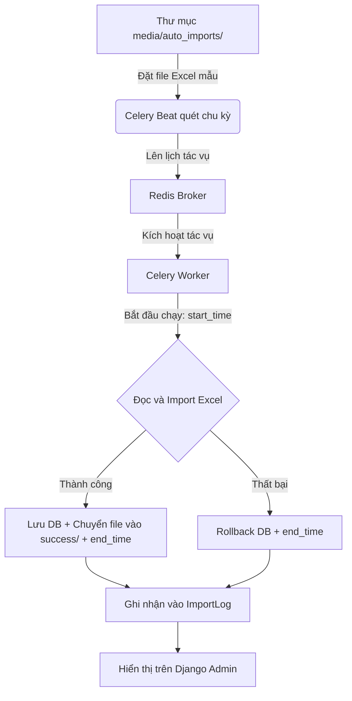

# Tài liệu hướng dẫn tổng quan dự án Report2026 (HP Co.)

Chào mừng bạn tiếp quản dự án! Đừng lo lắng nếu bạn chưa rành về Python. Tài liệu này được thiết kế để giúp bạn nắm bắt toàn bộ bức tranh của dự án từ kiến trúc, nghiệp vụ đến cách vận hành thực tế.

---

## 1. Dự án này là gì?
Dự án **Report2026** là một hệ thống **Backend API (Application Programming Interface)** chuyên phục vụ cho việc:
1. **Thu thập dữ liệu tự động**: Đọc các file báo cáo Excel xuất ra từ các hệ thống kế toán khác.
2. **Tính toán chỉ số hiệu suất**: Tính doanh thu, công nợ, dòng tiền, chi phí vận hành, tồn kho theo từng ngày, từng tháng cho từng đơn vị kinh doanh (Business Unit - BU) và cho toàn công ty.
3. **Cung cấp API cho Frontend**: Trả dữ liệu đã tính toán dưới dạng JSON để giao diện Dashboard (React/Vue) vẽ biểu đồ.

---

## 2. Các công nghệ cốt lõi được sử dụng
*   **Ngôn ngữ**: Python 3.14 (chạy trong môi trường ảo ở thư mục `.venv`).
*   **Framework Web**: **Django** & **Django REST Framework (DRF)**. Django giúp quản lý Database và Admin, còn DRF dùng để xây dựng các API.
*   **Hệ quản trị cơ sở dữ liệu**: **PostgreSQL** (chạy ở cổng `5433`, tên database là `reportdb`).
*   **Hệ thống hàng đợi & Tác vụ ngầm**: **Celery** kết hợp với **Redis Broker** để chạy các tác vụ import file Excel tự động.
*   **Thư viện xử lý Excel**: `django-import-export` kết hợp `tablib` để đọc/ghi file Excel cấu trúc lớn.

---

## 3. Cấu trúc thư mục & Ý nghĩa các file quan trọng

Thư mục làm việc của bạn bao gồm:
*   `.venv/`: Thư mục chứa môi trường Python và các thư viện đã cài đặt.
*   `report2026/` *(Thư mục cấu hình dự án)*:
    *   [settings.py](file:///d:/Sources/dashboard-report/report2026/settings.py): Cấu hình chung của dự án (Kết nối database, cấu hình bảo mật CORS/CSRF, danh sách các thư viện được cài đặt, lịch chạy tác vụ tự động Celery).
    *   [urls.py](file:///d:/Sources/dashboard-report/report2026/urls.py): File định tuyến (Routing) chính, điều hướng các request từ trình duyệt tới ứng dụng.
    *   [celery.py](file:///d:/Sources/dashboard-report/report2026/celery.py): File cấu hình khởi tạo Celery.
*   `accounting/` *(Ứng dụng xử lý kế toán - Nơi chứa toàn bộ logic nghiệp vụ)*:
    *   [models.py](file:///d:/Sources/dashboard-report/accounting/models.py): **Nơi định nghĩa cấu trúc cơ sở dữ liệu (Database Schema)**. Chứa các model chính như Khách hàng, Sản phẩm, Tồn kho, Chỉ số hiệu suất BU, và bảng nhật ký `ImportLog`.
    *   [views.py](file:///d:/Sources/dashboard-report/accounting/views.py): **Nơi nhận request và trả về response**. Chứa logic xử lý đăng nhập và các API cung cấp dữ liệu báo cáo.
    *   [serializers.py](file:///d:/Sources/dashboard-report/accounting/serializers.py): Bộ chuyển đổi dữ liệu thành định dạng JSON (và ngược lại) để Frontend dễ đọc.
    *   [tasks.py](file:///d:/Sources/dashboard-report/accounting/tasks.py): **Tác vụ ngầm**. Chứa code tự động quét thư mục để import dữ liệu từ file Excel và tính toán KPI hiệu suất tài chính.
    *   [resources.py](file:///d:/Sources/dashboard-report/accounting/resources.py): Quy tắc mapping dữ liệu giữa cột trong file Excel và cột trong DB.
    *   [urls.py](file:///d:/Sources/dashboard-report/accounting/urls.py): Định tuyến riêng cho các API của app `accounting`.
*   [run_celery.bat](file:///d:/Sources/dashboard-report/run_celery.bat): File batch script khởi chạy thủ công Celery độc lập (khi cần chạy thử nghiệm/gọi từ shell).

---

## 4. Các luồng nghiệp vụ chính của dự án

### Luồng A: Tự động nạp dữ liệu từ file Excel (Auto Import)



1. **Chu kỳ quét**: Hàng ngày vào lúc **06:00 AM** (giờ Việt Nam, tương ứng cấu hình `crontab(hour=6, minute=0)` trong [settings.py](file:///d:/Sources/dashboard-report/report2026/settings.py#L164) và múi giờ `CELERY_TIMEZONE = 'Asia/Ho_Chi_Minh'`), Celery Beat tự động bắn tác vụ vào hàng chờ Redis.
2. **Quét file**: Celery Worker nhận việc, quét thư mục `media/auto_imports/` để tìm các file có tên dạng:
    *   `BAN_HANG*.xlsx` (Bán hàng) -> Lưu vào `SalesTransaction`
    *   `MUA_HANG*.xlsx` (Mua hàng) -> Lưu vào `PurchaseDetail`
    *   `TON_KHO*.xlsx` (Tồn kho) -> Lưu vào `InventorySummary`
    *   `CONG_NO_NCC*.xlsx` (Công nợ nhà cung cấp) -> Lưu vào `SupplierDebt`
    *   `TUOI_NO_KH*.xlsx` (Tuổi nợ khách hàng) -> Lưu vào `ReceivablesAgeing`
    *   `SO_CHI_TIET*.xlsx` (Sổ chi tiết tài khoản ngân hàng/tiền mặt 111-112) -> Lưu vào `AccountDetail`
3. **An toàn dữ liệu**: Dữ liệu import của mỗi file được đặt trong một **database transaction** (`transaction.atomic()`). Hệ thống xóa sạch dữ liệu cũ rồi mới nạp dữ liệu mới. Nếu thành công, di chuyển file Excel vào thư mục `success/`. Nếu có bất kỳ lỗi nào, toàn bộ quá trình sẽ được Rollback về trạng thái cũ để tránh sai lệch dữ liệu.
4. **Nhật ký tiến trình (`ImportLog`)**: Hệ thống ghi nhận mốc thời gian bắt đầu thực thi (`start_time`), thời gian hoàn thành (`end_time`), trạng thái (`SUCCESS`/`ERROR`) và thông báo chi tiết vào bảng `ImportLog` hiển thị trên Django Admin.

---

### Luồng B: Tính toán chỉ số hiệu suất (KPI/Performance)
Sau khi dữ liệu Excel mới được nạp vào, hệ thống chạy hàm `update_single_bu_performance` để tổng hợp số liệu cho từng đơn vị kinh doanh (BU) và cho Tổng công ty:
*   **Doanh thu lũy kế tháng**: Tổng hợp từ bảng `SalesTransaction` dựa trên các khách hàng có `has_revenue=True`.
    > [!IMPORTANT]
    > **Lưu ý sự bất nhất về logic:**
    > - Doanh thu tháng (`rev_actual`) được tính bằng cách cộng cột `actual_sales` (Doanh số thực tế) của `SalesTransaction`.
    > - Doanh thu ngày (`daily_rev`) lại được tính bằng cách cộng cột `sales_amount` (Doanh số bán) của `SalesTransaction`.
    > Do đó, tổng doanh thu các ngày trong tháng có thể không khớp hoàn toàn với doanh thu lũy kế của tháng đó.
*   **Thực thu tiền mặt/ngân hàng**: Lọc từ bảng `AccountDetail` các bút toán có tài khoản nợ bắt đầu bằng `111` hoặc `112` và tài khoản đối ứng bắt đầu bằng `1311` hoặc `1312`.
*   **Tuổi nợ**: Tổng hợp công nợ quá hạn (`overdue_total`) và trước hạn (`due_total`) từ bảng `ReceivablesAgeing`.
    *   *Đã thu (đến hạn)* (`collection_due_actual`) lấy từ `due_total`.
    *   *Thu trong hạn + COD* (`collection_in_term_cod`) tính bằng `total_debt - overdue_total`.
*   **Tồn kho**: Tính tổng giá trị tồn kho từ bảng `InventorySummary` (cột `closing_value`).
*   Tất cả số liệu này được lưu vào bảng `BUPerformance` (theo tháng) và `BUPerformanceDaily` (theo ngày).

> [!WARNING]
> **Các trường số liệu thực tế chưa được tính toán:**
> Hiện tại, các trường `bank_debt_actual` (Nợ ngân hàng thực tế), `opex_actual` (Chi phí vận hành thực tế), và `cash_balance_actual` (Tiền cuối kỳ thực tế) trong bảng `BUPerformance` **chưa có logic tính toán** trong backend và luôn mang giá trị mặc định là `0`.

> [!NOTE]
> **Các bảng độc lập:**
> Dữ liệu mua hàng (`PurchaseDetail`) và Công nợ nhà cung cấp (`SupplierDebt`) được tự động nạp từ Excel nhưng hiện tại **không tham gia** vào luồng tính toán hiệu suất BU.

---

### Luồng C: Đồng bộ tồn kho kho hàng (Warehouse Inventory Sync)
Tác vụ `sync_warehouse_inventory_data` dùng để tổng hợp số liệu tồn kho từ bảng `InventorySummary` (đầu kỳ, nhập, xuất, cuối kỳ) rồi cập nhật trực tiếp vào từng kho trong bảng `Warehouse`. 
Nhà phát triển hoặc Admin có thể kích hoạt đồng bộ thủ công qua tính năng Action trong Django Admin của bảng `Warehouse`.

---

## 5. Hướng dẫn chạy và thao tác với dự án dành cho bạn

Để bắt đầu làm việc trên máy tính này, bạn làm theo các bước sau:

### Bước 1: Cấu hình và Tự động khởi động Redis Server
Hệ thống hỗ trợ tự động khởi chạy Redis Server cùng lúc với Django Web Server.
1. Mở file [settings.py](file:///d:/Sources/dashboard-report/report2026/settings.py#L172) và cấu hình đường dẫn tới file chạy Redis trên máy của bạn:
   ```python
   REDIS_SERVER_PATH = r"d:\downloads\redis-x64-5.0.14.1\redis-server.exe"
   ```
2. Khi khởi chạy lệnh ở Bước 2, hệ thống sẽ tự động kiểm tra và bật cửa sổ Redis Server chạy song song mà bạn không cần mở thủ công.

> [!IMPORTANT]
> **Khuyến nghị tương thích**: Redis chạy trên Windows thường là phiên bản cũ (v5.0.x). Do đó, thư viện kết nối Python trong môi trường ảo `.venv` bắt buộc phải sử dụng phiên bản `redis==4.6.0`. (Phiên bản `redis >= 5.x` sử dụng giao thức RESP3 sẽ gây lỗi `unknown command 'HELLO'`).

### Bước 2: Chạy Server phát triển (Development Server) & Celery + Redis tự động
Chạy máy chủ web Django thông thường trong môi trường ảo:
```powershell
py manage.py runserver
```

> [!TIP]
> **Tự động hóa hoàn toàn**: Chúng ta đã tích hợp mã nguồn quản lý trực tiếp vào [manage.py](file:///d:/Sources/dashboard-report/manage.py). Khi chạy lệnh `runserver` ở trên:
> 1. Django sẽ **tự động khởi chạy Redis Server, Celery Worker và Celery Beat** trong các cửa sổ terminal độc lập hoàn toàn tự động.
> 2. Cơ chế thông minh đảm bảo các dịch vụ chỉ mở đúng 1 bản duy nhất mỗi lần khởi chạy server (không bị lặp lại do `auto-reloader`).
> 3. **Tự động dọn dẹp khi dừng server**: Khi bạn nhấn `Ctrl + C` để dừng `runserver`, Django sẽ tự động gửi lệnh kết thúc và **đóng hoàn toàn tất cả các cửa sổ terminal Celery & Redis** đang chạy, tránh rác tiến trình chạy ngầm trên Windows.

---

## 6. API Endpoint phục vụ Frontend Dashboard

### Phân quyền & Bảo mật API (Authentication)
*   Hệ thống yêu cầu xác thực bằng **Knox Token** hoặc **Session**.
*   Giao thức gọi API (ngoại trừ `/api/login/`) bắt buộc phải đính kèm Header:
    `Authorization: Token <key_nhận_được_khi_login>`

### Danh sách các API Endpoint:

#### 1. Đăng nhập hệ thống
*   `POST /api/login/`:
    *   **Body (JSON)**: `{"username": "...", "password": "..."}`
    *   **Response (JSON)**: Trả về Token Knox, ngày hết hạn và thông tin cơ bản của user.

#### 2. Đăng xuất hệ thống (Knox Auth)
*   `POST /api/auth/logout/`: Hủy token hiện tại.
*   `POST /api/auth/logoutall/`: Hủy toàn bộ token đã cấp cho user.

#### 3. Lấy số liệu Hiệu suất BU theo Tháng (Dashboard chính)
*   `GET /api/bu-performance/`: Trả về số liệu kế hoạch và thực tế theo tháng kèm theo các trường KPI được tính toán tự động như `revenue_kpi`, `collection_kpi`, `inventory_vs_plan`.
*   **Query Parameters**:
    *   `?month=6&year=2026`
    *   `?bu_id=X`: Lọc theo BU (`null` hoặc bỏ trống để lấy Tổng công ty, `all` để lấy toàn bộ, hoặc ID cụ thể).
    *   `?only_roots=true`: Chỉ lấy các BU cấp cao nhất (không có BU cha).

#### 4. Lấy số liệu Hiệu suất BU theo Ngày (Vẽ biểu đồ)
*   `GET /api/performance/daily/`: Trả về dữ liệu doanh thu và thực thu phát sinh trong từng ngày của tháng.
*   **Query Parameters**:
    *   `?bu_id=X` (Bỏ trống hoặc ID cụ thể)
    *   `?month=6`
    *   `?year=2026`

#### 5. Lấy số liệu Báo cáo Thu nợ theo BU (Dashboard Thu Nợ)
*   `GET /api/dashboard/collection-by-bu/`:
    *   **Tác dụng**: Trả về 5 chỉ số thu nợ chi tiết theo từng đơn vị kinh doanh chính (`is_main=True`) cho một ngày cụ thể.
    *   **Query Parameters (Bắt buộc)**: `?date=YYYY-MM-DD` (Ví dụ: `?date=2026-06-15`).
    *   **Dữ liệu trả về**: Danh sách `rows` chi tiết của từng BU (dư nợ cần thu, nợ quá hạn, đã thu đến hạn, thu trong hạn + COD, tổng thu trong ngày) và tổng cộng `totals` của toàn bộ BU chính.

#### 6. Kích hoạt tính toán lại dữ liệu (Manual Trigger)
*   `POST /api/update-performance/`: Cho phép trigger tính toán và cập nhật lại chỉ số hiệu suất từ các bảng chi tiết.
    *   **Body (JSON)**:
        ```json
        {
          "bu_id": 1, // ID của BU (null nếu là Tổng công ty)
          "month": 6,
          "year": 2026,
          "target_date": "2026-06-15" // Mốc ngày kết thúc tính toán
        }
        ```

#### 7. Các API danh mục chi tiết (DRF ViewSets)
Các ViewSet này cung cấp giao diện Web API trực quan để lấy danh sách (`GET`), chi tiết (`GET [id]`), tạo (`POST`), sửa (`PUT`), xóa (`DELETE`) dữ liệu mẫu:
*   `/api/branches/` (Chi nhánh)
*   `/api/business-units/` (Đơn vị kinh doanh - BU):
    *   *Bộ lọc*: `?is_main=true` (chỉ lấy BU chính) hoặc `?is_main=false`
*   `/api/transactions/` (Chi tiết bán hàng)
*   `/api/customers/` (Khách hàng)
*   `/api/suppliers/` (Nhà cung cấp)
*   `/api/supplier-groups/` (Nhóm nhà cung cấp)
*   `/api/supplier-debts/` (Công nợ NCC)
*   `/api/account-details/` (Sổ chi tiết tài khoản 111-112):
    *   *Bộ lọc*: `?business_unit__code=...`
*   `/api/receivables-ageing/` (Chi tiết tuổi nợ):
    *   *Tìm kiếm*: `?search=mã_hoặc_tên_khách_hàng`
*   `/api/purchase-details/` (Chi tiết mua hàng):
    *   *Bộ lọc*: `?supplier__code=...&business_unit__code=...&warehouse__code=...`
*   `/api/inventory-summaries/` (Tổng hợp tồn kho)
