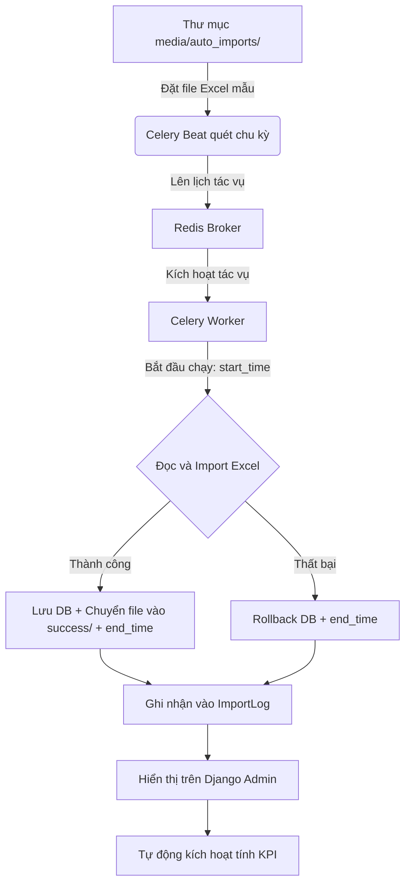

# Tài liệu hướng dẫn tổng quan dự án Report2026 (HP Co.)

Chào mừng bạn tiếp quản dự án! Đừng lo lắng nếu bạn chưa rành về Python. Tài liệu này được thiết kế để giúp bạn nắm bắt toàn bộ bức tranh của dự án từ kiến trúc, nghiệp vụ đến cách vận hành thực tế.

> [!IMPORTANT]
> **Quy trình thực thi chuẩn (SOP) & Checklist bắt buộc**:
> Tất cả các lập trình viên và AI Coding Agent khi tham gia phát triển, bảo trì dự án này bắt buộc phải đọc và tuân thủ quy trình 5 bước được định nghĩa tại file [CheckList.md](file:///d:/Sources/dashboard-report/CheckList.md) trước khi sửa đổi code hoặc thực hiện commit.

---

## 1. Dự án này là gì?
Dự án **Report2026** là một hệ thống **Backend API (Application Programming Interface)** chuyên phục vụ cho việc:
1. **Thu thập dữ liệu tự động**: Đọc các file báo cáo Excel xuất ra từ các hệ thống kế toán khác.
2. **Tính toán chỉ số hiệu suất**: Tính doanh thu, công nợ, dòng tiền, chi phí vận hành, tồn kho theo từng ngày, từng tháng cho từng đơn vị kinh doanh (Business Unit - BU) và cho toàn công ty.
3. **Cung cấp API cho Frontend**: Trả dữ liệu đã tính toán dưới dạng JSON để giao diện Dashboard (React/Vue) vẽ biểu đồ.

---

## 2. Các công nghệ cốt lõi được sử dụng
*   **Ngôn ngữ**: Python 3.14 (chạy trong môi trường ảo ở thư mục `.venv`).
*   **Framework Web**: **Django** & **Django REST Framework (DRF)**. Django giúp quản lý Database và Admin, còn DRF dùng để xây dựng các API.
*   **Hệ quản trị cơ sở dữ liệu**: **PostgreSQL** (chạy ở cổng `5433`, tên database là `reportdb`).
*   **Hệ thống hàng đợi & Tác vụ ngầm**: **Celery** kết hợp với **Redis Broker** để chạy các tác vụ import file Excel tự động.
*   **Thư viện xử lý Excel**: `django-import-export` kết hợp `tablib` để đọc/ghi file Excel cấu trúc lớn.

---

## 3. Cấu trúc thư mục & Ý nghĩa các file quan trọng

Thư mục làm việc của bạn bao gồm:
*   `.venv/`: Thư mục chứa môi trường Python và các thư viện đã cài đặt.
*   `report2026/` *(Thư mục cấu hình dự án)*:
    *   [settings.py](file:///d:/Sources/dashboard-report/report2026/settings.py): Cấu hình chung của dự án (Kết nối database, cấu hình bảo mật CORS/CSRF, danh sách các thư viện được cài đặt, lịch chạy tác vụ tự động Celery).
    *   [urls.py](file:///d:/Sources/dashboard-report/report2026/urls.py): File định tuyến (Routing) chính, điều hướng các request từ trình duyệt tới ứng dụng.
    *   [celery.py](file:///d:/Sources/dashboard-report/report2026/celery.py): File cấu hình khởi tạo Celery.
*   `accounting/` *(Ứng dụng xử lý kế toán - Nơi chứa toàn bộ logic nghiệp vụ)*:
    *   [models.py](file:///d:/Sources/dashboard-report/accounting/models.py): **Nơi định nghĩa cấu trúc cơ sở dữ liệu (Database Schema)**. Chứa các model chính như Khách hàng, Sản phẩm, Tồn kho, Chỉ số hiệu suất BU, và bảng nhật ký `ImportLog`.
    *   [views.py](file:///d:/Sources/dashboard-report/accounting/views.py): **Nơi nhận request và trả về response**. Chứa logic xử lý đăng nhập và các API cung cấp dữ liệu báo cáo.
    *   [serializers.py](file:///d:/Sources/dashboard-report/accounting/serializers.py): Bộ chuyển đổi dữ liệu thành định dạng JSON (và ngược lại) để Frontend dễ đọc.
    *   [tasks.py](file:///d:/Sources/dashboard-report/accounting/tasks.py): **Tác vụ ngầm**. Chứa code tự động quét thư mục để import dữ liệu từ file Excel và tính toán KPI hiệu suất tài chính.
    *   [resources.py](file:///d:/Sources/dashboard-report/accounting/resources.py): Quy tắc mapping dữ liệu giữa cột trong file Excel và cột trong DB.
    *   [urls.py](file:///d:/Sources/dashboard-report/accounting/urls.py): Định tuyến riêng cho các API của app `accounting`.
*   [run_celery.bat](file:///d:/Sources/dashboard-report/run_celery.bat): File batch script khởi chạy thủ công Celery độc lập (khi cần chạy thử nghiệm/gọi từ shell).
*   [requirements.txt](file:///d:/Sources/dashboard-report/requirements.txt): Tệp chứa danh sách các thư viện Python phụ thuộc cần thiết cho dự án.

---

## 4. Các luồng nghiệp vụ chính của dự án

### Luồng A: Tự động nạp dữ liệu từ file Excel (Auto Import)



1. **Chu kỳ quét**: Hàng ngày vào lúc **07:00 AM** (giờ Việt Nam, tương ứng cấu hình `crontab(hour=7, minute=0)` trong [settings.py](file:///d:/Sources/dashboard-report/report2026/settings.py#L165) và múi giờ `CELERY_TIMEZONE = 'Asia/Ho_Chi_Minh'`), Celery Beat tự động bắn tác vụ vào hàng chờ Redis.
2. **Quét file**: Celery Worker nhận việc, quét thư mục `media/auto_imports/` để tìm các file có tên dạng:
    *   `KHACH_HANG*.xlsx` (Khách hàng) -> Lưu vào `Customer` (Bảng danh mục khách hàng)
    *   `BAN_HANG*.xlsx` (Bán hàng) -> Lưu vào `SalesTransaction`
    *   `MUA_HANG*.xlsx` (Mua hàng) -> Lưu vào `PurchaseDetail`
    *   `TON_KHO*.xlsx` (Tồn kho) -> Lưu vào `InventorySummary`
    *   `CONG_NO_NCC*.xlsx` (Công nợ nhà cung cấp) -> Lưu vào `SupplierDebt`
    *   `TUOI_NO_KH*.xlsx` (Tuổi nợ khách hàng) -> Lưu vào `ReceivablesAgeing`
    *   `SO_CHI_TIET*.xlsx` (Sổ chi tiết các tài khoản 111, 112, 341) -> Lưu vào `AccountDetail`
3. **An toàn dữ liệu & Phạm vi xóa (Scope of Deletion)**: 
    Dữ liệu import của mỗi file được đặt trong một **database transaction** (`transaction.atomic()`). 
    - Đối với hầu hết các file giao dịch, hệ thống thực hiện lệnh xóa sạch toàn bộ dữ liệu hiện tại của bảng tương ứng trước khi nạp (`objects.all().delete()`). 
    - **Ngoại lệ an toàn cho danh mục Khách hàng (`KHACH_HANG`)**: Hệ thống **không** thực hiện xóa sạch bảng `Customer` (được cấu hình flag `skip_delete: True` trong code). Do bảng `Customer` có liên kết khóa ngoại với các bảng giao dịch bán hàng (`SalesTransaction`) và tuổi nợ (`ReceivablesAgeing`) bằng thuộc tính `on_delete=models.CASCADE`, việc xóa sạch bảng `Customer` sẽ kéo theo việc tự động xóa sạch toàn bộ dữ liệu giao dịch liên quan. Thay vào đó, tiến trình import Khách hàng hoạt động ở cơ chế **Upsert (Cập nhật hoặc Thêm mới)** dựa trên mã khách hàng (`code`).
    > [!WARNING]
    > **Thiết kế mặc định (Wipe and Reload):** Vì hệ thống thực thi `objects.all().delete()` đối với các bảng giao dịch, dữ liệu file nạp được ngầm định phải là **file lũy kế (cumulative)** từ đầu kỳ/đầu năm đến nay. Nếu người dùng nạp file lẻ theo tháng (ví dụ chỉ chứa dữ liệu tháng 6), dữ liệu các tháng từ 1 đến 5 đã nạp trước đó sẽ bị xóa sạch khỏi cơ sở dữ liệu.
    - Nếu import thành công, file Excel được di chuyển vào thư mục `success/`.
    - Nếu có bất kỳ lỗi cấu trúc/lỗi kiểu dữ liệu nào, toàn bộ quá trình sẽ được Rollback về trạng thái cũ để tránh mất/sai lệch dữ liệu cũ.
4. **Nhật ký tiến trình (`ImportLog`)**: Hệ thống ghi nhận mốc thời gian bắt đầu thực thi (`start_time`), thời gian hoàn thành (`end_time`), trạng thái (`SUCCESS`/`ERROR`/`NOTFOUND`) và thông báo chi tiết vào bảng `ImportLog` hiển thị trên Django Admin.
    - **Trạng thái `NOTFOUND` (Cảnh báo thiếu file)**: Nếu trong chu kỳ quét tự động mà có bất kỳ tệp tin nào được định nghĩa trong `IMPORT_MAP` bị thiếu (không tìm thấy trên ổ đĩa), hệ thống sẽ tạo một bản ghi log tổng hợp với trạng thái `NOTFOUND` liệt kê chi tiết các tiền tố tệp bị thiếu dưới dạng danh sách gạch đầu dòng trực quan.
5. **Cơ chế kích hoạt tính toán tự động (Orchestration Flow)**:
    - Ngay khi tiến trình import hoàn tất thành công, Celery Worker sẽ **tự động kích hoạt** việc tính toán lại KPI cho Tổng công ty và từng BU bằng cách xếp hàng các tác vụ ngầm:
      - `update_single_bu_performance.delay(None)` (Cho Tổng công ty).
      - `update_single_bu_performance.delay(bu.id)` (Cho từng BU cụ thể trong danh mục `BusinessUnit`).
    - **Lưu ý**: Tiến trình đồng bộ tồn kho kho hàng (`sync_warehouse_inventory_data`) **không tự động chạy** khi kết thúc import mà phải kích hoạt thủ công (xem chi tiết ở Luồng C).

---

### Luồng B: Tính toán chỉ số hiệu suất (KPI/Performance)
Sau khi dữ liệu Excel mới được nạp vào, hệ thống chạy hàm `update_single_bu_performance` để tổng hợp số liệu cho từng đơn vị kinh doanh (BU) và cho Tổng công ty. Dưới đây là logic nghiệp vụ và kỹ thuật chi tiết:

#### 1. Logic xác định phạm vi (Global / Sub-BU)
- **Quy ước Global**: Nếu `bu_id` nhận vào là `None` hoặc BU đó không có cha (`parent_id is None`), hệ thống thiết lập biến `is_global = True`.
- **Hành vi**: Khi `is_global = True`, hệ thống sẽ **bỏ qua bộ lọc theo BU** trên các bảng dữ liệu gốc, trực tiếp tổng hợp toàn bộ dữ liệu của toàn công ty. Đây là quy ước nghiệp vụ của HP Co. chứ không phải là giải thuật gom cụm đệ quy cây phân cấp.
- **BU cấp dưới (Sub-BU)**: Nếu `bu_id` cụ thể và có BU cha, hệ thống chỉ lọc chính xác bản ghi của riêng BU đó.

#### 2. Logic xử lý mốc thời gian (`target_date`)
- Nhận tham số ngày kết thúc tính toán `target_date_str`.
- Nếu không truyền:
  - Nếu tính toán cho **tháng hiện tại** (trùng tháng/năm hiện tại): `target_date` tự động lấy ngày hôm nay (`today.date()`).
  - Nếu tính toán cho **tháng cũ** trong quá khứ: `target_date` tự động lấy ngày cuối cùng của tháng đó (`calendar.monthrange(year, month)[1]`).
- Hệ thống sẽ chạy vòng lặp cập nhật phát sinh thực tế từng ngày (`BUPerformanceDaily`) bắt đầu từ ngày 1 đến hết ngày `target_date`.

#### 3. Bộ lọc Khách hàng ghi nhận doanh thu (`Customer.has_revenue`)
- Toàn bộ các truy vấn tính Doanh thu (`SalesTransaction`) và Thực thu (`AccountDetail`) đều được áp dụng bộ lọc bắt buộc:
  `customer__has_revenue=True`
- Chỉ có những khách hàng được cấu hình ghi nhận doanh thu mới tham gia vào các chỉ số KPI này. Các khách hàng còn lại sẽ bị loại bỏ hoàn toàn khỏi kết quả tính toán.

#### 4. Logic chi tiết tính các chỉ số hiệu suất
*   **Doanh thu lũy kế tháng**: Tổng hợp từ bảng `SalesTransaction` (cộng cột `actual_sales`).
    > [!IMPORTANT]
    > **Sự bất nhất về cột dữ liệu (Technical Debt):**
    > - Doanh thu tháng (`rev_actual`) tính bằng: `Sum('actual_sales')` từ `SalesTransaction`.
    > - Doanh thu ngày (`daily_rev` trong `BUPerformanceDaily`) lại tính bằng: `Sum('sales_amount')` từ `SalesTransaction`.
    > Do đó, tổng cộng doanh thu các ngày của bảng Daily có thể bị lệch so với doanh thu lũy kế tháng của bảng Monthly.
*   **Thực thu tiền mặt/ngân hàng (Collection - Quy tắc Kế toán)**: 
    - Lọc từ sổ chi tiết tài khoản `AccountDetail` các bút toán có:
      - Tài khoản của mình bắt đầu bằng `111` (tiền mặt) hoặc `112` (tiền gửi ngân hàng) (`account_number__startswith`).
      - Tài khoản đối ứng bắt đầu bằng `1311` hoặc `1312` (các tài khoản phải thu khách hàng) (`offset_account__startswith`).
    - **Công thức tính thực thu**: `coll_actual = debit_amount - credit_amount` (Phát sinh Nợ trừ Phát sinh Có).
*   **Tuổi nợ & Công nợ (Receivables Ageing)**:
    - Lọc từ bảng `ReceivablesAgeing`.
    - **Dư nợ cần thu** (`receivable_total`): Tính bằng tổng cột `total_debt`.
    - **Nợ quá hạn** (`receivable_overdue`): Tính bằng tổng cột `overdue_total`.
    - **Đã thu (đến hạn)** (`collection_due_actual`): Tính bằng tổng cột `due_total` (trên giao diện model tương ứng với cột `due_now`).
    - **Thu trong hạn + COD** (`collection_in_term_cod`): Tính bằng công thức `receivable_total - receivable_overdue` (Tổng nợ trừ Nợ quá hạn).
*   **Tồn kho KPI**: 
    - **Đường đi dữ liệu**: 
      `InventorySummary` -> `Warehouse` -> `BusinessUnit` (thông qua `warehouse__business_unit_id=bu_id`).
    - Bảng tồn kho `InventorySummary` không lưu trực tiếp thông tin `business_unit_id` mà phải thông qua liên kết kho hàng `Warehouse`.
    - **Giá trị tồn kho thực tế** (`inventory_value_actual`) của BU/Tổng công ty được tính bằng tổng cột `closing_value` của bảng `InventorySummary` theo filter BU.

*   Tất cả số liệu sau khi tính toán xong được lưu vào bảng `BUPerformance` (theo tháng) và `BUPerformanceDaily` (theo ngày).

> [!WARNING]
> **Các trường số liệu thực tế chưa được tính toán:**
> Hiện tại, các trường `bank_debt_actual` (Nợ ngân hàng thực tế), `opex_actual` (Chi phí vận hành thực tế), và `cash_balance_actual` (Tiền cuối kỳ thực tế) trong bảng `BUPerformance` **chưa có logic tính toán** trong backend và luôn mang giá trị mặc định là `0`.

> [!NOTE]
> **Các bảng độc lập:**
> Dữ liệu mua hàng (`PurchaseDetail`) và Công nợ nhà cung cấp (`SupplierDebt`) được tự động nạp từ Excel nhưng hiện tại **không tham gia** vào luồng tính toán hiệu suất BU.

---

### Luồng C: Đồng bộ tồn kho kho hàng (Warehouse Inventory Sync)
Tác vụ `sync_warehouse_inventory_data` dùng để tổng hợp số liệu tồn kho chi tiết từ bảng `InventorySummary` (cột đầu kỳ `opening_value`, nhập `in_value`, xuất `out_value`, cuối kỳ `closing_value`) nhóm theo kho hàng rồi cập nhật ngược trực tiếp vào các trường tương ứng trong bảng `Warehouse`.

> [!IMPORTANT]
> **Cơ chế kích hoạt**:
> Khác với tiến trình tính KPI BU tự động chạy sau khi import Excel, đồng bộ tồn kho kho hàng **bắt buộc phải kích hoạt thủ công** bằng một trong hai cách:
> 1. Truy cập Django Admin của bảng `Warehouse`, tích chọn các kho hàng cần cập nhật, chọn Action **`🔄 Đồng bộ tồn kho từ Inventory Summary`** rồi ấn Run.
> 2. Chạy tác vụ Celery `sync_warehouse_inventory_data` thông qua Django Celery Beat hoặc trigger bằng dòng lệnh.


---

## 5. Hướng dẫn chạy và thao tác với dự án dành cho bạn

Để bắt đầu làm việc trên máy tính này, bạn làm theo các bước sau:

### Bước 0: Khởi tạo file cấu hình môi trường `.env`
Hệ thống sử dụng thư viện `django-environ` để bảo mật và tách cấu hình cơ sở dữ liệu khỏi mã nguồn.
1. Tạo một tệp tin tên `.env` ở thư mục gốc của dự án (cùng cấp với thư mục `report2026/` và tệp `manage.py`).
2. Nhập các thông tin kết nối database tương ứng của máy bạn và cấu hình chu kỳ chạy Celery Beat nếu cần:
   ```env
   # 1. Cấu hình cơ sở dữ liệu
   DB_NAME=reportdb
   DB_USER=postgres
   DB_PASSWORD=your_password
   DB_HOST=localhost
   DB_PORT=5433

   # 2. Cấu hình chu kỳ tự động chạy nạp Excel của Celery Beat
   # Hỗ trợ các kiểu: daily (mặc định), weekly, monthly, custom (cron tùy chọn)
   IMPORT_SCHEDULE_TYPE=daily
   IMPORT_SCHEDULE_HOUR=7
   IMPORT_SCHEDULE_MINUTE=0
   
   # Thứ trong tuần (0-6 tương ứng CN-T7, áp dụng khi IMPORT_SCHEDULE_TYPE=weekly)
   IMPORT_SCHEDULE_DAY_OF_WEEK=1
   
   # Ngày trong tháng (1-31, áp dụng khi IMPORT_SCHEDULE_TYPE=monthly)
   IMPORT_SCHEDULE_DAY_OF_MONTH=1
      # Cron tùy chỉnh (áp dụng khi IMPORT_SCHEDULE_TYPE=custom)
    # minute hour day_of_month month day_of_week
    IMPORT_SCHEDULE_CRON=0 7 * * *

    # 3. Cấu hình tự động tải báo cáo từ MISA AMIS (Sử dụng Playwright)
    MISA_AMIS_LOGIN_URL=https://act.amis.vn/
    MISA_EMAIL=your_misa_email@example.com
    MISA_PASSWORD=your_misa_password
    MISA_HEADLESS=True
    MISA_EXPORT_SELECTOR="button:has-text('Xuất khẩu')"
    
    # URL của các báo cáo MISA cụ thể cần tải tự động
    MISA_URL_BAN_HANG=https://act.amis.vn/report/sales-detail
    MISA_URL_MUA_HANG=https://act.amis.vn/report/purchase-detail
    MISA_URL_TON_KHO=https://act.amis.vn/report/inventory-summary
    MISA_URL_CONG_NO_NCC=https://act.amis.vn/report/supplier-debt
    MISA_URL_TUOI_NO_KH=
    MISA_URL_SO_CHI_TIET=
   ```
*(Lưu ý: Tệp `.env` đã được tự động thêm vào `.gitignore` để tránh đẩy thông tin nhạy cảm lên Git).*

### Bước 0.5: Cài đặt các thư viện Python cần thiết
Trước khi khởi chạy hệ thống lần đầu, bạn cần cài đặt toàn bộ các thư viện được định nghĩa sẵn trong dự án:
1. Đảm bảo môi trường ảo (Virtual Environment) đã được kích hoạt.
2. Chạy lệnh cài đặt:
   ```powershell
   pip install -r requirements.txt
   ```

### Bước 0.6: Cài đặt Driver trình duyệt cho Playwright (Bắt buộc cho tác vụ MISA)
Tác vụ tự động hóa MISA sử dụng Playwright để điều khiển Chromium. Bạn cần tải về driver trình duyệt:
1. Đảm bảo môi trường ảo đã được kích hoạt.
2. Chạy lệnh:
   ```powershell
   playwright install chromium
   ```

### Bước 1: Cấu hình và Tự động khởi động Redis Server
Hệ thống hỗ trợ tự động khởi chạy Redis Server cùng lúc với Django Web Server.
1. Mở file [settings.py](file:///d:/Sources/dashboard-report/report2026/settings.py#L172) và cấu hình đường dẫn tới file chạy Redis trên máy của bạn:
   ```python
   REDIS_SERVER_PATH = r"d:\downloads\redis-x64-5.0.14.1\redis-server.exe"
   ```
2. Khi khởi chạy lệnh ở Bước 2, hệ thống sẽ tự động kiểm tra và bật cửa sổ Redis Server chạy song song mà bạn không cần mở thủ công.

> [!IMPORTANT]
> **Khuyến nghị tương thích**: Redis chạy trên Windows thường là phiên bản cũ (v5.0.x). Do đó, thư viện kết nối Python trong môi trường ảo `.venv` bắt buộc phải sử dụng phiên bản `redis==4.6.0`. (Phiên bản `redis >= 5.x` sử dụng giao thức RESP3 sẽ gây lỗi `unknown command 'HELLO'`).

### Bước 2: Chạy Server phát triển (Development Server) & Celery + Redis tự động
Chạy máy chủ web Django thông thường trong môi trường ảo:
```powershell
py manage.py runserver
```

> [!TIP]
> **Tự động hóa hoàn toàn**: Chúng ta đã tích hợp mã nguồn quản lý trực tiếp vào [manage.py](file:///d:/Sources/dashboard-report/manage.py). Khi chạy lệnh `runserver` ở trên:
> 1. Django sẽ **tự động khởi chạy Redis Server, Celery Worker và Celery Beat** trong các cửa sổ terminal độc lập hoàn toàn tự động.
> 2. Cơ chế thông minh đảm bảo các dịch vụ chỉ mở đúng 1 bản duy nhất mỗi lần khởi chạy server (không bị lặp lại do `auto-reloader`).
> 3. **Tự động dọn dẹp khi dừng server**: Khi bạn nhấn `Ctrl + C` để dừng `runserver`, Django sẽ tự động gửi lệnh kết thúc và **đóng hoàn toàn tất cả các cửa sổ terminal Celery & Redis** đang chạy, tránh rác tiến trình chạy ngầm trên Windows.

---

## 6. API Endpoint phục vụ Frontend Dashboard

### Phân quyền & Bảo mật API (Authentication)
*   Hệ thống yêu cầu xác thực bằng **Knox Token** hoặc **Session**.
*   Giao thức gọi API (ngoại trừ `/api/login/`) bắt buộc phải đính kèm Header:
    `Authorization: Token <key_nhận_được_khi_login>`

### Danh sách các API Endpoint:

#### 1. Đăng nhập hệ thống
*   `POST /api/login/`:
    *   **Body (JSON)**: `{"username": "...", "password": "..."}`
    *   **Response (JSON)**: Trả về Token Knox, ngày hết hạn và thông tin cơ bản của user.

#### 2. Đăng xuất hệ thống (Knox Auth)
*   `POST /api/auth/logout/`: Hủy token hiện tại.
*   `POST /api/auth/logoutall/`: Hủy toàn bộ token đã cấp cho user.

#### 3. Lấy số liệu Hiệu suất BU theo Tháng (Dashboard chính)
*   `GET /api/bu-performance/`: Trả về số liệu kế hoạch và thực tế theo tháng kèm theo các trường KPI được tính toán tự động như `revenue_kpi`, `collection_kpi`, `inventory_vs_plan`.
*   **Query Parameters**:
    *   `?month=6&year=2026`
    *   `?bu_id=X`: Lọc theo BU (`null` hoặc bỏ trống để lấy Tổng công ty, `all` để lấy toàn bộ, hoặc ID cụ thể).
    *   `?only_roots=true`: Chỉ lấy các BU cấp cao nhất (không có BU cha).

#### 4. Lấy số liệu Hiệu suất BU theo Ngày (Vẽ biểu đồ)
*   `GET /api/performance/daily/`: Trả về dữ liệu doanh thu và thực thu phát sinh trong từng ngày của tháng.
*   **Query Parameters**:
    *   `?bu_id=X` (Bỏ trống hoặc ID cụ thể)
    *   `?month=6`
    *   `?year=2026`

#### 5. Lấy số liệu Báo cáo Thu nợ theo BU (Dashboard Thu Nợ)
*   `GET /api/dashboard/collection-by-bu/`:
    *   **Tác dụng**: Trả về 5 chỉ số thu nợ chi tiết theo từng đơn vị kinh doanh chính (`is_main=True`) cho một ngày cụ thể.
    *   **Query Parameters (Bắt buộc)**: `?date=YYYY-MM-DD` (Ví dụ: `?date=2026-06-15`).
    *   **Dữ liệu trả về**: Danh sách `rows` chi tiết của từng BU (dư nợ cần thu, nợ quá hạn, đã thu đến hạn, thu trong hạn + COD, tổng thu trong ngày) và tổng cộng `totals` của toàn bộ BU chính.

#### 6. Kích hoạt tính toán lại dữ liệu (Manual Trigger)
*   `POST /api/update-performance/`: Cho phép trigger tính toán và cập nhật lại chỉ số hiệu suất từ các bảng chi tiết.
    *   **Body (JSON)**:
        ```json
        {
          "bu_id": 1, // ID của BU (null nếu là Tổng công ty)
          "month": 6,
          "year": 2026,
          "target_date": "2026-06-15" // Mốc ngày kết thúc tính toán
        }
        ```

#### 7. Các API danh mục chi tiết (DRF ViewSets)
Các ViewSet này cung cấp giao diện Web API trực quan để lấy danh sách (`GET`), chi tiết (`GET [id]`), tạo (`POST`), sửa (`PUT`), xóa (`DELETE`) dữ liệu mẫu:
*   `/api/branches/` (Chi nhánh)
*   `/api/business-units/` (Đơn vị kinh doanh - BU):
    *   *Bộ lọc*: `?is_main=true` (chỉ lấy BU chính) hoặc `?is_main=false`
*   `/api/transactions/` (Chi tiết bán hàng)
*   `/api/customers/` (Khách hàng)
*   `/api/suppliers/` (Nhà cung cấp)
*   `/api/supplier-groups/` (Nhóm nhà cung cấp)
*   `/api/supplier-debts/` (Công nợ NCC)
*   `/api/account-details/` (Sổ chi tiết các tài khoản 111, 112, 341):
    *   *Bộ lọc*: `?business_unit__code=...`
*   `/api/receivables-ageing/` (Chi tiết tuổi nợ):
    *   *Tìm kiếm*: `?search=mã_hoặc_tên_khách_hàng`
*   `/api/purchase-details/` (Chi tiết mua hàng):
    *   *Bộ lọc*: `?supplier__code=...&business_unit__code=...&warehouse__code=...`
*   `/api/inventory-summaries/` (Tổng hợp tồn kho)

---

## 7. Lưu ý kỹ thuật chuyên sâu & Hướng phát triển tương lai (Dành cho Developer/Agent)

Để hỗ trợ đắc lực cho các Agent/Developer tiếp quản và vận hành dự án, dưới đây là các phân tích chi tiết về mặt thiết kế kỹ thuật, rủi ro hiệu năng tiềm ẩn và phương án giải quyết tương ứng:

### 7.1. Logic Doanh thu không khớp (Technical Debt)
* **Bối cảnh**: Doanh thu lũy kế tháng (`rev_actual` trong `BUPerformance`) tính bằng `Sum('actual_sales')`, trong khi doanh thu ngày (`daily_rev` trong `BUPerformanceDaily`) tính bằng `Sum('sales_amount')`.
* **Trạng thái**: Đây là **nợ kỹ thuật (Technical Debt)** đã được ghi nhận trong danh sách nâng cấp [target.md](file:///d:/Sources/dashboard-report/target.md#L8-L15) (mức độ Ưu tiên cao).
* **Hướng xử lý**: Lập trình viên mới được phép đồng bộ lại công thức của 2 bảng này sau khi đã thống nhất với bộ phận nghiệp vụ/kế toán xem trường nào (`actual_sales` hay `sales_amount`) mới thực sự là nguồn dữ liệu chuẩn.

### 7.2. Cảnh báo chủ động khi có lỗi (Error Handling & Alerts)
* **Bối cảnh**: Khi có lỗi định dạng file Excel (thiếu cột, sai kiểu dữ liệu,...) hoặc lỗi runtime, hệ thống thực hiện rollback giao dịch và lưu bản ghi nhật ký với trạng thái `ERROR` vào cột "Nội dung chi tiết" (`message`) của bảng `ImportLog` trên Django Admin. Bản ghi lỗi này bao gồm chi tiết lỗi chung (Base Errors) và chi tiết cụ thể trên từng dòng bị lỗi để nhà phát triển dễ dàng gỡ lỗi (debug).
* **Hạn chế**: Hiện tại dự án chưa tích hợp bất kỳ cơ chế cảnh báo chủ động nào (như Email, Slack hay Telegram).
* **Hướng xử lý tương lai**: Tích hợp thêm gửi Webhook cảnh báo khẩn cấp trong khối xử lý ngoại lệ `except Exception as e:` của hàm `auto_import_excel_from_folder` trong [tasks.py](file:///d:/Sources/dashboard-report/accounting/tasks.py#L75-L83).

### 7.3. Rủi ro khóa bảng khi dữ liệu phình to (Scalability & Table Lock)
* **Bối cảnh**: Hiện tại, mỗi khi import Excel, hệ thống sẽ xóa sạch dữ liệu cũ (`objects.all().delete()`) rồi nạp lại dữ liệu mới trong khối `transaction.atomic()`.
* **Rủi ro hiệu năng**: Khi bảng `SalesTransaction` hoặc `AccountDetail` lên tới hàng triệu dòng, việc này sẽ gây ra tình trạng **Exclusive Lock** trên cơ sở dữ liệu PostgreSQL trong thời gian dài, làm treo toàn bộ API đọc dữ liệu của Frontend.
* **Hướng xử lý tương lai**: Khi quy mô dữ liệu tăng lên, cần nâng cấp quy trình import:
  1. Chuyển sang cơ chế **Import tăng dần (Incremental/Upsert Load)** hoặc ghi đè theo từng phần (ví dụ: chỉ reload tháng hiện tại) thay vì xóa trắng toàn bộ bảng.
  2. Sử dụng **Staging Table & Swap Table**: Nạp dữ liệu vào bảng tạm, sau đó thực hiện đổi tên bảng trong transaction (chỉ mất vài mili-giây, giảm thiểu thời gian khóa bảng).
  3. Sử dụng `bulk_create` hoặc lệnh `COPY` của PostgreSQL thay vì import từng dòng qua ORM.
  4. Đọc file Excel lớn theo từng chunk để tránh tràn bộ nhớ RAM của Server.

### 7.4. Phạm vi xóa khi nạp Excel (Scope of Deletion)
* **Bối cảnh**: Lệnh `objects.all().delete()` ở đầu luồng Import Excel sẽ **xóa sạch toàn bộ lịch sử dữ liệu của bảng đó từ trước đến nay**, chứ không chỉ xóa dữ liệu của tháng/kỳ đang import.
* **Hệ quả & Điều kiện**: Hệ thống hiện tại đang ngầm giả định các file Excel nạp vào luôn là **file lũy kế từ trước đến nay** (hoặc tích lũy từ đầu năm). Nếu người dùng nạp file lẻ tách biệt theo tháng (ví dụ: chỉ chứa riêng tháng 6), dữ liệu các tháng từ 1 đến 5 đã nạp trước đó sẽ bị xóa mất hoàn toàn.
* **Hướng xử lý tương lai**: Cần chuyển đổi từ xóa trắng bảng sang **xóa theo điều kiện thời gian/kỳ kế toán** (ví dụ: chỉ xóa và ghi đè các bản ghi có cùng tháng/năm với file Excel đang nạp) để hỗ trợ import file rời theo tháng.

### 7.5. Cấu trúc cây phân cấp của Business Unit (BU Hierarchy)
* **Bối cảnh**: Bảng `BusinessUnit` sử dụng mối quan hệ đệ quy đơn giản thông qua khóa ngoại tự tham chiếu `parent = models.ForeignKey('self')`. Hệ thống **không** sử dụng các thư viện quản lý cây như `django-mptt` hay `django-treebeard`.
* **Logic tổng hợp**: Trong hàm tính toán KPI `update_single_bu_performance`:
  - Nếu `bu_id` là `None` hoặc BU đó không có cha (`parent_id is None`), hệ thống coi là `is_global = True` và tính tổng hợp cho toàn công ty (không lọc theo BU).
  - Nếu `bu_id` cụ thể, hệ thống chỉ lọc chính xác các bản ghi của BU đó (không đệ quy gom cụm số liệu của các BU con).
* **Hiệu năng**: Do không chạy đệ quy lặp qua các BU con khi tính toán cho BU cha, hệ thống hiện tại tránh được lỗi N+1 Query khét tiếng khi tính toán báo cáo. Tuy nhiên, việc gom cụm số liệu cấp phòng ban (sub-BU) lên BU cấp cao hơn hiện chưa được hỗ trợ tự động theo cây phân cấp.

### 7.6. Cơ chế phân quyền xem báo cáo (Row-Level Security / Data Isolation)
* **Hiện trạng**: Hệ thống hiện tại **chưa có cơ chế phân quyền theo cấp độ dữ liệu (Object-level permission/Row-level security)**. 
* **Rủi ro bảo mật**: Bất kỳ User nào khi đã đăng nhập thành công (có Knox Token hợp lệ) đều có quyền gọi các API báo cáo như `/api/bu-performance/?bu_id=X` hoặc `/api/transactions/?business_unit__code=X` để xem số liệu tài chính của bất kỳ BU nào trong công ty mà không bị hạn chế.
* **Cảnh báo cho Developer**: Đây là một **lỗ hổng bảo mật (Security Gap)** cần đặc biệt lưu ý. Khi triển khai các API ViewSet hoặc báo cáo mới cho HP Co., lập trình viên bắt buộc phải thiết kế thêm lớp phân quyền tùy biến (`permissions.BasePermission`) kiểm tra quyền sở hữu BU của tài khoản hiện tại (`request.user`) để tránh làm rò rỉ dữ liệu doanh thu nội bộ giữa các BU độc lập.

### 7.7. Quy ước đặt tên file Excel (Pattern Matching) và Định dạng ngày tháng
* **Bối cảnh**: Hệ thống sử dụng pattern `glob.glob("PREFIX*.xlsx")` (như `BAN_HANG*.xlsx`) chỉ để bóc tách và phân biệt loại dữ liệu cần import, sau đó sắp xếp theo ngày giờ tạo file trên ổ đĩa để tìm ra file mới nhất (`latest_file`).
* **Trích xuất thời gian**: Hệ thống **không bóc tách** thông tin năm/tháng từ tên file (ví dụ: file tên `BAN_HANG_2026_06.xlsx` không giúp hệ thống tự biết đây là dữ liệu tháng 6).
* **Nguồn gốc thời gian thực tế**: Toàn bộ thông tin thời gian (ngày hạch toán, ngày chứng từ...) được **đọc và parse trực tiếp từ dữ liệu các cột bên trong file Excel** trong quá trình import.
* **Lưu ý cho Developer**: Nếu muốn sửa đổi hệ thống sang dạng xóa/ghi đè theo kỳ kế toán cụ thể (như mục 7.4), lập trình viên sẽ cần:
  - Thiết lập quy ước đặt tên file Excel bắt buộc có chứa mốc thời gian để parse trong code (ví dụ bóc tách `2026_06` từ tên file), hoặc
  - Đọc lướt qua dữ liệu của cột ngày tháng trong file trước để xác định kỳ kế toán rồi thực hiện xóa/ghi đè bản ghi trùng kỳ.

### 7.8. Chiến lược xử lý khi trùng lặp file nạp (Idempotency)
* **Bối cảnh**: Khi kế toán vô tình copy lại một file Excel trùng tên hoặc trùng nội dung đã import thành công trước đó vào thư mục `media/auto_imports/`.
* **Cơ chế xử lý**: Hệ thống hoạt động theo **Kịch bản A (Idempotent - An toàn)**:
  1. Khi chạy, code import sẽ thực thi xóa sạch dữ liệu cũ (`objects.all().delete()`) của bảng tương ứng trước.
  2. Nạp lại toàn bộ dữ liệu mới từ file Excel vào DB.
  3. Di chuyển file Excel vào thư mục `success/` (nếu file đã tồn tại trong `success/`, code sẽ ghi đè đè lên file cũ).
* **Kết quả**: Dữ liệu trong database được đảm bảo nhất quán và không sinh ra dữ liệu rác hay trùng lặp bản ghi, tuy nhiên tiến trình ghi đè (Wipe and Reload) vẫn xảy ra bình thường.

### 7.9. Cơ chế xử lý của API Tính toán lại dữ liệu (Manual Trigger Sync)
* **Hiện trạng**: API `POST /api/update-performance/` hiện tại đang được xử lý ở chế độ **Đồng bộ (Synchronous)**. 
* **Logic hoạt động**: Khi gọi API này, luồng HTTP Request sẽ bị chặn (block) để gọi trực tiếp hàm xử lý `update_single_bu_performance()` và chỉ trả về response khi toàn bộ quá trình tính toán KPI cho BU hoàn tất.
* **Rủi ro hiệu năng**: Khi các bảng dữ liệu gốc (`SalesTransaction`, `AccountDetail`...) phình to lên hàng triệu dòng, việc tính toán đồng bộ trên request này sẽ mất nhiều thời gian, dẫn đến lỗi **HTTP 504 Gateway Timeout** từ phía Web Server (như Nginx/Apache) trước khi kịp trả phản hồi về cho Frontend.
* **Hướng xử lý tương lai**: Cần chuyển đổi cơ chế gọi hàm trực tiếp sang chạy ngầm thông qua hàng chờ Celery bằng cách dùng phương thức `.delay()` (Ví dụ: `update_single_bu_performance.delay(bu_id, month, year, target_date_str)`). Khi đó, API sẽ lập tức trả về phản hồi `{"status": "processing", "task_id": "..."}` để Frontend hiển thị trạng thái chờ và poll kết quả sau.

---

## 8. Giải đáp các câu hỏi Onboarding thực tế (FAQ dành cho Nhà phát triển)

Dưới đây là phần trả lời chi tiết cho các câu hỏi thường gặp khi nhà phát triển hoặc AI Agent mới bắt đầu nghiên cứu mã nguồn dự án:

### Q1: Trường `Customer.has_revenue` được gán thủ công hay import từ đâu?
* **Trả lời**: Trường này được hỗ trợ **import tự động** thông qua `CustomerResource` (mapping với cột `Có ghi nhận doanh thu` trong file Excel danh sách Khách hàng). 
  - Nếu file Excel không có cột này hoặc cột để trống, hệ thống sẽ gán giá trị mặc định là `True`.
  - Người quản trị hoặc lập trình viên hoàn toàn có thể **chỉnh sửa thủ công** giá trị này trực tiếp trên giao diện Django Admin của model `Customer` bất kỳ lúc nào để điều chỉnh việc tính toán doanh thu/thực thu cho khách hàng đó.

### Q2: Logic `parent == NULL` xác định Global Company là chủ ý nghiệp vụ hay giải pháp tình thế (workaround)?
* **Trả lời**: Đây là **chủ ý nghiệp vụ** của HP Co.
  - Hệ thống quy ước: Nếu `bu_id is None` hoặc một Business Unit không có đơn vị cha (`parent_id is None`), BU này sẽ được xem như đại diện cho **Tổng công ty (Global)**.
  - Khi đó, hệ thống sẽ tính toán tổng hợp số liệu cho toàn công ty bằng cách bỏ qua bộ lọc `business_unit` trên toàn bộ các bảng dữ liệu gốc (chứ không chạy thuật toán gom cụm đệ quy cây phân cấp từ các BU con lên).

### Q3: Các trường `actual_sales` và `sales_amount` khác nhau như thế nào trong nghiệp vụ kế toán của dự án?
* **Trả lời**: Đây là hai trường số liệu doanh số riêng biệt được lưu trữ trong bảng bán hàng `SalesTransaction`:
  - `sales_amount` (Doanh số bán): Là doanh số thô ghi nhận trên hóa đơn bán lẻ/đơn hàng bán ban đầu (được dùng để tính chỉ số phát sinh doanh thu ngày `daily_revenue`).
  - `actual_sales` (Doanh số thực tế): Là doanh số thực tế đã được kế toán hạch toán, rà soát hoặc trừ đi các khoản giảm trừ doanh thu cuối kỳ (được dùng để tính toán doanh thu lũy kế tháng `mtd_revenue_actual`).
  - Sự khác biệt về mặt nghiệp vụ này chính là lý do dẫn đến sự lệch số liệu giữa doanh thu lũy kế tháng và tổng doanh thu các ngày trong tháng (Technical Debt được ghi nhận ở mục 7.1).

### Q4: Lệnh `objects.all().delete()` ở đầu luồng Import Excel là xóa toàn bộ hay xóa tăng dần (incremental)?
* **Trả lời**: Logic hiện tại là **xóa sạch toàn bộ lịch sử (Wipe and Reload)** của bảng tương ứng bằng lệnh `objects.all().delete()`.
  - Hệ thống hoạt động dựa trên giả định rằng các file Excel nạp vào thư mục `auto_imports` luôn là **file lũy kế năm/kỳ** từ trước đến nay.
  - Nếu người dùng nạp file rời (chỉ chứa dữ liệu phát sinh của riêng 1 tháng), hành vi xóa sạch toàn bộ bảng này sẽ làm **mất hoàn toàn** dữ liệu của các tháng trước đó. Hãy đặc biệt lưu ý rủi ro này (xem thêm chi tiết hướng xử lý tại mục 7.4).

### Q5: Khi import xong, hệ thống có tự động chạy `update_single_bu_performance()` và `sync_warehouse_inventory_data()` không?
* **Trả lời**: 
  - **Tự động chạy `update_single_bu_performance()`**: Có. Ngay khi luồng import file kết thúc thành công trong tác vụ `auto_import_excel_from_folder`, hệ thống sẽ tự động gửi các tác vụ Celery ngầm (`.delay()`) để tính toán lại KPI cho Tổng công ty và cho toàn bộ các BU lẻ trong hệ thống.
  - **KHÔNG tự động chạy `sync_warehouse_inventory_data()`**: Tác vụ đồng bộ dữ liệu tồn kho từ `InventorySummary` vào `Warehouse` không được gọi tự động. Tiến trình này bắt buộc phải được **kích hoạt thủ công** bởi Admin/Developer thông qua nút Action trong danh sách `Warehouse` của Django Admin (hoặc cấu hình lên lịch riêng trong Celery Beat).

### Q6: Tại sao kết quả (Result Data) của Celery Task trong bảng "Task results" lại hiển thị các ký tự mã thoát Unicode (ví dụ: \u1ed4...) và cách khắc phục?
* **Trả lời**: Mặc định Celery tuần tự hóa (serialize) kết quả trả về của hàm dưới dạng chuỗi JSON bằng `json.dumps(..., ensure_ascii=True)` để đảm bảo an toàn truyền tin, chuyển các ký tự có dấu thành mã thoát. 
  - **Cách khắc phục**: Để hiển thị đẹp, hệ thống đã cấu hình lớp `CustomTaskResultAdmin` trong [admin.py](file:///d:/Sources/dashboard-report/accounting/admin.py) tự động giải mã JSON (`json.loads`) trước khi render trên bảng danh sách của Django Admin. Nhờ đó, người dùng vẫn nhìn thấy tiếng Việt có dấu chuẩn một cách tự động mà không cần can thiệp vào tầng ghi dữ liệu.

### Q7: Lệnh `createdefaultuser` dùng để làm gì và sử dụng như thế nào?
* **Trả lời**: Lệnh `createdefaultuser` là một Custom Django Management Command dùng để khởi tạo nhanh một tài khoản admin/superuser mặc định (`username='admin'`, `email='admin@haophuong.com'`, `password='123'`) trong cơ sở dữ liệu PostgreSQL.
  - Phù hợp khi triển khai hệ thống mới hoặc khi cơ sở dữ liệu PostgreSQL cục bộ vừa được thiết lập lại.
  - **Cách dùng**: Chạy lệnh `py manage.py createdefaultuser` từ cửa sổ terminal. Hệ thống sẽ tự động kiểm tra xem tài khoản `admin` đã tồn tại chưa; nếu chưa, nó sẽ tạo mới, ngược lại sẽ in ra cảnh báo bỏ qua.

### Q8: Bảng Nhân viên (`Employee`) có những thuộc tính mới nào được bổ sung gần đây?
* **Trả lời**: Model `Employee` đã được bổ sung thêm 2 trường thông tin: 
  - `age` (Tuổi - kiểu CharField, mặc định là 0).
  - `gender` (Giới tính - kiểu CharField, mặc định là 0).
  - Đồng thời, định dạng chuỗi đại diện hiển thị của nhân viên (`__str__`) được cập nhật từ chỉ hiển thị tên thành hiển thị cả tên và mã nhân viên dưới dạng `f"{self.name} ({self.code})"` giúp người quản trị dễ dàng phân biệt trên giao diện Django Admin.

---

## 9. Tổng Hợp Tiến Độ Dự Án (Project Status Tracker)

Mục này được cập nhật thường xuyên để giúp đội ngũ nắm bắt được các nhiệm vụ đã hoàn thành và các phần việc nợ kỹ thuật (Technical Debt) / tính năng còn dang dở cần phát triển tiếp.

### ✅ Những điểm ĐÃ LÀM ĐƯỢC (Completed)
1. **Tối ưu hóa logic Import an toàn**: 
   - Đã khắc phục triệt để lỗi sập luồng nạp do thư viện `import_export` gặp dữ liệu khoảng trắng (trailing space) hoặc mã đối tượng bị trống (Bằng cách tự động gán `None` trong `before_import_row`).
   - Đảm bảo cơ chế Rollback an toàn trong `transaction.atomic()` khi có dòng dữ liệu hỏng.
2. **Nâng cấp Bot MISA Automation**:
   - Báo cáo Tuổi nợ KH: Đã loại bỏ thao tác điền *Kỳ báo cáo* giúp script tương thích với UI mới.
   - Báo cáo Sổ chi tiết: Tự động mở dropdown chọn *Bậc 1* và tick chính xác các tài khoản `111, 112, 341`.
3. **Cơ chế Giám sát & Báo lỗi**:
   - MISA Automation: Bổ sung luồng chụp ảnh màn hình lưu file `MISA_Error_*.png` và báo lỗi Traceback ra console nếu gặp sự cố giao diện MISA thay đổi.
   - Import Database: Xây dựng bảng model `ImportLog` trên Django Admin lưu trữ lịch sử nạp (trạng thái `SUCCESS`/`ERROR`, thời gian chạy, báo lỗi chi tiết đến từng dòng dữ liệu hỏng).

### ⏳ Những điểm CHƯA LÀM ĐƯỢC (Pending / Nợ kỹ thuật)
1. **Tối ưu hóa hiệu năng Import (Exclusive Lock bảng)**: (Ưu tiên Cao) File sổ chi tiết hiện tại đã hơn 7.000 dòng, luồng Wipe & Reload `objects.all().delete()` gây khóa bảng trong 1-2 phút. Cần chuyển sang cơ chế **Swap Table** hoặc **Xóa theo kỳ kế toán**.
2. **Đồng bộ hóa công thức tính Doanh thu**: (Ưu tiên Cao) Doanh thu tháng đang tính bằng `actual_sales` trong khi Doanh thu ngày tính bằng `sales_amount`, dẫn đến vênh số liệu. Cần làm rõ nghiệp vụ và đồng bộ lại.
3. **Bổ sung tính toán các chỉ số thực tế bị thiếu**: (Ưu tiên Cao) Các trường Nợ ngân hàng, Chi phí vận hành, Tiền cuối kỳ đang mang giá trị `0`. Cần trích xuất từ các tài khoản (ví dụ 341, 641, 642, 111, 112) trong Sổ chi tiết để tổng hợp.
4. **Tận dụng dữ liệu Mua hàng và Công nợ NCC**: (Ưu tiên Trung bình) Cần tích hợp các số liệu chi phí này vào báo cáo tháng để hiển thị dòng tiền ra (cash out).
5. **Phân quyền truy cập API chi tiết (Authorization)**: (Ưu tiên Trung bình) Cần áp dụng Row-Level Security để Trưởng BU chỉ được xem dữ liệu của BU mình quản lý.
6. **Khắc phục N+1 Query và Tối ưu hiệu năng Database**: (Ưu tiên Thấp) Sử dụng `.select_related()` hoặc `.prefetch_related()` cho các API lấy danh sách như Giao dịch bán hàng, Sổ chi tiết.
