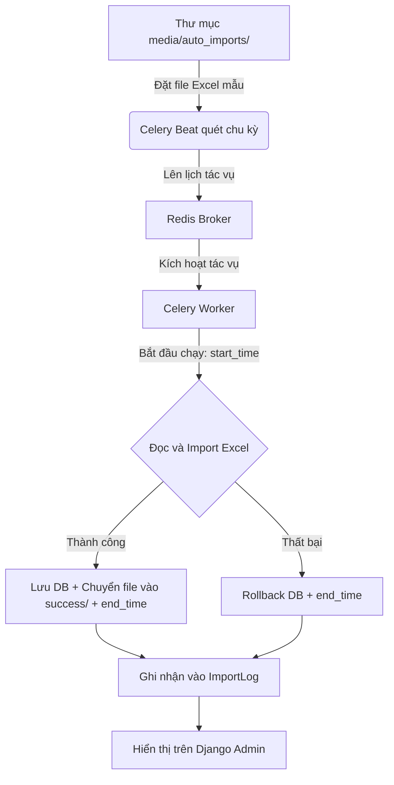

# Hướng Dẫn Vận Hành Hệ Thống Tác Vụ Tự Động (Celery & Redis Import Excel)

Tài liệu này hướng dẫn cách cấu hình, khởi chạy, và theo dõi hệ thống tự động import dữ liệu từ file Excel vào Database định kỳ sử dụng **Celery Beat**, **Celery Worker**, và **Redis Broker** trên môi trường Windows.

---

## 🏗️ 1. Kiến Trúc & Luồng Xử Lý



1. **Celery Beat (Scheduler)**: Theo dõi lịch cấu hình trong Django settings và gửi tác vụ vào Redis hàng ngày.
2. **Redis Broker**: Làm cầu nối trung chuyển tin nhắn tác vụ giữa Beat và Worker.
3. **Celery Worker (Executor)**: Lấy tác vụ từ Redis, chạy đơn luồng (chế độ `-P solo` trên Windows) để thực hiện import.
4. **Database Transaction**: Dữ liệu import của mỗi file được đặt trong khối `transaction.atomic()`. Nếu file bị lỗi cấu trúc dữ liệu, toàn bộ quá trình import file đó sẽ được rollback về trạng thái cũ để tránh sai lệch dữ liệu.
5. **ImportLog (Logging)**: Bản ghi lưu lại lịch sử thời gian bắt đầu thực thi, thời gian kết thúc, tên file và trạng thái kết quả.

---

## 📂 2. Các File Quan Trọng Trong Hệ Thống

* **[run_celery.bat](file:///d:/Sources/dashboard-report/run_celery.bat)**: File script nhấp đúp để khởi chạy đồng thời **Celery Worker** và **Celery Beat** dưới dạng 2 terminal riêng độc lập mà không bị lỗi treo hay thoát.
* **[accounting/models.py](file:///d:/Sources/dashboard-report/accounting/models.py#L378)**: Chứa Model `ImportLog` lưu trữ lịch sử hoạt động.
* **[accounting/admin.py](file:///d:/Sources/dashboard-report/accounting/admin.py#L237)**: Cấu hình hiển thị bảng `ImportLog` trên Django Admin với hai cột thời gian chạy chi tiết.
* **[accounting/tasks.py](file:///d:/Sources/dashboard-report/accounting/tasks.py#L17)**: Tác vụ `auto_import_excel_from_folder` chứa logic tìm kiếm file mới nhất theo tiền tố, xóa dữ liệu cũ và nạp dữ liệu mới.
* **[report2026/settings.py](file:///d:/Sources/dashboard-report/report2026/settings.py#L164)**: Chứa cấu hình kết nối Redis Broker, Timezone và lịch quét `CELERY_BEAT_SCHEDULE`.

---

## 🚀 3. Hướng Dẫn Vận Hành & Khởi Chạy

Để hệ thống tự động chạy ngầm hoạt động ổn định trên máy, hãy làm theo 3 bước sau:

### Bước 1: Khởi động Redis Server
Bật Redis Server (mặc định chạy tại port `6379`).
> [!IMPORTANT]
> **Khuyến nghị tương thích**: Redis chạy trên Windows thường là phiên bản cũ (v5.0.x). Do đó, thư viện kết nối Python trong môi trường ảo `.venv` bắt buộc phải sử dụng phiên bản `redis==4.6.0`. (Phiên bản `redis >= 5.x` sử dụng giao thức RESP3 sẽ gây lỗi `unknown command 'HELLO'`).

### Bước 2: Khởi động Django Web Server (Tự động kích hoạt Celery)
Chạy máy chủ web Django thông thường:
```powershell
py manage.py runserver
```

> [!TIP]
> **Tự động hóa hoàn toàn**: Đã tích hợp mã nguồn quản lý trực tiếp vào [manage.py](file:///d:/Sources/dashboard-report/manage.py). Khi anh chạy lệnh `runserver` ở trên:
> 1. Django sẽ **tự động khởi chạy Celery Worker và Beat** trong hai cửa sổ terminal mới hoàn toàn tự động.
> 2. Cơ chế thông minh đảm bảo Celery chỉ mở đúng 1 bản duy nhất mỗi lần khởi chạy server (không bị lặp lại do `auto-reloader`).
> 3. **Tự động dọn dẹp khi dừng server**: Khi anh nhấn `Ctrl + C` để dừng `runserver`, Django sẽ tự động gửi lệnh kết thúc và **đóng hoàn toàn 2 cửa sổ terminal Celery** đang chạy, giúp tránh rác tiến trình chạy ngầm.

---

## ⏱️ 3. Cách Thay Đổi Lịch Trình Tự Động Chạy

Khi anh muốn đổi giờ chạy tác vụ tự động, hãy mở file **[report2026/settings.py](file:///d:/Sources/dashboard-report/report2026/settings.py#L164)** và điều chỉnh biến `CELERY_BEAT_SCHEDULE`:

```python
CELERY_BEAT_SCHEDULE = {
    'auto_import_excel_daily': {
        'task': 'accounting.tasks.auto_import_excel_from_folder',
        'schedule': crontab(hour=6, minute=0), # Chạy lúc 6 giờ 00 phút sáng hàng ngày theo múi giờ Việt Nam
    },
}
```

> [!WARNING]
> Sau khi thay đổi thời gian (hour, minute) trong `settings.py`, anh **bắt buộc phải tắt cửa sổ Celery Beat cũ và mở lại (hoặc chạy lại `run_celery.bat`)** thì thời gian chạy mới có hiệu lực.

---

## 📊 4. Theo Dõi và Kiểm Tra Lịch Sử Import

1. Anh truy cập vào trang quản trị Django Admin theo đường dẫn: `http://localhost:8089/admin/accounting/importlog/` (hoặc thông qua IP của máy chủ).
2. Tại đây, bảng **Lịch sử Import dữ liệu** sẽ hiển thị rõ ràng:
   - **Thời gian bắt đầu**: Ghi nhận chính xác giây lúc Worker tiếp nhận file Excel.
   - **Thời gian hoàn thành**: Ghi nhận giây lúc dữ liệu nạp xong vào DB và file Excel được di dời.
   - **Tên file / Tiến trình**: Tên của file được import (Ví dụ: `BAN_HANG.xlsx`, `TON_KHO.xlsx`,...).
   - **Trạng thái**: `Thành công` (Success - màu xanh lá) hoặc `Lỗi` (Error - màu đỏ).
   - **Nội dung tóm tắt**: Thống kê số dòng đã xóa cũ & nạp mới, hoặc thông tin chi tiết về lỗi dòng/cột nếu file Excel sai cấu trúc dữ liệu.
