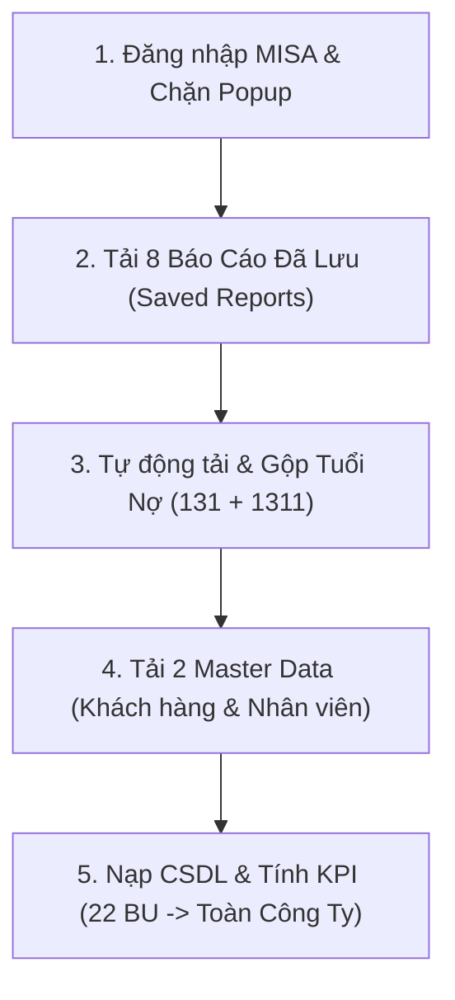

# Hướng dẫn Chạy Terminal & Test Scripts — Report2026

Tài liệu này là **Nguồn tham chiếu trung tâm (Single Source of Truth)** cho toàn bộ các lệnh terminal, Django Management Commands và script tiện ích của dự án **Report2026**.

> [!IMPORTANT]
> **Quy ước thư mục làm việc**: Tất cả các lệnh bên dưới đều phải chạy tại thư mục gốc của dự án (`d:\Sources\dashboard-report\`), nơi có tệp `manage.py` và môi trường ảo `.venv`.

---

## 🌟 MỤC LỤC NHANH

| Tình huống | Lệnh cần dùng | Vị trí tài liệu |
|---|---|---|
| **🔥 CHẠY TOÀN BỘ END-TO-END (Tải + Gộp + Nạp + Tính KPI)** | `python manage.py sync_misa --action=all` | [Mục 1](#1-quy-trình-chạy-tổng-thể-tự-động-end-to-end---option-2-khuyến-nghị-số-1) |
| Cài đặt môi trường lần đầu | `.venv\Scripts\activate; pip install -r requirements.txt` | [Mục 2](#2-cài-đặt--thiết-lập-môi-trường-chạy-1-lần) |
| Khởi chạy Server phát triển hàng ngày | `python manage.py runserver` | [Mục 3.2](#32-khởi-chạy-server-phát-triển) |
| Tải riêng 1 báo cáo đã lưu (Saved Report) | `python manage.py sync_misa --action=download --prefix=TAI_KHOAN_CT` | [Mục 4.1](#41-tải-riêng-từng-báo-cáo-misa-theo-prefix) |
| Tải & Tự động Gộp Tuổi Nợ 131 + 1311 | `python manage.py sync_misa --action=download --prefix=TUOI_NO_KH` | [Mục 4.2](#42-tải--tự-động-gộp-tuổi-nợ-khách-hàng-tuoi_no_kh) |
| Tải Master Data Khách hàng / Nhân viên | `python manage.py sync_misa --action=download --prefix=DANH_SACH_KHACH_HANG` | [Mục 4.3](#43-tải-master-data-khách-hàng--nhân-viên) |
| Nạp toàn bộ file trong `media/auto_imports/` vào DB | `python manage.py sync_misa --action=import` | [Mục 4.4](#44-nạp-toàn-bộ-file-excel-có-sẵn-vào-csdl--tính-kpi) |
| Nạp 1 file Excel rời cụ thể vào DB | `python import_specific_file.py <path>` | [Mục 4.5](#45-nạp-1-file-excel-rời-vào-csdl-import_specific_filepy) |
| Tính lại KPI cho 1 BU cụ thể | `python manage.py calculate_bu_performance` | [Mục 4.6](#46-tính-lại-kpi-cho-bu-cụ-thể) |
| Tính lại KPI Tổng công ty theo Tháng chỉ định | `python manage.py calculate_global_performance` | [Mục 4.7](#47-tính-lại-kpi-tổng-công-ty-theo-tháng-chỉ-định) |
| Xem Snapshot CSDL thời điểm hiện tại | `python scripts/show_snapshot.py` | [Mục 6.4](#64-xem-báo-cáo-data-snapshot-csdl-ngay-lập-tức-show_snapshotpy) |
| Nạp Danh mục Khách hàng & Mapping Sales | `python scripts/import_customer_mapping.py` | [Mục 6.9](#69-nạp-danh-mục-khách-hàng--mapping-sales-phụ-trách-import_customer_mappingpy) |
| Báo cáo Phân cấp Công nợ 3 tầng (BU -> Sales -> KH) | `python scripts/report_3tier_bu_drilldown.py` | [Mục 6.11](#611-báo-cáo-công-nợ-phân-cấp-3-tầng-drilldown-report_3tier_bu_drilldownpy) |
| Gửi Thử Nghiệm / Live Email Nhắc Nợ | `python scripts/send_live_debt_reminders.py` | [Mục 6.15](#615-công-cụ-kích-hoạt-gửi-email-nhắc-nợ-cli--live-send_live_debt_reminderspy) |
| Chạy Unit Test Suite kiểm thử hệ thống | `python manage.py test accounting` | [Mục 5.2](#52-chạy-toàn-bộ-test-suite-backend) |

---

## 1. QUY TRÌNH CHẠY TỔNG THỂ TỰ ĐỘNG (END-TO-END) — OPTION 2 [KHUYẾN NGHỊ SỐ 1]

Đây là quy trình **chuẩn xác, ổn định và tự động hóa cao nhất** của hệ thống, giúp hoàn tất chu trình dữ liệu từ MISA Web về CSDL và hiển thị trên Dashboard chỉ bằng 1 câu lệnh duy nhất.

### 1.1. Cú pháp chạy nhanh

```powershell
# Kích hoạt môi trường ảo (nếu chưa kích hoạt)
.venv\Scripts\activate

# ── LỆNH CHẠY TRỌN GÓI END-TO-END DUY NHẤT ────────────────────────────────
python manage.py sync_misa --action=all
```

> [!TIP]
> Lệnh `python manage.py sync_misa` (không truyền tham số) cũng mặc định thực thi toàn bộ luồng `--action=all`.

---

### 1.2. Các bước hệ thống tự động thực hiện dưới nền

Khi chạy lệnh trên, hệ thống ngầm thực hiện tuần tự 5 giai đoạn:



1. **Giai đoạn 1 — Khởi tạo trình duyệt & Xác thực:**
   - Khởi chạy Playwright Chromium (tương thích cả Headless và Headed).
   - Nạp phiên đăng nhập từ `media/misa_session.json` (tự động đăng nhập lại và gia hạn nếu session hết hạn).
   - Kích hoạt **Global Smart Anti-Popup Engine** tự động đóng các popup quảng cáo, mẹo sử dụng và cảnh báo đăng nhập đồng thời (*"Tiếp tục đăng nhập"*).
2. **Giai đoạn 2 — Tải 8 Báo Cáo Đã Lưu (Saved Reports):**
   - Truy cập `MISA_URL_REPORT_SAVED` (`https://actapp.misa.vn/app/RP/ReportSavedList`).
   - Tự động mở và xuất các báo cáo đã cấu hình:
     + `01 - Sổ chi tiết bán hàng` ➔ `BAN_HANG_*.xlsx`
     + `02 - Sổ chi tiết mua hàng` ➔ `MUA_HANG_*.xlsx`
     + `03 - Tổng hợp tồn kho` ➔ `TON_KHO_*.xlsx`
     + `04 - Tổng hợp công nợ phải trả nhà cung cấp` ➔ `CONG_NO_NCC_*.xlsx`
     + `05 - Sổ chi tiết các tài khoản` ➔ `TAI_KHOAN_CT_*.xlsx`
     + `07 - Bảng kê số dư ngân hàng` ➔ `SO_DU_NH_*.xlsx`
   - Tự động đóng tab con/popup ngay sau khi tải xong từng báo cáo để giải phóng RAM.
3. **Giai đoạn 3 — Tự động tải và Gộp Tuổi Nợ 131 & 1311:**
   - Tải `06 - Chi tiết công nợ phải thu theo tuổi nợ 131` ➔ `TUOI_NO_KH_131_*.xlsx`.
   - Tải `06 - Chi tiết công nợ phải thu theo tuổi nợ 1311` ➔ `TUOI_NO_KH_1311_*.xlsx`.
   - Kích hoạt `merge_tuoi_no_kh_excel_files` gộp dữ liệu 2 tài khoản thành 1 file duy nhất `media/auto_imports/TUOI_NO_KH_*.xlsx` (khớp hoàn toàn công thức đối soát công nợ).
4. **Giai đoạn 4 — Tải Master Data Danh mục:**
   - Truy cập `MISA_URL_CUSTOMER` (`https://actapp.misa.vn/app/DI/DICustomer`) ➔ Kích hoạt xuất `.mi-s1-file-export` ➔ Tải `DANH_SACH_KHACH_HANG_*.xlsx`.
   - Truy cập `MISA_URL_EMPLOYEE` (`https://actapp.misa.vn/app/DI/DIEmployee`) ➔ Kích hoạt xuất `.mi-s1-file-export` ➔ Tải `DANH_SACH_NHAN_VIEN_*.xlsx`.
5. **Giai đoạn 5 — Nạp CSDL & Tính toán KPI đồng bộ:**
   - Đọc và làm sạch toàn bộ file Excel trong `media/auto_imports/`.
   - Xóa dữ liệu cũ theo đúng kỳ báo cáo và Bulk Insert dữ liệu mới vào PostgreSQL.
   - Tính toán tuần tự: **Tính toàn bộ 22 BU con trước** $\rightarrow$ **Tính Tổng Toàn Công Ty (`None`) sau cùng** để số liệu MTD/YTD luôn khớp 100%.

---

## 2. Cài đặt & Thiết lập Môi trường (Chạy 1 lần)

> [!NOTE]
> Thực hiện toàn bộ mục này **1 lần duy nhất** khi cài đặt mới hoặc khôi phục môi trường.

### 2.1. Tạo file cấu hình môi trường `.env`

Tạo file `.env` tại thư mục gốc dự án theo mẫu chuẩn sau:

```env
# ── 1. KẾT NỐI CƠ SỞ DỮ LIỆU PostgreSQL ──────────────────────────────────
DB_NAME=reportdb
DB_USER=postgres
DB_PASSWORD=your_password
DB_HOST=localhost
DB_PORT=5433                       # Lưu ý cổng PostgreSQL (5433 hoặc 5432 tùy máy)

# ── 2. CELERY BEAT — LỊCH TỰ ĐỘNG NẠP EXCEL ──────────────────────────────
IMPORT_SCHEDULE_TYPE=daily
IMPORT_SCHEDULE_HOUR=7
IMPORT_SCHEDULE_MINUTE=0
IMPORT_SCHEDULE_CRON=20 7,9,11,14,16 * * 1-6

# ── 3. MISA AMIS — ĐĂNG NHẬP & TỰ ĐỘNG TẢI BÁO CÁO (Playwright) ─────────
MISA_AMIS_LOGIN_URL=https://act.amis.vn/
MISA_EMAIL=your_misa_email@example.com
MISA_PASSWORD=your_misa_password
MISA_HEADLESS=True                 # True = chạy ẩn; False = mở trình duyệt để quan sát

# Kỳ báo cáo mặc định
MISA_REPORT_PERIOD_OPTION=Tháng này

# ── CƠ CHẾ XUẤT BÁO CÁO (CHỌN OPTION 2 KHUYẾN NGHỊ) ──────────────────────
# 2 = Tải từ danh sách Saved Reports & Master Data trực tiếp (CHUẨN XÁC & MỚI NHẤT)
# 1 = [DEPRECATED] Cơ chế cũ click modal tham số từng bước (Dễ bị lệch khi MISA đổi UI)
USE_OPTION_EXPORT_REPORT_MISA=2

MISA_URL_REPORT_SAVED=https://actapp.misa.vn/app/RP/ReportSavedList
MISA_URL_CUSTOMER=https://actapp.misa.vn/app/DI/DICustomer
MISA_URL_EMPLOYEE=https://actapp.misa.vn/app/DI/DIEmployee
```

### 2.2. Cài đặt thư viện & Playwright Browser

```powershell
# Kích hoạt virtualenv
.venv\Scripts\activate

# Cài đặt thư viện Python
pip install -r requirements.txt

# Cài đặt Chromium browser cho Playwright
playwright install chromium
```

### 2.3. Khởi tạo Database & Tài khoản Quản trị

```powershell
# Chạy migration tạo bảng CSDL
python manage.py migrate

# Tạo tài khoản admin mặc định (username: admin / password: 123)
python manage.py createdefaultuser
```

---

## 3. Khởi chạy Hệ thống Hàng Ngày

### 3.1. Kiểm tra cấu hình hệ thống

```powershell
python manage.py check
```

### 3.2. Khởi chạy Server phát triển

```powershell
python manage.py runserver
```

> [!TIP]
> Khi chạy `python manage.py runserver`, hệ thống tự động khởi động kèm Redis Server, Celery Worker và Celery Beat. Nhấn `Ctrl + C` để đóng sạch toàn bộ các tiến trình.

---

## 4. Các Lệnh Điều Khiển Từng Phần (Thao Tác Thủ Công / Kiểm Thử)

### 4.1. Tải riêng từng báo cáo MISA theo `--prefix`

Dùng khi chỉ muốn tải 1 báo cáo cụ thể về thư mục `media/auto_imports/`:

```powershell
# Tải Sổ chi tiết các tài khoản (TAI_KHOAN_CT)
python manage.py sync_misa --action=download --prefix=TAI_KHOAN_CT

# Tải Sổ chi tiết bán hàng (BAN_HANG)
python manage.py sync_misa --action=download --prefix=BAN_HANG

# Tải Sổ chi tiết mua hàng (MUA_HANG)
python manage.py sync_misa --action=download --prefix=MUA_HANG

# Tải Tổng hợp tồn kho (TON_KHO)
python manage.py sync_misa --action=download --prefix=TON_KHO

# Tải Công nợ phải trả Nhà cung cấp (CONG_NO_NCC)
python manage.py sync_misa --action=download --prefix=CONG_NO_NCC

# Tải Bảng kê số dư ngân hàng (SO_DU_NH)
python manage.py sync_misa --action=download --prefix=SO_DU_NH
```

---

### 4.2. Tải & Tự động Gộp Tuổi Nợ Khách hàng (`TUOI_NO_KH`)

Khi chạy lệnh này, hệ thống sẽ tự động tải cả 2 báo cáo tuổi nợ 131 và 1311 trên MISA rồi gộp thành file `TUOI_NO_KH_*.xlsx`:

```powershell
# Chỉ tải và gộp file Tuổi nợ (không import CSDL)
python manage.py sync_misa --action=download --prefix=TUOI_NO_KH

# Tải, gộp và nạp ngay vào CSDL rồi tính nợ
python manage.py sync_misa --action=all --prefix=TUOI_NO_KH
```

---

### 4.3. Tải Master Data Khách hàng / Nhân viên

```powershell
# Tải Danh sách Khách hàng (Master Data)
python manage.py sync_misa --action=download --prefix=DANH_SACH_KHACH_HANG

# Tải Danh sách Nhân viên (Master Data)
python manage.py sync_misa --action=download --prefix=DANH_SACH_NHAN_VIEN
```

---

### 4.4. Nạp toàn bộ file Excel có sẵn vào CSDL & Tính KPI

Dùng sau khi đã tải các file Excel về `media/auto_imports/` và muốn import lại hàng loạt:

```powershell
# Nạp toàn bộ file trong media/auto_imports/ vào DB và tính lại KPI
python manage.py sync_misa --action=import
```

---

### 4.5. Nạp 1 file Excel rời vào CSDL (`import_specific_file.py`)

Dùng khi có một file Excel cụ thể tải về thủ công hoặc cần import lại:

```powershell
# Xem danh sách các file Excel hiện có trong media/auto_imports/
python import_specific_file.py

# Nạp file Bán hàng cụ thể
python import_specific_file.py media/auto_imports/BAN_HANG_20260824_090000.xlsx

# Nạp file Sổ chi tiết các tài khoản
python import_specific_file.py media/auto_imports/TAI_KHOAN_CT_20260824_090000.xlsx

# Nạp file Tuổi nợ đã gộp
python import_specific_file.py media/auto_imports/TUOI_NO_KH_20260824_090000.xlsx

# Nạp file theo tên tiếng Việt xuất từ MISA
python manage.py sync_misa --action=import --file="media/auto_imports/So_chi_tiet_ban_hang.xlsx"
```

---

### 4.6. Tính lại KPI cho BU cụ thể

```powershell
# Tính lại KPI cho BU Thang máy (BU_ELEVATOR - ID=44) Tháng 8/2026
python manage.py calculate_bu_performance --bu_id=44 --month=8 --year=2026

# Tính lại KPI cho BU HPC (ID=70) Tháng 8/2026
python manage.py calculate_bu_performance --bu_id=70 --month=8 --year=2026
```

---

### 4.7. Tính lại KPI Tổng công ty theo Tháng chỉ định

```powershell
# Cách 1: Tính lại KPI Tổng công ty cho Tháng 8/2026 (Management Command)
python manage.py calculate_global_performance --month 8 --year 2026

# Cách 2: Tính lũy kế tuần tự từ Tháng 1 -> Tháng 8/2026 (Đồng bộ YTD chuẩn 100%)
python scripts/update_company_total.py 8 2026
```

---

## 5. Kiểm Thử & Đảm Bảo Chất Lượng (Quality Assurance)

### 5.1. Kiểm tra cấu hình Django

```powershell
python manage.py check
```

### 5.2. Chạy toàn bộ Test Suite Backend

```powershell
# Chạy toàn bộ 44 unit tests của module accounting (đảm bảo 100% PASS)
python manage.py test accounting
```

---

## 6. Scripts Bảo Trì & Công Cụ Tiện Ích

### 6.1. Debug tải MISA có giao diện (`test_download_ban_hang.py`)

```powershell
# Mở trình duyệt Chromium thật để quan sát quá trình bot tương tác
python scripts/test_download_ban_hang.py
```

### 6.2. Nạp Danh mục Nhóm Khách hàng (`import_customer_group.py`)

```powershell
python scripts/import_customer_group.py
```

### 6.3. Nạp Mục tiêu Kế hoạch Năm & Tháng (`seed_target_plans.py`)

```powershell
python scripts/seed_target_plans.py
```

### 6.4. Xem Báo Cáo Data Snapshot CSDL Ngay Lập Tức (`show_snapshot.py`)

```powershell
# In bảng số liệu Snapshot CSDL Tháng 8/2026 cho Tổng công ty và từng BU
python scripts/show_snapshot.py --month 8 --year 2026

# Xem Snapshot riêng cho BU Thang máy
python scripts/show_snapshot.py --bu BU_ELEVATOR
```

### 6.5. Phát hiện Chức danh Quản lý & Trưởng bộ phận (`detect_manager_titles.py`)

```powershell
python scripts/detect_manager_titles.py
```

### 6.6. Tự động Gán Sếp cho Nhân viên theo Phòng ban (`auto_assign_managers.py`)

```powershell
python scripts/auto_assign_managers.py
```

### 6.7. Xem Cây Phòng ban & Nhân viên Trực thuộc (`show_department_tree.py`)

```powershell
python scripts/show_department_tree.py
```

### 6.8. Tự động Gán Sales phụ trách Khách hàng từ Sổ Bán hàng (`auto_assign_customer_sales.py`)

```powershell
python scripts/auto_assign_customer_sales.py
```

### 6.9. Nạp Danh mục Khách hàng & Mapping Sales Phụ Trách (`import_customer_mapping.py`)

```powershell
# Nạp danh mục khách hàng và tự động chốt công nợ kỳ 2026-08
python scripts/import_customer_mapping.py --period 2026-08
```

### 6.10. Báo Cáo Công Nợ Toàn Diện Theo BU & Nhân Viên (`report_bu_employee_debt.py`)

```powershell
python scripts/report_bu_employee_debt.py --period 2026-08
```

### 6.11. Báo Cáo Công Nợ Phân Cấp 3 Tầng Drilldown (`report_3tier_bu_drilldown.py`)

```powershell
# Xem phân cấp 3 tầng: [BU] -> [Sales] -> [Khách hàng] cho BU Thang máy
python scripts/report_3tier_bu_drilldown.py --bu BU_ELEVATOR --period 2026-08

# Xem phân cấp cho toàn bộ 22 BU
python scripts/report_3tier_bu_drilldown.py --all --period 2026-08
```

### 6.12. Kiểm Thử Bộ REST API Endpoints Công Nợ (`test_debt_apis.py`)

```powershell
python scripts/test_debt_apis.py
```

### 6.13. Kiểm Thử Tự Động Hóa Gửi Email Nhắc Nợ (`test_debt_email_automation.py`)

```powershell
python scripts/test_debt_email_automation.py
```

### 6.14. Gửi Thử Nghiệm Email Nhắc Nợ Chỉ Định Qua SMTP (`send_test_debt_emails.py`)

```powershell
python scripts/send_test_debt_emails.py
```

### 6.15. Công Cụ Kích Hoạt Gửi Email Nhắc Nợ CLI / Live (`send_live_debt_reminders.py`)

```powershell
# 1. Chạy thử nghiệm thống kê (Mặc định dry-run, không gửi email thật):
python scripts/send_live_debt_reminders.py --period 2026-08

# 2. Gửi 1 email mẫu về hộp thư test cá nhân:
python scripts/send_live_debt_reminders.py --period 2026-08 --test-email your_email@haophuong.com

# 3. KÍCH HOẠT GỬI THỰC TẾ (LIVE) CHO TOÀN BỘ SALES VÀ TRƯỞNG BU:
python scripts/send_live_debt_reminders.py --period 2026-08 --live

# 4. Chỉ gửi thực tế cho riêng Trưởng BU:
python scripts/send_live_debt_reminders.py --period 2026-08 --live --recipient-type MANAGERS

# 5. Chỉ gửi thực tế cho 1 BU cụ thể (Ví dụ BU Thang Máy):
python scripts/send_live_debt_reminders.py --period 2026-08 --live --bu BU_ELEVATOR
```
