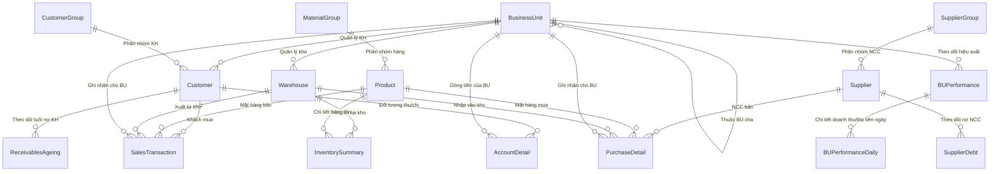

# Tài liệu Cấu trúc & Mapping Cơ sở dữ liệu

Tài liệu này mô tả chi tiết kiến trúc cơ sở dữ liệu của hệ thống, mối quan hệ giữa các bảng (Entity Relationship), nguồn dữ liệu import từ Excel và cơ chế tự động tính toán hiệu suất (KPI) thông qua Celery.

---

## 1. Sơ đồ Mối quan hệ thực thể (ERD)

Sơ đồ dưới đây thể hiện sự liên kết giữa các bảng danh mục gốc, dữ liệu giao dịch phát sinh từ Excel và dữ liệu KPI tổng hợp.

---

## 2. Danh mục Gốc (Master Data)

Đây là những bảng chứa dữ liệu danh mục nền tảng, ít biến động. Các bảng giao dịch phát sinh luôn tham chiếu đến những bảng này để đảm bảo tính nhất quán dữ liệu.

Các model được định nghĩa chi tiết tại file [models.py](file:///d:/Sources/dashboard-report/accounting/models.py).

### 2.1. Đơn vị kinh doanh (`BusinessUnit`)
* **Mục đích:** Quản lý cơ cấu tổ chức và các phòng ban kinh doanh (BU).
* **Đặc điểm:** Có mối quan hệ tự tham chiếu (Self-reference) thông qua trường `parent` để xây dựng cấu trúc cây (BU cha - BU con), phục vụ việc cộng dồn KPI từ dưới lên.

### 2.2. Kho hàng (`Warehouse`)
* **Mục đích:** Quản lý thông tin kho bãi và giá trị tồn kho.
* **Liên kết:** Mỗi kho thuộc quyền sở hữu của một đơn vị kinh doanh (`BusinessUnit`).

### 2.3. Khách hàng (`Customer`) & Nhóm khách hàng (`CustomerGroup`)
* **Mục đích:** Lưu trữ thông tin đối tác mua hàng.
* **Liên kết:** Mỗi khách hàng thuộc một `CustomerGroup` và được quản lý/chăm sóc bởi một `BusinessUnit` cụ thể. Trường `has_revenue` dùng để cấu hình xem khách hàng đó có được tính vào doanh thu tổng hợp hay không.

### 2.4. Nhà cung cấp (`Supplier`) & Nhóm nhà cung cấp (`SupplierGroup`)
* **Mục đích:** Lưu trữ thông tin đối tác cung cấp hàng hóa đầu vào.

### 2.5. Hàng hóa (`Product`) & Nhóm vật tư hàng hóa (`MaterialGroup`)
* **Mục đích:** Danh mục sản phẩm, vật tư trong hệ thống.

---

## 3. Dữ liệu Phát sinh từ Excel (Transaction Data)

Dữ liệu của các bảng này được làm sạch và import tự động mỗi ngày từ các file Excel trong thư mục `media/auto_imports` thông qua Celery task `auto_import_excel_from_folder`.

| Tiền tố file Excel | Model đích | Mô tả dữ liệu & Nghiệp vụ |
| :--- | :--- | :--- |
| **`BAN_HANG`** | [SalesTransaction](file:///d:/Sources/dashboard-report/accounting/models.py#L100) | Lưu chi tiết từng dòng hóa đơn bán hàng, doanh số bán, chiết khấu và doanh số thực tế (`actual_sales`). |
| **`MUA_HANG`** | [PurchaseDetail](file:///d:/Sources/dashboard-report/accounting/models.py#L273) | Chi tiết các giao dịch mua hàng từ nhà cung cấp, giá trị mua và thuế VAT đầu vào. |
| **`TON_KHO`** | [InventorySummary](file:///d:/Sources/dashboard-report/accounting/models.py#L242) | Báo cáo nhập - xuất - tồn (số lượng & giá trị đầu kỳ, trong kỳ, cuối kỳ) cho từng cặp Sản phẩm - Kho hàng. |
| **`CONG_NO_NCC`**| [SupplierDebt](file:///d:/Sources/dashboard-report/accounting/models.py#L150) | Theo dõi dư nợ và phát sinh công nợ đối với từng Nhà cung cấp. |
| **`TUOI_NO_KH`** | [ReceivablesAgeing](file:///d:/Sources/dashboard-report/accounting/models.py#L209) | Phân tích chi tiết tuổi nợ của Khách hàng (trước hạn / quá hạn theo các mốc 7, 14, 30, 60, 90, 120 ngày). |
| **`SO_CHI_TIET`** | [AccountDetail](file:///d:/Sources/dashboard-report/accounting/models.py#L172) | Sổ chi tiết các tài khoản tiền mặt và ngân hàng (111, 112) đối ứng với tài khoản phải thu (131) nhằm xác định số tiền thực tế thu được từ khách hàng. |

---

## 4. Dữ liệu Tổng hợp KPI (Performance & Analytics)

Các bảng này đóng vai trò lưu trữ kết quả tính toán KPI, được sử dụng trực tiếp để vẽ biểu đồ và hiển thị trên giao diện Dashboard. Việc tính toán và cập nhật được thực hiện tự động bởi hàm `update_single_bu_performance` trong file [tasks.py](file:///d:/Sources/dashboard-report/accounting/tasks.py#L83).

### 4.1. Hiệu suất BU theo tháng (`BUPerformance`)
Lưu trữ các chỉ số mục tiêu kế hoạch (Plan) đối chiếu với số liệu thực tế (Actual) tích lũy trong tháng của từng BU (hoặc toàn công ty nếu `business_unit` là `None`).

Các chỉ số KPI chính gồm:
* **Doanh thu tích lũy (MTD Revenue):** Lấy từ tổng `actual_sales` trong bảng `SalesTransaction` có ngày hạch toán thuộc tháng/năm tương ứng và khách hàng có `has_revenue=True`.
* **Thực thu tiền mặt (MTD Collection):** Tính toán từ chênh lệch phát sinh Nợ - Có của tài khoản tiền mặt/ngân hàng đối ứng phải thu khách hàng trong bảng `AccountDetail`.
* **Quản trị công nợ:** Thu trong hạn + COD, nợ quá hạn, dư nợ cần thu (lấy từ bảng `ReceivablesAgeing`).
* **Giá trị tồn kho:** Giá trị tồn kho thực tế đầu kỳ, nhập kỳ, xuất kỳ và cuối kỳ (lấy từ bảng `InventorySummary`).

### 4.2. Hiệu suất BU theo ngày (`BUPerformanceDaily`)
* **Mục đích:** Lưu trữ doanh thu và thực thu phát sinh trong từng ngày đơn lẻ của tháng.
* **Liên kết:** Mỗi bản ghi tham chiếu đến một dòng tổng hợp tháng của `BUPerformance`.
* **Nghiệp vụ:** Hỗ trợ vẽ biểu đồ đường xu hướng doanh thu/thu tiền hàng ngày của đơn vị kinh doanh.
