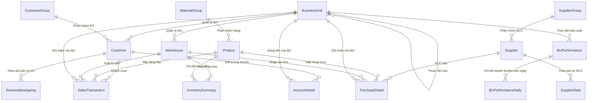

# Tài liệu Cấu trúc & Mapping Cơ sở dữ liệu

Tài liệu này mô tả chi tiết kiến trúc cơ sở dữ liệu của hệ thống, mối quan hệ giữa các bảng (Entity Relationship), nguồn dữ liệu import từ Excel và cơ chế tự động tính toán hiệu suất (KPI) thông qua Celery.

---

## 1. Sơ đồ Mối quan hệ thực thể (ERD)

Sơ đồ dưới đây thể hiện sự liên kết giữa các bảng danh mục gốc, dữ liệu giao dịch phát sinh từ Excel và dữ liệu KPI tổng hợp.

---

## 2. Danh mục Gốc (Master Data)

Đây là những bảng chứa dữ liệu danh mục nền tảng, ít biến động. Các bảng giao dịch phát sinh luôn tham chiếu đến những bảng này để đảm bảo tính nhất quán dữ liệu.

Các model được định nghĩa chi tiết tại gói [accounting/models/](file:///d:/Sources/dashboard-report/accounting/models/) (`organization.py`, `master_data.py`, `transactions.py`, `debt.py`, `performance.py`) và re-export tại [models.py](file:///d:/Sources/dashboard-report/accounting/models.py).

### 2.1. Đơn vị kinh doanh (`BusinessUnit`)
* **Mục đích:** Quản lý cơ cấu tổ chức và các phòng ban kinh doanh (BU).
* **Đặc điểm:** Có mối quan hệ tự tham chiếu (Self-reference) thông qua trường `parent` để xây dựng cấu trúc cây (BU cha - BU con), phục vụ việc cộng dồn KPI từ dưới lên.

### 2.2. Kho hàng (`Warehouse`)
* **Mục đích:** Quản lý thông tin kho bãi và giá trị tồn kho.
* **Liên kết:** Mỗi kho thuộc quyền sở hữu của một đơn vị kinh doanh (`BusinessUnit`).

### 2.3. Khách hàng (`Customer`) & Nhóm khách hàng (`CustomerGroup`)
* **Mục đích:** Lưu trữ thông tin đối tác mua hàng.
* **Liên kết:** Mỗi khách hàng thuộc một `CustomerGroup` và được quản lý/chăm sóc bởi một `BusinessUnit` cụ thể. Trường `has_revenue` dùng để cấu hình xem khách hàng đó có được tính vào doanh thu tổng hợp hay không.

### 2.4. Nhà cung cấp (`Supplier`) & Nhóm nhà cung cấp (`SupplierGroup`)
* **Mục đích:** Lưu trữ thông tin đối tác cung cấp hàng hóa đầu vào.

### 2.5. Hàng hóa (`Product`) & Nhóm vật tư hàng hóa (`MaterialGroup`)
* **Mục đích:** Danh mục sản phẩm, vật tư trong hệ thống.

### 2.6. Nhân sự (`Employee`), Phòng ban (`Department`), Chức danh (`JobTitle`) & Quá trình công tác (`EmployeeAssignment`)
* **Mục đích:** Quản lý cơ cấu nhân sự, cây tổ chức phân cấp quản lý và lưu vết lịch sử luân chuyển công tác (SCD Type 2).
* **Liên kết:**
  * `Customer.assigned_employee`: Gán Sales/Quản lý phụ trách khách hàng.
  * `EmployeeAssignment.manager`: Lưu thông tin cấp trên trực tiếp tại từng thời kỳ.

---

## 3. Dữ liệu Phát sinh từ Excel (Transaction Data)

Dữ liệu của các bảng này được làm sạch và import tự động mỗi ngày từ các file Excel trong thư mục `media/auto_imports` thông qua Celery task `auto_import_excel_from_folder`.

| Tiền tố file Excel | Model đích | Mô tả dữ liệu & Nghiệp vụ |
| :--- | :--- | :--- |
| **`BAN_HANG`** | [SalesTransaction](file:///d:/Sources/dashboard-report/accounting/models/transactions.py) | Lưu chi tiết từng dòng hóa đơn bán hàng, doanh số bán, chiết khấu và doanh số thực tế (`actual_sales`). |
| **`MUA_HANG`** | [PurchaseDetail](file:///d:/Sources/dashboard-report/accounting/models/debt.py) | Chi tiết các giao dịch mua hàng từ nhà cung cấp, giá trị mua và thuế VAT đầu vào. |
| **`TON_KHO`** | [InventorySummary](file:///d:/Sources/dashboard-report/accounting/models/performance.py) | Báo cáo nhập - xuất - tồn (số lượng & giá trị đầu kỳ, trong kỳ, cuối kỳ) cho từng cặp Sản phẩm - Kho hàng. |
| **`CONG_NO_NCC`**| [SupplierDebt](file:///d:/Sources/dashboard-report/accounting/models/debt.py) | Theo dõi dư nợ và phát sinh công nợ đối với từng Nhà cung cấp. |
| **`TUOI_NO_KH`** | [ReceivablesAgeing](file:///d:/Sources/dashboard-report/accounting/models/debt.py) | Phân tích chi tiết tuổi nợ của Khách hàng (trước hạn / quá hạn theo các mốc 7, 14, 30, 60, 90, 120 ngày). |
| **`TAI_KHOAN_CT`** | [AccountDetail](file:///d:/Sources/dashboard-report/accounting/models/transactions.py) | Sổ chi tiết các tài khoản tiền mặt và ngân hàng (111, 112, 341) đối ứng với tài khoản phải thu (131) nhằm xác định số tiền thực tế thu được từ khách hàng. |
| **`SO_DU_NH`** | [BankBalance](file:///d:/Sources/dashboard-report/accounting/models/transactions.py) | Bảng kê số dư tiền gửi ngân hàng từng tài khoản theo kỳ báo cáo. |

---

## 4. Dữ liệu Tổng hợp KPI (Performance & Analytics)

Các bảng này đóng vai trò lưu trữ kết quả tính toán KPI, được sử dụng trực tiếp để vẽ biểu đồ và hiển thị trên giao diện Dashboard. Việc tính toán và cập nhật được thực hiện tự động bởi hàm `update_single_bu_performance` trong file [tasks.py](file:///d:/Sources/dashboard-report/accounting/tasks.py#L83).

### 4.1. Hiệu suất BU theo tháng (`BUPerformance`)
Lưu trữ các chỉ số mục tiêu kế hoạch (Plan) đối chiếu với số liệu thực tế (Actual) tích lũy trong tháng của từng BU (hoặc toàn công ty nếu `business_unit` là `None`).

Các chỉ số KPI chính gồm:
* **Doanh thu tích lũy (MTD Revenue):** Lấy từ tổng `actual_sales` trong bảng `SalesTransaction` có ngày hạch toán thuộc tháng/năm tương ứng và khách hàng có `has_revenue=True`.
* **Thực thu tiền mặt (MTD Collection):** Tính toán từ chênh lệch phát sinh Nợ - Có của tài khoản tiền mặt/ngân hàng đối ứng phải thu khách hàng trong bảng `AccountDetail`.
* **Quản trị công nợ:** Thu trong hạn + COD, nợ quá hạn, dư nợ cần thu (lấy từ bảng `ReceivablesAgeing`).
* **Giá trị tồn kho:** Giá trị tồn kho thực tế đầu kỳ, nhập kỳ, xuất kỳ và cuối kỳ (lấy từ bảng `InventorySummary`).
* **Tiền cuối kỳ thực tế (Cash Balance Actual):** Cộng dồn số dư Nợ (`balance_debit`) ở dòng giao dịch cuối cùng trong tháng của tài khoản `111` (Tiền mặt) và `112` (Tiền gửi ngân hàng) từ bảng `AccountDetail`.
* **Nợ ngân hàng thực tế (Bank Debt Actual):** Số dư Có (`balance_credit`) ở dòng giao dịch cuối cùng trong tháng của tài khoản `341` từ bảng `AccountDetail`.

### 4.2. Hiệu suất BU theo ngày (`BUPerformanceDaily`)
* **Mục đích:** Lưu trữ doanh thu và thực thu phát sinh trong từng ngày đơn lẻ của tháng.
* **Liên kết:** Mỗi bản ghi tham chiếu đến một dòng tổng hợp tháng của `BUPerformance`.
* **Nghiệp vụ:** Hỗ trợ vẽ biểu đồ đường xu hướng doanh thu/thu tiền hàng ngày của đơn vị kinh doanh.

### 4.3. Tổng hợp Công nợ Nhân sự & Quản lý theo kỳ (`EmployeeReceivableSummary`)
* **Mục đích:** Lưu trữ bản chụp (Snapshot) số liệu công nợ chốt theo từng kỳ (`reporting_period`) cho từng Nhân viên / Quản lý.
* **Cơ chế tính toán:** 
  * Nợ cá nhân (`own_total_debt`): Tổng hợp từ các Khách hàng do Sales phụ trách trực tiếp trong `ReceivablesAgeing`.
  * Nợ nhóm / Quản lý (`team_total_debt`): Thuật toán Bottom-Up Rollup cộng dồn đệ quy toàn bộ nợ của các nhân viên cấp dưới trực thuộc quản lý.
* **Phục vụ:** Tối ưu hóa tốc độ truy vấn Dashboard (< 50ms) và phục vụ API Báo cáo Phân cấp Công nợ 3 Tầng Drilldown (`/api/debt/bus/<bu_code>/drilldown/`).

---

## 5. Báo Cáo Rà Soát Ánh Xạ Chi Tiết & Lỗi Thiết Kế (Technical Debt)

### 5.1. Bảng tổng hợp trạng thái ánh xạ các bảng

| File Excel Báo cáo | Model Đích | Trạng thái ánh xạ tổng quát | Phát hiện sai lệch / Lỗi mất dữ liệu |
| :--- | :--- | :--- | :--- |
| **`BAN_HANG*.xlsx`** | `SalesTransaction` | Tốt (Đã sửa lỗi) | Đã sửa lỗi ánh xạ: Cột **`Mã kho`** & **`Chi nhánh`** được ánh xạ đầy đủ. |
| **`TON_KHO*.xlsx`** | `InventorySummary` | Tốt (Sau nâng cấp giá bán) | Hỗ trợ tính toán động trị giá khi thiếu cột trị giá từ Excel. |
| **`MUA_HANG*.xlsx`** | `PurchaseDetail` | Tốt | Hoạt động chính xác theo đúng cấu trúc tệp. |
| **`CONG_NO_NCC*.xlsx`** | `SupplierDebt` | Khớp | Rủi ro tiềm ẩn về khoảng trắng thừa ở mã nhà cung cấp giống tồn kho cũ. |
| **`TUOI_NO_KH*.xlsx`** | `ReceivablesAgeing`| Tốt (Đã sửa lỗi) | Đã sửa lỗi ánh xạ: Toàn bộ 14 cột tuổi nợ chi tiết được nạp chính xác. |
| **`TAI_KHOAN_CT*.xlsx`**| `AccountDetail` | Tốt (Đã sửa lỗi) | Hỗ trợ nạp đầy đủ Tên tài khoản, Dư Nợ/Có, Mã/Tên đơn vị. |
| **`KHACH_HANG*.xlsx`** | `Customer` | Khớp | Tự động tạo danh mục bổ sung khi có phát sinh mới. |

### 5.2. Chi tiết các điểm sai lệch nghiêm trọng và nguyên nhân

#### A. Báo cáo Bán hàng (`BAN_HANG`) ➔ Model `SalesTransaction`
*   **Các trường ánh xạ đúng:** `posting_date` ➔ `Ngày hạch toán`, `doc_id` ➔ `Số chứng từ`, `customer` ➔ `Mã khách hàng`, `product` ➔ `Mã hàng`, `employee` ➔ `Mã nhân viên bán hàng`, `business_unit` ➔ `Mã thống kê`, `quantity` ➔ `Tổng số lượng bán`, `unit_price` ➔ `Đơn giá`, `sales_amount` ➔ `Doanh số bán`, `tax_percent` ➔ `% Thuế`, `tax_amount` ➔ `Thuế GTGT`, `debit_acc` ➔ `TK Nợ`, `credit_acc` ➔ `TK Có`, `discount_acc` ➔ `TK chiết khấu`, `discount_amount` ➔ `Chiết khấu`, `actual_sales` ➔ `Doanh số thực tế`.
*   **Kết quả sửa đổi:** Class `SalesTransactionResource` đã khai báo tường minh hai trường `warehouse` (Kho) và `branch` (Chi nhánh) sử dụng `ForeignKeyWidget` khớp chính xác danh mục liên kết. Dữ liệu import không còn bị `NULL`.

#### B. Báo cáo Tồn kho (`TON_KHO`) ➔ Model `InventorySummary` & `Product`
*   **Các trường ánh xạ đúng:** `warehouse` ➔ `Mã kho`, `product` ➔ `Mã hàng`, `opening_quantity` ➔ `Đầu kỳ_Số lượng`, `in_quantity` ➔ `Nhập kho_Số lượng`, `out_quantity` ➔ `Xuất kho_Số lượng`, `closing_quantity` ➔ `Cuối kỳ_Số lượng`, `selling_price` ➔ `Đơn giá bán 1`.
*   **Cơ chế tự động:** Các trường trị giá (`opening_value`, `in_value`, `out_value`, `closing_value`) tự động tính toán bằng `Số lượng * Đơn giá bán 1` nếu các cột này bị trống hoặc bằng 0 trong file Excel của MISA.

#### C. Báo cáo Công nợ nhà cung cấp (`CONG_NO_NCC`) ➔ Model `SupplierDebt`
*   **Các trường ánh xạ đúng:** `supplier` ➔ `Mã nhà cung cấp`, `opening_debit`/`opening_credit` ➔ `Đầu kỳ_Nợ`/`Đầu kỳ_Có`, `incurred_debit`/`incurred_credit` ➔ `Phát sinh_Nợ`/`Phát sinh_Có`, `closing_debit`/`closing_credit` ➔ `Cuối kỳ_Nợ`/`Cuối kỳ_Có`.
*   **Rủi ro:** Mã nhà cung cấp được `.strip()` để kiểm tra danh mục nhưng chưa được gán ngược lại cho `row['Mã nhà cung cấp']`, có rủi ro lỗi mapping khóa ngoại nếu tệp Excel bị thừa khoảng trắng.

#### D. Báo cáo Tuổi nợ khách hàng (`TUOI_NO_KH`) ➔ Model `ReceivablesAgeing`
*   **Các trường ánh xạ đúng:** `customer` ➔ `Mã khách hàng`, `branch` ➔ `Chi nhánh`, `doc_date` ➔ `Ngày chứng từ`, `total_debt` ➔ `Tổng nợ`, `due_total` ➔ `Nợ trước hạn_Tổng`, `overdue_total` ➔ `Nợ quá hạn_Tổng`.
*   **Kết quả sửa đổi:** Đã bổ sung khai báo đầy đủ 14 cột tuổi nợ chi tiết (bao gồm `no_due_limit`, `due_0_7`, `due_8_14`, `due_15_21`, `due_22_28`, `due_29_60`, `due_above_60`, `overdue_0_14`, `overdue_15_30`, `overdue_31_45`, `overdue_46_60`, `overdue_61_90`, `overdue_91_120`, `overdue_above_120`) trong class `ReceivablesAgeingResource`. Dữ liệu được mapping chính xác 100% vào DB.

#### E. Báo cáo Sổ chi tiết tài khoản (`TAI_KHOAN_CT`) ➔ Model `AccountDetail`
*   **Các trường ánh xạ đúng:** `posting_date` ➔ `Ngày hạch toán`, `doc_id` ➔ `Số chứng từ`, `customer` ➔ `Mã đối tượng`, `business_unit` ➔ `Mã thống kê`, `branch` ➔ `Chi nhánh`, `account_number` ➔ `Tài khoản`, `offset_account` ➔ `TK đối ứng`, `debit_amount` ➔ `Phát sinh Nợ`, `credit_amount` ➔ `Phát sinh Có`, `unreasonable_cost` ➔ `CP không hợp lý`, `account_name` ➔ `Tên tài khoản`, `balance_debit` ➔ `Dư Nợ`, `balance_credit` ➔ `Dư Có`, `unit_code` ➔ `Mã đơn vị`, `unit_name` ➔ `Tên đơn vị`.
*   **Đánh giá:** Đã khắc phục lỗi copy-paste trường và khai báo thiếu sót, dữ liệu nạp đầy đủ 100%.
