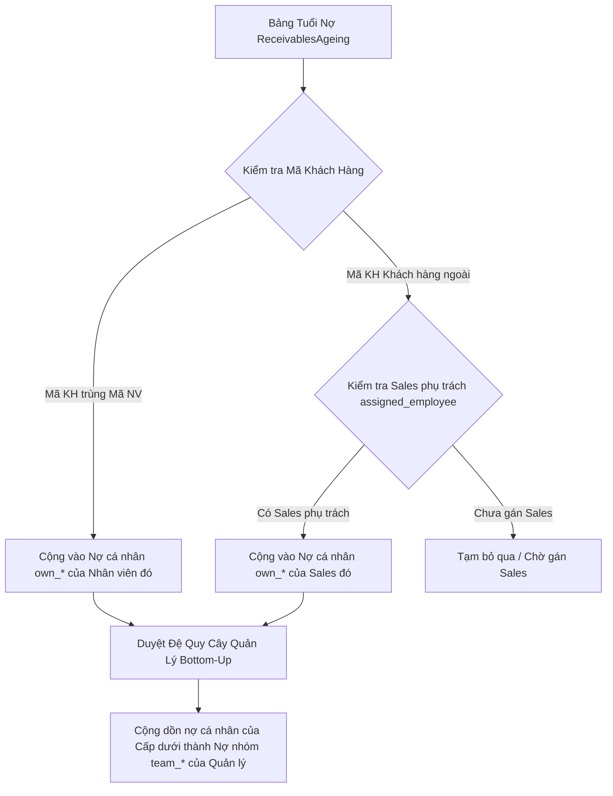

# BÁO CÁO NGHIỆP VỤ & TỔNG HỢP KIẾN TRÚC PHASE 2: TÍNH TOÁN CÔNG NỢ NHÂN VIÊN & QUẢN LÝ NHÓM

Tài liệu này tổng hợp toàn bộ Kiến trúc Kỹ thuật, Thuật toán đã xây dựng và **Danh sách các Điểm Nghiệp vụ cần Trao đổi với Kế toán** phục vụ công tác chốt yêu cầu bài toán Công nợ Nhân viên & Quản lý nhóm.

---

## 1. Tổng Quan Kiến Trúc Đã Triển Khai (Phase 1 & Phase 2)

### A. Phase 1: Mối Liên Kết Dữ Liệu Lịch Sử (SCD Type 2 & Customer Sales)
1. **`EmployeeAssignment.manager`** ([accounting/models/employee.py](file:///d:/Sources/dashboard-report/accounting/models/employee.py#L144)):
   - Liên kết Quản lý trực tiếp (`ForeignKey(Employee)`).
   - Bảo toàn lịch sử công tác: Một nhân viên có thể thay đổi Sếp theo từng giai đoạn (`start_date` $\rightarrow$ `end_date`).
2. **`Customer.assigned_employee`** ([accounting/models/organization.py](file:///d:/Sources/dashboard-report/accounting/models/organization.py#L57)):
   - Chỉ định Nhân viên Sales phụ trách chính của từng Khách hàng.

### B. Phase 2: Bảng Chốt Số Liệu & Động Cơ Tính Toán
1. **Model `EmployeeReceivableSummary`** ([accounting/models/performance.py](file:///d:/Sources/dashboard-report/accounting/models/performance.py#L113)):
   - Lưu vết chốt công nợ theo kỳ `reporting_period` (YYYY-MM).
   - **Chỉ số cá nhân (`own_*`)**: Nợ cá nhân do mình phụ trách trực tiếp.
   - **Chỉ số nhóm / quản lý (`team_*`)**: Nợ cả nhóm cộng dồn đệ quy từ toàn bộ cấp dưới.
2. **Engine Service `employee_debt_calculator.py`** ([accounting/services/employee_debt_calculator.py](file:///d:/Sources/dashboard-report/accounting/services/employee_debt_calculator.py)):
   - `update_employee_receivable_summary(reporting_period)`: Tự động tổng hợp nợ cá nhân và duyệt đệ quy cây quản lý Bottom-Up.

---

## 2. Thuật Toán Xử Lý Dữ Liệu Đã Cấu Hình

1. **Thuật toán Dual Mapping (Mapping Kép)**:
   - **TH1 (Nhân viên nợ trực tiếp)**: Nếu `Customer.code == Employee.employee_code`, khoản nợ tính trực tiếp vào `own_*` của Nhân viên đó.
   - **TH2 (Khách hàng ngoài nợ)**: Nếu `Customer.assigned_employee` được chỉ định, khoản nợ tính vào `own_*` của Sales phụ trách.
2. **Thuật toán Đệ quy Quản lý Nhóm (Bottom-Up Rollup)**:
   - Tra cứu cây quản lý active tại mốc ngày cuối kỳ báo cáo.
   - Hàm `get_all_subordinate_ids_recursive()` thu thập 100% cấp dưới (trực tiếp + gián tiếp).
   - Cộng dồn toàn bộ `own_*` của cấp dưới vào `team_*` của Trưởng nhóm / Trưởng phòng.

---

## 3. Thực Tế Số Liệu CSDL Hiện Tại (Kỳ 2026-07)

- **Số liệu Tuổi nợ MISA (`ReceivablesAgeing`)**: Đang có **1,393 dòng tuổi nợ** với tổng số dư **68,115,133,663 VNĐ (68.1 Tỷ VNĐ)**.
- **Đối tượng nợ hiện tại**: 100% là các Khách hàng doanh nghiệp / đối tác ngoài (như *CÔNG TY HISA*, *THAI VATANA UPAKORN*, *CÔNG TY HỢP LONG*...).
- **Hiện trạng trường `assigned_employee`**: Đang để `NULL` (Chưa gán Sales phụ trách trong danh mục Khách hàng).

---

## 4. DANH SÁCH CÂU HỎI CẦN TRAO ĐỔI VỚI KẾ TOÁN NGHIỆP VỤ

> [!IMPORTANT]
> **Anh gửi 4 câu hỏi này cho Kế toán Nghiệp vụ để thống nhất quy tắc:**

1. **Khách hàng ngoài quy nợ cho ai?**
   - Số nợ 68.1 Tỷ VNĐ của các Khách hàng doanh nghiệp/đối tác ngoài sẽ được quy trách nhiệm cho **Nhân viên Sales nào**?
   - Kế toán có file Excel danh mục Khách hàng kèm cột `Mã nhân viên phụ trách` hay quy nợ dựa trên Sales phát sinh đơn hàng gần nhất?

2. **Nhân viên nợ công ty (Tạm ứng / Nợ nội bộ) được lấy từ nguồn nào?**
   - Khoản nợ cá nhân của Nhân viên (Tạm ứng công tác phí TK 141, Phải thu khác TK 1388 trong Sổ chi tiết tài khoản) có cần đưa vào Báo cáo Công nợ Nhân viên này không, hay báo cáo này chỉ tính Công nợ bán hàng Khách hàng?

3. **Nguyên tắc phân định Nợ Cá Nhân & Nợ Quản Lý đối với Trưởng Phòng**:
   - Nếu Trưởng phòng vừa trực tiếp bán hàng (phụ trách Khách hàng A) vừa quản lý 5 nhân viên Sales:
     - `own_total_debt`: Có phải là nợ của Khách hàng A (do Trưởng phòng trực tiếp bán)?
     - `team_total_debt`: Có phải là tổng nợ Khách hàng A + Nợ của tất cả Khách hàng do 5 nhân viên cấp dưới phụ trách?

4. **Kỳ chốt số liệu công nợ hàng tháng**:
   - Khi chốt công nợ kỳ `2026-07`, hệ thống sẽ lấy cây Nhân sự & Sếp tại ngày `31/07/2026`. Nếu trong tháng 8 nhân viên chuyển đội, số liệu tháng 7 có giữ nguyên theo Sếp cũ tháng 7 không? *(Hệ thống hiện tại đã hỗ trợ SCD Type 2 giữ nguyên lịch sử)*.
